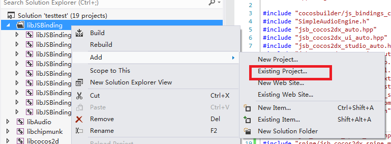

# 如何在jsb项目中使用extension
##添加websockets
###Visual Studio
1.在AppDelete.cpp中添加头文件
>\#include "network/jsb_websocket.h"

2.在AppDelegate::applicationDidFinishLaunching中添加
>sc->addRegisterCallback(register_jsb_websocket);

3.在解决方案内添加libNetwork子项目

在解决方案上右键选择add->Existing Project

在你创建的项目文件夹中选择js-bindings\cocos2d-x\cocos\network\proj.win32\libNetwork.vcxproj

4.添加libNetwrok静态库

在jsb子项目上右键选择属性对话框

在Linker->Input->Additionnal Dependencies中添加libNetwork.lib

5.编译运行

###Xcode
todo

##添加SocketIO

###Visual Studio
在jsb中添加SocketIO与添加websocket的过程相似，大概如下：

1.在AppDelete.cpp中添加头文件
>\#include "network/jsb_socketio.h"

2.在AppDelegate::applicationDidFinishLaunching中添加
>sc->addRegisterCallback(register_jsb_socketio);

3.在解决方案内添加libNetwork子项目（如已经添加过就略过）

4.在jsb子项目上Linker->Input->Additionnal Dependencies中添加libNetwork.lib（如已经添加过就略过）

5.编译运行

###Xcode
todo
##添加Spine

###Visual Studio
1.添加libJSBingdingForSpine

在libJSBinding文件夹上右键添加已有项目

选择frameworks\js-bindings\bindings\proj.win32\libJSBindingForSpine.vcxproj

2.添加libSpine库
在解决方案上右键添加已有项目，选择frameworks\js-bindings\cocos2d-x\cocos\editor-support\spine\proj.win32\libSpine.vcxproj

3.在AppDelete.cpp中添加spine自动绑定和手动绑定的头文件
>\#include "jsb_cocos2dx_spine_auto.hpp"

>\#include "spine/jsb_cocos2dx_spine_manual.h"

4.在AppDelegate::applicationDidFinishLaunching中添加
>sc->addRegisterCallback(register_all_cocos2dx_spine);

>sc->addRegisterCallback(register_all_cocos2dx_spine_manual);

5.在jsb子项目上Linker->Input->Additionnal Dependencies中添加libSpine.lib和libJSBindingForSpine.lib

6.编译运行

###Xcode
todo