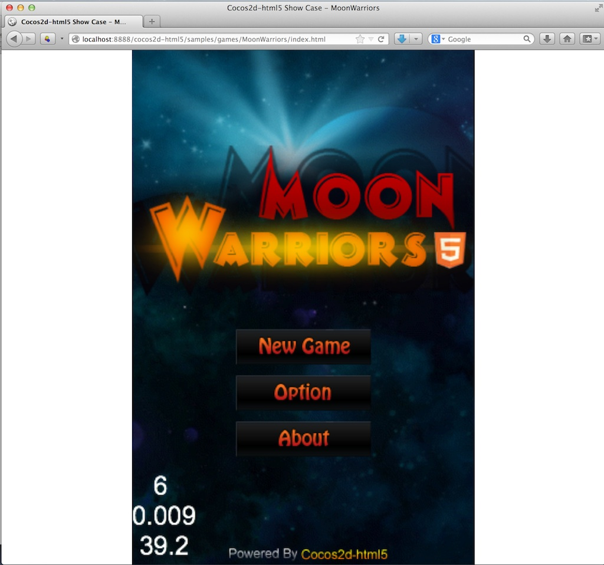
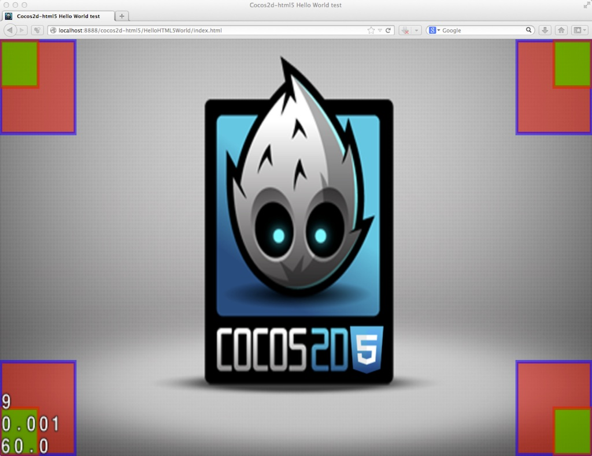
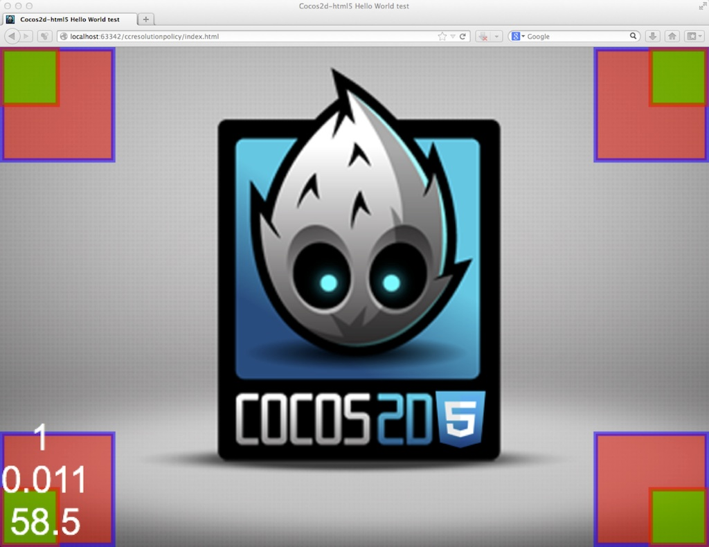

#Cocos2d-html5 2.2.2的屏幕适配方案

##关于屏幕适配

作为WEB开发者，相信大家都经历过跨平台多分辨率适配的痛。对于如何将网页的内容适配到不同尺寸的浏览器窗口，Responsive Design是目前非常热门的解决方案。可惜它不适用于Canvas中的游戏内容，所以Cocos2d-html5为游戏开发者提供了Resolution Policy解决方案。现在，在最新的2.2.2版本中，我们对它进行了重构，将它从Cocos2d-x的移植，变成了现在这样更适合网页游戏开发者的独特Resolution Policy解决方案。

这样的结果肯定不是我们想看到的...

这才像话，不过你也许也不满意，因为两条讨厌的白边，不用着急，我们也有你想要的。

现在就来看看使用新的Resolution Policy有多简单。

##使用方式

####1. 设置Resolution Policy

好吧，其实你什么也不用做，沿用之前版本的Resolution Policy设置代码就可以了。如果你还没有用过Resolution Policy，只需要在游戏载入过程完成之后（`applicationDidFinishLaunching`方法中或者之后），调用下面的代码：

>
	cc.EGLView.getInstance().setDesignResolutionSize(320, 480, cc.RESOLUTION_POLICY.SHOW_ALL);

`setDesignResolutionSize`函数的前两个参数是你想要在你的代码中使用的游戏分辨率，第三个参数就是你选择的适配方案。引擎中内置了5种适配方案，每种都有自己独特的行为，详见下文。

如果你已经设置了设计分辨率，那么你可以直接设置你的Resolution Policy：

>
	cc.EGLView.getInstance().setResolutionPolicy(cc.RESOLUTION_POLICY.NO_BORDER);

2.2.2版中的重构主要是基于WEB端游戏与原生游戏的区别所设计。原生游戏中游戏总是使用全部屏幕空间，但是在WEB端你的网页中也许除了游戏还有别的视觉或文字元素，或者也许你需要给你的游戏设计一个漂亮的边框。所以Cocos2d-html5引擎的适配方案会默认适配游戏Canvas元素的父节点，如果你希望游戏场景适配浏览器屏幕，那么只需要将Canvas直接放置到body下就可以了：

>
	<body>
		<canvas id="gameCanvas"></canvas>
	</body>

####2. 监听浏览器窗口大小变化事件

新的适配方案允许在浏览器大小变化的时候自动重新尝试适配。比如说，当用户拖拽来改变浏览器大小，或者更有用的情况，当他们转动自己手机方向的时候。游戏中任意时刻都可以开启这种行为，只需要调用cc.EGLView的`resizeWithBrowserSize`函数：

>
	cc.EGLView.getInstance().resizeWithBrowserSize(true);

为了更灵活得应对变化，我们为cc.EGLView提供了一个新的函数，你可以通过`setResizeCallback`函数注册一个回调函数来监听浏览器窗口大小变化事件：

>
	cc.EGLView.getInstance().setResizeCallback(function() {
		// 做任何你所需要的游戏内容层面的适配操作
		// 比如说，你可以针对用户的移动设备方向来决定所要应用的适配模式
	});

####3. Fullscreen API

[Fullscreen API](https://developer.mozilla.org/en-US/docs/Web/Guide/API/DOM/Using_full_screen_mode)是浏览器允许WEB页面在获得用户全屏幕的一个新的制定中的API。

Cocos2d-html5在移动端浏览器中会尝试自动进入全屏幕来给用户更好的游戏体验（需要指出并不是所有浏览器都支持这个API）。

另一方面，桌面端几乎所有现代浏览器都支持Fullscreen API，如果你希望使用这个API，Cocos2d-html5也简化了它的使用方式：

* 尝试进入全屏模式（需要用户交互）: `cc.Screen.getInstance().requestFullScreen();`
* 检测是否处于全屏模式: `cc.Screen.getInstance().fullScreen();`
* 退出全屏模式: `cc.Screen.getInstance().exitFullScreen();`

####4. Resolution Policy的意义

使用Resolution Policy的好处很明显，不论设备屏幕大小如何，也不论浏览器窗口的宽高比，你的游戏场景都会被自动放缩到屏幕大小。更重要的是，在游戏代码中，你将永远使用你所设计的游戏分辨率来布置游戏场景。比如说，如果你将设计分辨率设置为320 * 480，那么在游戏代码中你的游戏窗口右上角坐标将永远是(320, 480)(在FIXED_WIDTH模式高度可能会被缩放，同样在FIXED_HEIGHT模式下宽度可能存在缩放的情况，具体看下文说明)。

####5. API的变化

* cc.EGLView加入了`setResolutionPolicy`函数，可以用来设置屏幕适配模式。
* cc.EGLView加入了`setResizeCallback`函数来注册浏览器大小变化事件的回调函数。
* cc.EGLView的`_adjustSizeToBrowser`函数被弃用，在下一个稳定版本中将会被删除。
* cc.EGLView的`_resizeWithBrowserSize`被重命名为`resizeWithBrowserSize`。
* 使用用户自定义适配模式以及窗口resize事件的回调函数尚未被绑定到JSB中，如果你需要使用JSB的话，可能会造成错误。

##重要概念

####1. 游戏外框 Frame

游戏外框是你的游戏Canvas元素的初始父节点，一般情况下，它是html文档的`body`元素。但是如果你愿意，它可以是DOM结构中的任意容器节点。Canvas元素的初始大小并不重要，屏幕适配过程中它会被自动放缩来适应你设置的外框大小。
再次提醒，如果你希望游戏窗口适应整个浏览器窗口，那么只需要将Canvas元素直接放在`body`下。

####2. 游戏容器 Container

在Cocos2d-html5的初始化进程中，引擎会自动将你的Canvas元素放置到一个DIV容器中，而这个容器会被加入到Canvas的原始父节点（游戏外框）中。这个游戏容器是实现屏幕适配方案的重要辅助元素，你可以通过`cc.container`来访问它。

####3. 游戏世界 Content

游戏世界代表游戏内使用的世界坐标系。

####4. 视窗 Viewport

视窗是游戏世界相对于游戏Canvas元素坐标系中的坐标及大小.

####5. 容器适配策略 Container Strategy

容器适配策略负责对游戏容器和游戏Canvas元素进行放缩以适应游戏外框。

####6. 内容适配策略 Content Strategy

内容适配策略负责将游戏世界放缩以适应游戏容器，同时也会计算并设置视窗。

##系统预设适配模式

在Cocos2d-html5 2.2.2中预设了5种适配模式，继承自2.2.1版本并使用新的架构重写，下面将图解每种适配模式的行为。图中红色方框指示的是游戏世界的边界，而绿色方框指示的是Canvas元素的边界。

所有适配模式都是由一个容器适配策略搭配一个内容适配策略所组成的，括号中显示的是每个模式的构成方式。

####1. SHOW_ALL (PROPORTION_TO_FRAME + SHOW_ALL)

SHOW_ALL模式会尽可能按原始宽高比放大游戏世界以适配外框(Frame)，同时使得游戏内容全部可见，所以浏览器宽高比不同于游戏宽高比时，窗口中会有一定的留白。

####2. NO_BORDER (EQUAL_TO_FRAME + NO_BORDER)

NO_BORDER模式会尽可能按原始宽高比放大游戏世界以适配外框，并且保证不留空白。所以浏览器宽高比不同于游戏宽高比时，游戏世界会被部分切割。

####3. EXACT_FIT (EQUAL_TO_FRAME + EXACT_FIT)

EXACT_FIT模式会忽略原始宽高比放大游戏世界以完全适应外框，所以浏览器宽高比不同于游戏宽高比时，游戏世界会被一定程度拉伸。

####4. FIXED_WIDTH (EQUAL_TO_FRAME + FIXED_WIDTH)

FIXED_WIDTH模式会横向放大游戏世界以适应外框的宽度，纵向按原始宽高比放大。结果有两种可能，类似与SHOW_ALL模式的结果（如图），或者类于NO_BORDER模式。它与前面两种模式的差别在于，在FIXED_WIDTH模式下游戏世界坐标系等同于Canvas元素坐标系，并且Canvas元素必然占满整个外框。

注意图中情况下与SHOW_ALL模式的区别，此时Canvas大小是整个外框大小，所以可显示内容区域实际上比SHOW_ALL模式更多。

####5. FIXED_HEIGHT (EQUAL_TO_FRAME + FIXED_HEIGHT)

与前一个模式相反，FIXED_HEIGHT模式会纵向放大游戏世界以适应外框的高度，横向按原始宽高比放大。结果同上。

在这个模式下，与NO_BORDER模式的区别是此时游戏世界坐标系和大小等同于Canvas坐标系。

##开发者自定义适配模式

####1. 用系统预设策略来构建适配模式

如你所看到的，所有预设模式都是预设策略的组合，你也可以做到同样的事情，系统预设策略如下所示：

- Container strategies: 容器适配策略
	- cc.ContainerStrategy.EQUAL_TO_FRAME: 使容器大小等同于外框
	- cc.ContainerStrategy.PROPORTION_TO_FRAME: 使容器大小按原始宽高比放大以适应外框
	- cc.ContainerStrategy.ORIGINAL_CONTAINER: 原始容器大小

- Content strategies 内容适配策略
	- cc.ContentStrategy.SHOW_ALL
	- cc.ContentStrategy.NO_BORDER
	- cc.ContentStrategy.EXACT_FIT
	- cc.ContentStrategy.FIXED_WIDTH
	- cc.ContentStrategy.FIXED_HEIGHT

要构建一个自定义适配模式，只需要使用下面的示例代码：
>
	var policy = new cc.ResolutionPolicy(cc.ContainerStrategy.PROPORTION_TO_FRAME, cc.ContentStrategy.EXACT_FIT);
	cc.EGLView.getInstance().setDesignResolutionSize(320, 480, policy);

上面这个示例的适配模式将与SHOW_ALL模式的表现完全相同。

####2. 实现自己的容器/内容适配策略

如果你不满足于系统预设的适配策略，你甚至可以实现自己的策略来满足你的任何需求。

继承容器适配策略的方法：
>
	var MyContainerStg = cc.ContainerStrategy.extend({
		preApply: function (view) {
			// 这个函数将在适配策略前被调用，如果你的策略不需要，可以去除这个函数。
		},
>
		apply: function (view, designedResolution) {
			// 适配过程
		},
>
		postApply: function (view) {
			// 这个函数将在适配策略后被调用，如果你的策略不需要，可以去除这个函数。
		}
	});

继承内容适配策略的方法：
>
	var MyContentStg = cc.ContentStrategy.extend({
		preApply: function (view) {
			// 这个函数将在适配策略前被调用，如果你的策略不需要，可以去除这个函数。
		},
>
		apply: function (view, designedResolution) {
			var containerW = cc.canvas.width, containerH = cc.canvas.height;
>			
			// 计算游戏世界大小，以及相对于设计分辨率的x轴比例和y轴比例
>
			return this._buildResult(containerW, containerH, contentW, contentH, scaleX, scaleY);
		},
>
		postApply: function (view) {
			// 这个函数将在适配策略后被调用，如果你的策略不需要，可以去除这个函数。
		}
	});

最后，你就可以使用自定义策略来构建一个适配模式：
>
	var policy = new cc.ResolutionPolicy(new MyContainerStg(), new MyContentStg());
	cc.EGLView.getInstance().setDesignResolutionSize(320, 480, policy);

如果你想了解更多关于新的屏幕适配策略，你可以查看2.2.2版本中CCEGLView.js的源码 [github repository](https://github.com/cocos2d/cocos2d-html5/blob/develop/cocos2d/core/platform/CCEGLView.js)