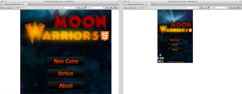
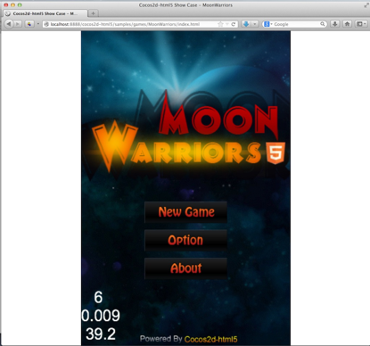
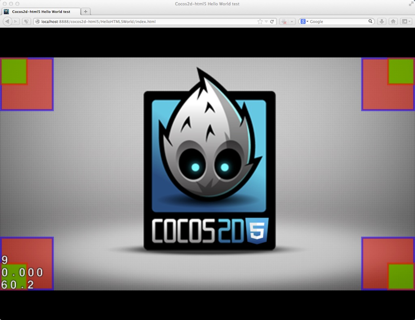
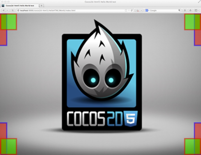
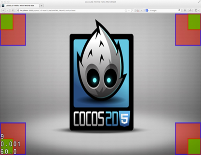
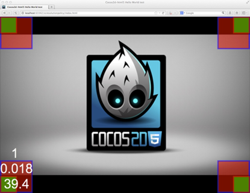
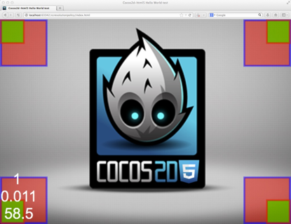

# 了解Cocos2d-html5 2.2.2分辨率策略

## Background背景

作为网络开发人员，我们都知道，要提供跨浏览器和跨平台的优质体验是相当困难的。一个主要的问题就是不断调整浏览器窗口的内容大小。现在有一种叫做响应式网页设计的东西，所以，对于Cocos2d-html5的开发人员，我们在2.2.2版本中为你带来了新的分辨率策略设计

分辨率策略的核心在于使你的游戏画面符合浏览器窗口。


如果你看到我们的游戏界面是这样的，一定很受伤吧。


这才是我们想要的，当然大多数时候，有的人很讨厌白色的导航键，所以，我们为你提供了其他选择。

现在我们就去看一看，使用这些新功能有多简便吧。

## 用法

### 1. 设置策略

你只需在调用applicationDidFinishLaunching 方法( main.js )之时或之后使用如下代码，就可以让Cocos2d-html5使你的游戏自动的适应浏览器，

```
cc.EGLView.getInstance().setDesignResolutionSize(320, 480, cc.RESOLUTION_POLICY.SHOW_ALL);
```

第1和第2个参数是你希望在游戏代码中使用的分辨率。第3个参数是你希望使用的分辨率策略。这里有5个预定义的策略，每一个都有自己的行为。详情请参见后文。

如果你已经制定了设计分辨率，你只需使用下列函数即可改变你的分辨率策略：

```
cc.EGLView.getInstance().setResolutionPolicy(cc.RESOLUTION_POLICY.NO_BORDER);
```

与cocos2d-x 非常不同，html5版本是在浏览器上运行的，所以，除了游戏窗口，你的画面上还会显示其他内容。或者你可能需要在你的画面上应用类型，但是不要指望它会占满整个屏幕空间。所以，我们的分辨率策略默认适应画面的外容器。如果你希望适应浏览器窗口，你需要将你的游戏画面直接放到以下的“body”中：

```
<body>
    <canvas id="gameCanvas"></canvas>
</body>
```

### 2. 调整浏览器窗口大小

新的设计能在浏览器大小发生变化时能自动进行再调整。比如，当用户调整浏览器大小时，或者当他们转动手机方向时。要激活这一功能，需使用EGLView的resizeWithBrowserSize函数：
1cc.EGLView.getInstance().resizeWithBrowserSize(true);
For permitting a more flexible design, we provided a new function in cc.EGLView, you can observe the resize event by setting a callback function with `setResizeCallback`:
为了使设计更为灵活，我们在cc.EGLView中提供了一种新的函数，你可以通过设置`setResizeCallback`这种回调函数观察调整大小这一事件：

```
cc.EGLView.getInstance().setResizeCallback(function() {
    // Do things according to your need, 
    // e.g. change a resolution policy when user's mobile orientation changed.
});
```

### 3. 全屏API

[全屏 API](https://developer.mozilla.org/en-US/docs/Web/Guide/API/DOM/Using_full_screen_mode)（Fullscreen API）是一种新型的网络API，它可以全屏显示网页内容。

Cocos2d-html5将尽力在手机浏览器上激活全屏模式，以使用户能够有更优质的体验。（但请你注意，并非每种浏览器都允许这一动作）

另外，现代台式电脑浏览器同样支持全屏API，只要是你希望如此，你只需按照如下步骤：

试着进入全屏模式：**cc.Screen.getInstance().requestFullScreen();**

检查一下页面是否处于全屏模式：**cc.Screen.getInstance().fullScreen();**

退出全屏模式： **cc.Screen.getInstance().exitFullScreen();**

### 4. 优点

使用分辨率策略的优点显而易见，你完全不用考虑各种各样的浏览器及设备大小。更重要的是，你无需人工调整游戏中所有东西的大小，一切都有Cocos2d-html5来处理。设想一下，如果你搭建的原计划的分辨率大小为320 * 480，你应在游戏逻辑代码中随时关注这一大小。你游戏的右上角将一直是(320, 480)。

### 5. API改变

- 设置分辨率策略的函数setResolutionPolicy已经添加到cc.EGLView中。
- 注册调整大小事件的回调函数 setResizeCallback已经添加到cc.EGLView中。
- cc.EGLView中的_adjustSizeToBrowser函数已弃用。
- cc.EGLView中的_resizeWithBrowserSize 函数已重构为resizeWithBrowserSize。
- 设置分辨率策略以及回调调整大小事件的新方法还没有同JSB绑定，所以，如需使用JSB，请注意。

## 原理

### 1. 帧

帧就是画面组件的外容器，通常情况下，它是超文本标记语言（html）的主体（`body`）组件。但是在某些情况下，cocos2d游戏只是网页的一部分，除此之外，还有一些文本、图像或者其他的东西。这样，你就可以将画面封入DOM组件中（帧），画面组件的初始大小并不重要，分辨率策略将调整画面大小以符合帧。

如果你希望使游戏符合浏览器窗口，你应该直接将画面组件放至主体（`body`）组件下。

### 2. Cocos2d容器

在初始化过程中，Cocos2d会将你的画面封入一个Cocos2d容器中，而容器本身将被加入到画面（帧）的原始外部组件中。该容器能帮助分辨率策略散发魔力，通过cc.container，你可以访问Cocos2d容器。

### 3.游戏内容

游戏内容就是游戏世界的坐标。

### 4. 可视窗

可视窗是游戏世界的矩形界面，在像素中，与画面坐标相关。

### 5. 容器策略

容器策略控制如何根据帧对cocos2d容器大小及游戏画面组件做出相应调整的行为。

### 6.内容策略

内容策略控制如何根据容器对游戏世界做出相应调整的行为，并搭建可视窗。

## 预定义策略


现在，我要介绍全部的5种预定义策略，在每一个捕捉的图像中，红色矩形代表游戏内容区，绿色矩形代表画面区。

所有的分辨率策略都与一个容器策略和内容策略结合在一起，括号里显示了每一种策略的结合情况。

### 1. SHOW_ALL（符合帧的比例+显示全部）



显示全部策略（Show all policy）在帧中将容器调整到最大，它将在屏幕上以你原先设定的宽/高比例显示所有内容。所以，在调整过程中会有一些空白区域。

### 2. NO_BORDER（与帧同等大小+无边框）



无边框策略（No border policy）将按比例调整容器大小，使其填满整个帧。在这种情况下，如果帧的宽/高比例与你设计的比例不一致，你游戏中的一些区域将被剪掉。

### 3. EXACT_FIT（与帧同等大小+精准配合）



精确配合策略（Exact fit policy）将调整容器大小以精确符合帧，所以游戏的宽/高比例可能会丢失。

### 4. FIXED_WIDTH（与帧同等大小+固定宽度）



固定宽度策略（Fixed width policy）将调整容器的宽度以符合帧的宽度，其高度也会做相应调整。

看起来好像和显示全部策略并无两样，但是这里，整个画面能填满整个帧，游戏世界的坐标系统和画面坐标系统一致。

### 5. FIXED_HEIGHT（与帧同等大小+固定高度）



游戏的宽度比游戏的高度要大，所以固定宽度策略有点像显示全部策略，而固定高度策略有点像无边框策略。相反，如果游戏的宽度比游戏的高度要小，那么固定宽度策略就会像无边框策略，而固定高度策略就有点像显示全部策略。但是固定高度及固定宽度策略都将视整个帧为可视窗及游戏世界矩形界面。

## 自定义分辨率策略

### 1. 预定义策略的结合

如你所见，预定义策略就是使用预定义策略的结合，你也可以做同样的事情。预定义策略列举如下：

- 容器策略
	- cc.ContainerStrategy.EQUAL_TO_FRAME
	- cc.ContainerStrategy.PROPORTION_TO_FRAME
	- cc.ContainerStrategy.ORIGINAL_CONTAINER

- 内容策略
	- cc.ContentStrategy.SHOW_ALL
	- cc.ContentStrategy.NO_BORDER
	- cc.ContentStrategy.EXACT_FIT
	- cc.ContentStrategy.FIXED_WIDTH
	- cc.ContentStrategy.FIXED_HEIGHT

如果你希望构建及使用分辨率策略与策略的结合，你应按照以下步骤进行：

```
var policy = new cc.ResolutionPolicy(cc.ContainerStrategy.PROPORTION_TO_FRAME, cc.ContentStrategy.EXACT_FIT);
cc.EGLView.getInstance().setDesignResolutionSize(320, 480, policy);
```

这一策略操作步骤应与显示全部策略一模一样。

### 2. 执行你自己的策略

如果你对我们预定义的策略不满意，你甚至可以执行你自己的策略以符合你任何需求。

扩展容器策略：

```
var MyContainerStg = cc.ContainerStrategy.extend({
     preApply: function (view) {
         // This function is called before the process of adaptation,
         // you can remove this function if you don't need
     },
     apply: function (view, designedResolution) {
         // Apply process
     },
    postApply: function (view) {
        // This function is called after the process of adaptation,
        // you can remove this function if you don't need
    }
});
```

扩张内容策略

```
var MyContentStg = cc.ContentStrategy.extend({
     preApply: function (view) {
         // This function is called before the process of adaptation,
         // you can remove this function if you don't need
     },
     apply: function (view, designedResolution) {
         var containerW = cc.canvas.width, containerH = cc.canvas.height;
        // The process to calculate the content size, the x axe scale and the y axe scale
        return this._buildResult(containerW, containerH, contentW, contentH, scaleX, scaleY);
    },
    postApply: function (view) {
        // This function is called after the process of adaptation,
        // you can remove this function if you don't need
    }
});
```

最后，你应该使用自定义策略构建你自己的策略。

```
var policy = new cc.ResolutionPolicy(new MyContainerStg(), new MyContentStg());
cc.EGLView.getInstance().setDesignResolutionSize(320, 480, policy);
```

如果你希望得到更多有关新分辨率策略执行的详细信息，你可以参考的CCEGLView.js源代码或者我们的[github](https://github.com/cocos2d/cocos2d-html5/blob/develop/cocos2d/core/platform/CCEGLView.js)资源库
