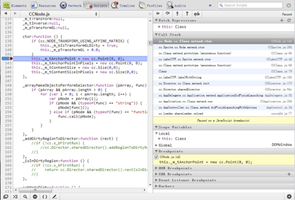
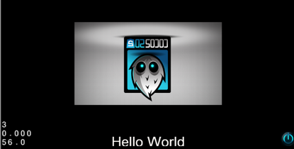
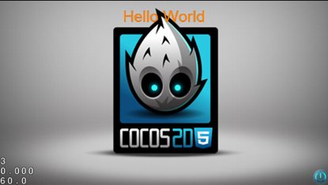

# Cocos2d-html5新手入门

## 简介

Cocos2D-html5是最新从Cocos2D-X团队中剥离出来的分支引擎，由Javascript语言为支持HTML5的浏览器编写而成。该引擎API源于Cocos2d-X，所以如果你此前有任何Cocos2d游戏引擎的相关经验，你就已经知道如何使用Cocos2d-html5。如果此前从未使用过Cocos2d游戏引擎，请放心本文将教会你入门所需的所有知识。

因为Cocos2D-html5是基于网络的游戏引擎，所以只要你能够访问文本编辑器，就可以在任何平台上编写应用程序，而且你可以在有网络浏览器的任何设备上运行应用程序，只要该浏览器支持HTML5！多么方便啊，所以这也是为什么我们说“未来尽在你的浏览器中”。

## Javascript? Java脚本？

尽管有人担心“脚本语言”的效率，当然Java脚本肯定比C＋＋慢，但是包括V8 Javascript引擎和硬件加速画面渲染工具在内的技术使得游戏开发成为可能。现在，移动电话上的硬件仍然缺少一些有效运行javascript的“吸引力”，但是Cocos2d-x团队正在研究 “供Cocos2d JSB脚本绑定”，也就是说，你在Cocos2d-html5上运行的同样的代码也可以在Cocos2d-X 及Cocos2d-iPhone上完美的运行，无需或者只需少许修改。所有这一切都被我们称为“在移动电话上的速度几乎和本地一样快”。

未来，我们将看到移动电话会变得非常强大，你将看到越来越多运行四核几GHz CPU的手机，而且还配备有专门的图形芯片。我们预计html5游戏将在这些手机上运行的和电脑上一样棒。

## WebGL如何？

网页图形库（WebGL）是一种供网络使用的开放式图形语言（OpenGL），也就是3d硬件加速。

在撰写本文之时，Cocos2d-html5还没有通过WebGL实现。

一旦移动电话采用WebGL作为标准，Cocos2d-html5游戏将完美的在这些移动电话上运行，只要游戏设计师想得到，就没有做不到！

Cocos2d-html5 2.1.0及以上版本将有WebGL支持。

## 安装Cocos2d-html5

安装Cocos2d-html5就像解压一样容易，只需运行"index.html"！

1. 从官方网址"html5.cocos2d-x.org"下载Cocos2d-html5
2. 解压文件至任一目录
3. 打开"index.html"运行项目Hello World
4. 如果你在页面上看到了HelloWorld
5. 安装成功！

如果Hello World卡住了，出现黑屏，请不要慌，你使用的浏览器可能因为安全原因拦截了本地文件中的某些API。

有两种解决办法：

1. 使用Firefox 12 ,Opera或者Safari, 这些浏览器对本地文件更友好。
2. 在你的电脑上安装网站服务器（webserver）。

## 安装网站服务器（非强制性）

你可以有多种选择：

   - XAMPP : for windows, Mac, Linux.
   - WAMP : for windows
   - MAMP : for mac

1. 下载适合你的网站服务器，
2. 按照说明进行安装，
3. 找到安装目录，
4. 找到根目录，文件名应该类似于"htdocs" 或者 "www"
5. 将经压缩后的Cocos2d-html5文件复制到进来
6. 将你的浏览器指向"localhost"

你应该能看到如下画面：


如果你还有疑问，请参见[webserver trouble shooting guide]()

## 调试代码

调试Javascript代码对于网络开发人员来说应该是再熟悉不过的了。如今的浏览器已经内编有工具来帮助你开发Javascript应用。

对于大多数浏览器而言，只需按F12 就能打开开发人员工具，

（在Opera上，按Ctrl+ Shift + i）

（在Safari上，在“preference”里找到“高级”，然后选择“在目录栏里显示开发目录”以打开开发人员工具，右击后选择“查看组件”）


我们推荐使用Google Chrome，因为该浏览器最为方便，而且配备有各种功能。

更多有关如何使用Chrome 开发人员工具（Chrome Developer Tools）的详情请参看以下网址文件：[https://developers.google.com/chrome-developer-tools/docs/elements](https://developers.google.com/chrome-developer-tools/docs/elements) 

在这里，你可以访问控制台，它能够输出游戏引擎内部的任何错误。你也可以在控制台中输入Javascript命令。

让Hello World更有趣

Hello World默认的样本代码里，背景是一个cocos2d-html5标志以及“Hello World”的字样，实在是太单调乏味了。


这是一个Cocos2d-html5的迷你教程，可以让你将Hello World的模版变得更加有趣。

打开HelloHTML5World目录中的“src/myApp.js”。

你第一眼注意到的就是这个

第27行：var Helloworld = cc.Layer.extend() 

这是Cocos2d-html5中对象继承的方式，来源于John Resig's javascript Inheritance，在这里表示我们在CCLayer中定义了一种新的被称为Helloworld的类。

其他的对于任何一个此前使用过Cocos2d的人来说都在熟悉不过了，除了

第38行：this._super() 

它表示运行此函数的父类版本。

## 开始进入正题！

找到第74行初始化背景精灵的地方

第74行：this.sprite = cc.Sprite.create("res/HelloWorld.png");

我们在第74行后面添加this.sprite.setRotation(180);，将它旋转180度，让它倒过来

现在，我们让它变小一点。

```
// add "HelloWorld" splash screen" 
this.sprite = cc.Sprite.create("res/HelloWorld.png");
this.sprite.setPosition(size.width / 2, size.height / 2);
this.sprite.setScale(0.5);
this.sprite.setRotation(180);
```

预览一下我们做出的改变，现在效果图应该是这样的



让精灵动起来

首先，我们需要定义动作，我们希望将它变回原来的大小，所以，我们先来定义这个动作：

```
var scaleToA = cc.ScaleTo.create(2, 1, 1); 
```

然后，我们定义另一个动作，将它转回原来的方向。

```
var rotateToA = cc.RotateTo.create(2, 0);
```

在这里，我们定义了两个动作，持续时间为2秒，一个是将它的宽和高变回原来的大小，另一个是将它转回原来的方向

现在，你可以让精灵运行这一动作了

```
// add "HelloWorld" splash screen" 
this.sprite = cc.Sprite.create("res/HelloWorld.png");
this.sprite.setPosition(size.width / 2, size.height / 2);
this.sprite.setScale(0.5);
this.sprite.setRotation(180);
var rotateToA = cc.RotateTo.create(2, 0);
var scaleToA = cc.ScaleTo.create(2, 1, 1);
this.sprite.runAction(rotateToA);
```

这个介绍很清晰详尽了吧！但是，如果我们希望播放连续的几个动画怎么办呢？这也不成问题

```
// add "HelloWorld" splash screen" 
this.sprite = cc.Sprite.create("res/HelloWorld.png");
this.sprite.setPosition(size.width / 2, size.height / 2);
this.sprite.setScale(0.5);
this.sprite.setRotation(180);
var rotateToA = cc.RotateTo.create(2, 0);
var scaleToA = cc.ScaleTo.create(2, 1, 1);
this.sprite.runAction(rotateToA);
this.sprite.runAction(cc.Sequence.create(rotateToA, scaleToA));
//or at the same time
// this.sprite.runAction(cc.Spawn.create(rotateToA, scaleToA));
```


恭喜，你已经学会如何将一个单调乏味的HelloWorld样本代码变成一个至少不那么无趣的动画HelloWorld!现在，或许你都可以在Cocos2d-html5中编写ppt了！

## 结语

我希望这份有关Cocos2d-html5的简介能够对你有帮助，也希望你感觉Cocos2d-html5的搭建、学习以及框架的使用都很容易。有了Cocos2d-html5，你可以高效的完成你的游戏，并在浏览器之间运行这些游戏。

如果你觉得满意，请登录推特： [http://www.twitter.com/cocos2dx](http://www.twitter.com/cocos2dx)，让我们知道，你的到访是我们前进的不竭动力。
