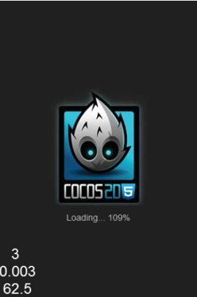

# 月亮战士——Cocos2d-html5展示

以下是Cocos2d-html5 alpha的展示，其中包括很多功能：
- 视差背景
- 瓷砖地图
- 行动
- 缓冲
- 帧动画
- 定时器
- 标签
- 键盘调度程序
- 场景转换

美术及视听版权归Enigmata Genus Revenge所有，未经许可，不得使用任何受版权保护的材料。

本展示由GPL颁布许可证。在即将发布的html5游戏中，我们欢迎你使用本展示作为建议教程 

（控制：使用方向键来移动你的轮船）

从[MoonWarriorsSourceCode](https://github.com/cocos2d/cocos2d-js-tests/tree/master/games/MoonWarriors)下载源代码


- 提示及注意事项

	- [搭建JetBrains WebStorm以与Cocos2D-html5合作运行](http://www.gamefromscratch.com/post/2012/06/07/Setting-up-JetBrains-WebStorm-to-work-with-Cocos2D.aspx)
	- [关于cc.Class释放模式（Class Release Mode）](http://www.cocos2d-x.org/wiki/About_ccClass_Release_Mode)
## 关于ccClass发布模式

在Cocos2d-html5 2.1引擎中，我们通过使用“发布模式”（"release mode"）提升了John Resig's javascript继承的性能

整个游戏引擎都使用了John Resig's Javascript继承（扩展）。它的速度非常快，使用方便。

但是为了模仿C类型的OOP模式，我们需要一种能够访问函数母板本的方式。this._super()就能实现，但是在性能方面会有一些牺牲。

我们之前所做的就是重写在运行时间使用this._super()的函数，将它们直接指向母函数。它就像一个迷你JIT编译程序！

这样一来，性能可以提高至少10%，缺点在于我们现在无法在含有this._super()的函数中设置断点，因为此函数在运行时间被重写了。

所以，我们添加了一个标记，你可以将此优化打开或者关闭。

我们之所以称其为发布模式是因为只在发布编译时推荐此模式。

如果你希望打开此优化，只需在cocos2d.js中添加"CLASS_RELEASE_MODE:true"显示配置信息命令。

## 下载

- Cocos2d-html5 github报告:
	- [http://github.com/cocos2d/cocos2d-html5/](http://github.com/cocos2d/cocos2d-html5/)
- Cocos2d-html5发布：
	- [Stable release](http://www.cocos2d-x.org/download)

### 在线演示

- [易学范例](http://cocos2d-x.org/npm/cocos2d-html5/index.html)
- [月亮战士](http://www.cocos2d-x.org/MoonWarriors/index.html)
- [攻击的橘子](http://www.cocos2d-x.org/html5-samples/samples/games/FruitAttack/index.html)
- [测试用例](http://www.cocos2d-x.org/html5-samples/samples/tests/index.html)

### 维基目录

- [关于ccClass发布模式](http://www.cocos2d-x.org/wiki/About_ccClass_Release_Mode)
- [Cocos2d-html5新手入门](http://www.cocos2d-x.org/wiki/Getting_Started_with_Cocos2d-html5)
- [月亮战士——Cocos2d-html5展示](http://www.cocos2d-x.org/wiki/MoonWarriors_-_Cocos2d-html5_Showcase)



