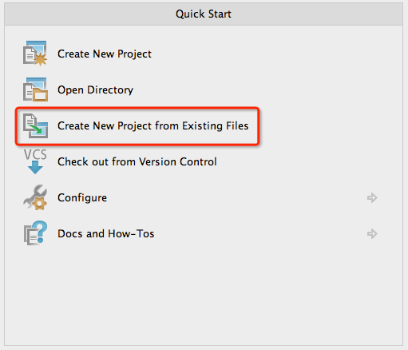
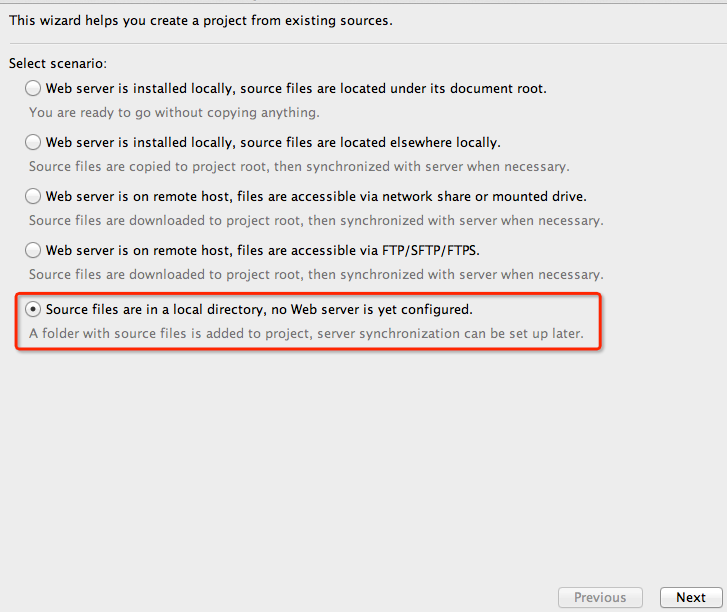
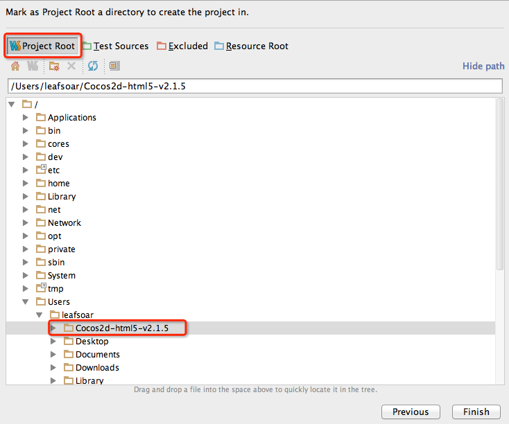
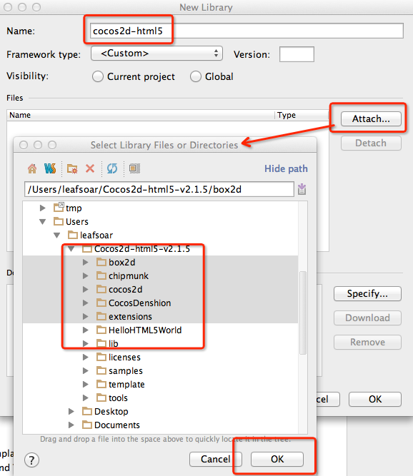

#手把手，快速搭建 Cocos2d-html5 v2.x 开发调试环境
---

在这篇文章中，你将学会如何快速搭建 Cocos2d-html5 的开发和运行环境，对于脚本来说，大多编辑器提供语法高亮显示，而没有语义补全，虽然有些开发环境提供了自动补全功能，但都不大好用。这里推荐使用 WebStorm，作为一个 IDE（集成开发环境），它有非常强大的代码补全，而且其补全相当智能，提高了开发效率。还能与 Google Chrome 浏览器配合，完成实时编辑和调试功能。当然你可以有其它选择。下面详细介绍它的详细配置步骤。

##环境准备
在开始之前，首先下载需要的文件，依赖等，对于 Cocos2d-html5 使用当前的最新稳定版本，2.1.5 。你可以在 这里[下载](http://cocos2d-x.googlecode.com/files/Cocos2d-html5-v2.1.5.zip)。[WebStorm](http://www.jetbrains.com/webstorm/download/index.html) 请访问官网，根据自己的系统环境选择下载，这里使用的是 6.0.2 版本。 为了能够使得 IDE 与浏览器协同编辑调试，需要安装 Chrome [jetbrains-ide-support](https://chrome.google.com/webstore/detail/jetbrains-ide-support/hmhgeddbohgjknpmjagkdomcpobmllji) 插件。有了以上三者，就可以进行配置。这里以 Mac OS X 作为系统环境。

##配置 WebStorm 项目，代码补全功能
在开始开发之前，第一步需要将 Cocos2d-html5 导入 WebStorm 项目工程。

- 首先解压缩 Cocos2d-html5-v2.1.5.zip 压缩包。
- 打开 WebStorm 进入欢迎界面，选择又侧`Create New Project from Existing Files` 项

- `Select scenario`选择最后一项一项“Source files are in a local directory …”，点击下一步

- 浏览文件夹到**Cocos2d-html5-v2.1.5**目录，然后点击`Project Root`设定根目录

- 点击 “Finish” 完成项目导入。

完成以上步骤，便已经能够在 WebStorm 里面打开所有内容，编辑 `HelloHTML5World/src/myApp.js` 已经能够完成自动补全功能，这是因为当前整个项目包含了所有 js 源码。

如果是其它位置的项目没有包含 js 库完成自动补全的需要手动添加库（根据实际需要）。完成对 Cocos2d-html5 的补全，使用以下方式添加 js 库：

- 点击菜单 WebStorm Preferences 进入 Settings 界面
- 定位到 Project Settings 中 JavaScript 的 Libraries 选购项

- 点击 Add 按钮，进入 库 添加配置界面

- 如图所示，填写库名称，然后 `Attach` 浏览添加目录，其中根据需要包含库目录，OK！
以上是在其它独立的项目，使用 Cocos2d-html5 库时的环境配置。能够以如此的方式在任何项目添加 Cocos2d-html5 的库，可以在项目的 “External Libraries” 看到所有的依赖库。

##浏览器同步编写实时刷新，单步调试
以上是使用 WebStorm 开发环境的步骤，但同样需要浏览运行，查看效果。

右击项目主目录的 index.html 选择 调试 index.html 后，将以 Chrome 打开此页面（系统默认浏览器），而打开的方式，我们看到是系统文件路径，如 ：

`url = “file:///Users/leafsoar/Cocos2d-html5-v2.1.5/index.html”`

需要注意的是，以此方式所打开的页面，静态页面正常浏览，但选择**Hello World**运行，会加载不了，这是由于 Cocos2d-html5 的处理机制与浏览器的兼容问题造成的（在其它浏览器会有不同的结果），官方推荐以服务的方式运行，如`http://localhost`的方式。

在这里我们在浏览器中输入`http://localhost:63342/Cocos2d-html5-v2.1.5/`来访问当前项目，在 Chrome 我们也同样安装了 JetBrains 插件，以此协同工作。这样在修改项目中静态页面的时候，将会自动更新至页面，看到实时效果。`http://localhost:63342`是由 WebStorm 提供了服务，后面跟项目名称，以服务的方式访问页面，查看效果。

调试步骤，我们需要修改 右击 调试 index.html 的 url 地址。点击工具条，调试配置，**index.html**右侧下拉**Edit Configurations**，将默认的 Path 地址由：

`“/Users/leafsoar/Cocos2d-html5-v2.1.5/index.html” `修改为 `“http://localhost:63342/Cocos2d-html5-v2.1.5/” `如图：

完成以上配置后，我们在如 “HelloHTML5World/src/myApp.js” 中的代码设置以断点，后调试运行项目，测试 Hello World 便可以单步调试了：

我们可以修改`HelloHTML5World`来快速学习它们，其中`template`提供了一个项目模板，如果需要建立自己的项目，可以将它拷贝，然后基于它编写自己的代码程序。
