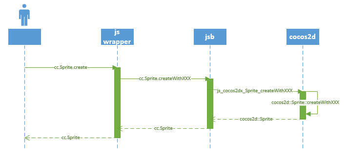

# How Cocos2d-js create a Sprite object#

In cocos2d-js we have two ways to create a Sprite object: Unified create function and constructor.
They are supported both in html5 and jsb, but the implementations of them are quiet different.
## 1. Unified create function ##

In Cocos2d-html5 2.x, we need to use different create functions to create a sprite, such as:

	var sprite = cc.Sprite.create(filename, rect);
	var sprite = cc.Sprite.createWithTexture(texture, rect);
	var sprite = cc.Sprite.createWithSpriteFrameName(spriteFrameName);
But in Cocos2d-js 3.0, we only need a unified create function:
	
	var sprite = cc.Sprite.create(filename, rect);
	var sprite = cc.Sprite.create(texture, rect);
	var sprite = cc.Sprite.create(spriteFrameName);

In jsb\_create\_apis.js we make some js wrapper for cc.Sprite.create, so if we use cc.Sprite.create function we will call someone of cc.Sprite._create and cc.Sprite.createWithXXX according to the length and type of arguments, and they are C++ functions' bindings:

| Javascript       				| JSB                         | cocos2d-x                         |
| ---------------------------- |------------------------------|----------------------------------|              
| cc.Sprite._create		       | js_cocos2dx_Sprite_create    | cocos2d::Sprite::create              |
| cc.Sprite.createWithSpriteFrame | js_cocos2dx_Sprite_createWithSpriteFrameName          | cocos2d::Sprite::createWithSpriteFrameName |
| cc.Sprite.createWithTexture    | js_cocos2dx_Sprite_createWithTexture    | cocos2d::Sprite::createWithTexture           |

So if we use:
    
    var sprite = cc.Sprite.create(texture,cc.rect(0,0,480,320));

we actually call:

	cocos2d::Sprite* ret = cocos2d::Sprite::createWithTexture(arg0, arg1);

## 2.constructor ##
Another improvement is that we can use new operator to call class' constructor now. For example, we can use constructor to make a Sprite object by:

	var sprite = new cc.Sprite(filename, rect);
	var sprite = new cc.Sprite(texture, rect);
	var sprite = new cc.Sprite(spriteFrameName);

In this way we actually call js\_cocos2dx\_Sprite\_constructor in C++ code. In this C++ function we allocate memory for this sprite and add it to autorelease pool, and then execute _ctor function in javascript for initialization. In _ctor function we will call someone of initWithXXX, and they are also C++ functions' bindings:

| Javascript       				| JSB                         | cocos2d-x                         |
| ---------------------------- |------------------------------|----------------------------------|              
| cc.Sprite.initWithSpriteFrameName	       | js_cocos2dx_Sprite_initWithSpriteFrameName    | cocos2d::Sprite::initWithSpriteFrameName              |
| cc.Sprite.initWithSpriteFrame | js_cocos2dx_Sprite_initWithSpriteFrame          | cocos2d::Sprite::initWithSpriteFrame |
| cc.Sprite.initWithFile    | js_cocos2dx_Sprite_initWithFile    | cocos2d::Sprite::initWithFile           |
| cc.Sprite.initWithTexture    | js_cocos2dx_Sprite_initWithTexture    | cocos2d::Sprite::initWithTexture           |

#How to extend a class #

In cocos2d-html5 2.x, we need to use different init functions in create when extending a class, such as:

	var MySprite = cc.Sprite.extend({
		ctor:function(){
			this._super();
			//do something
		}
		//add your properties and functions
	});
	MySprite.create = function(filename,rect){
		var sprite = new MySprite();
		if (filename && typeof(filename) === "object") {
			if (fileName instanceof cc.Texture2D) {
				// Init  with texture and rect
				sprite.initWithTexture(fileName, rect);
			}
			else{
				//...
			}
		}else{
			//.....
		}
		return sprite;
	}
In cocos2d-js, we only need to override ctor function with correct arguments, and call _super function.

	var MySprite = cc.Sprite.extend({
		ctor:function(filename,rect){
			this._super(filename,rect);
			//do something
		}
		//add your properties and functions
	});

In \_super funciton we will call Sprite's ctor function(js\_cocos2dx\_Sprite_ctor) and do some other things for construction. Thus you can create your "MySprite" object:

	var sprite = new MySprite(texture,cc.rect(0,0,480,320))

In the C++ code, js\_cocos2dx\_Sprite\_constructor execute cc.Sprite.prototype_ctor. In _ctor function we will call initWithXXX functions according to filename and rect arguments.

