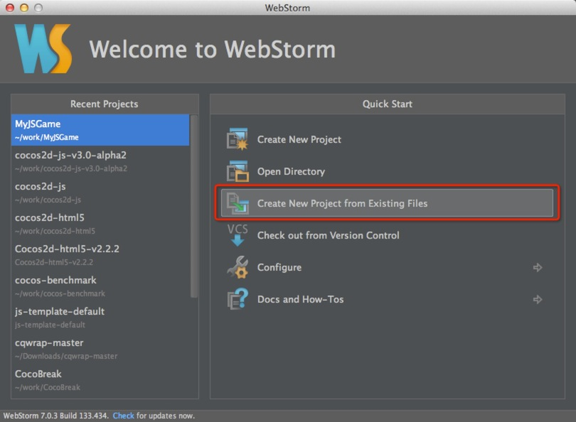
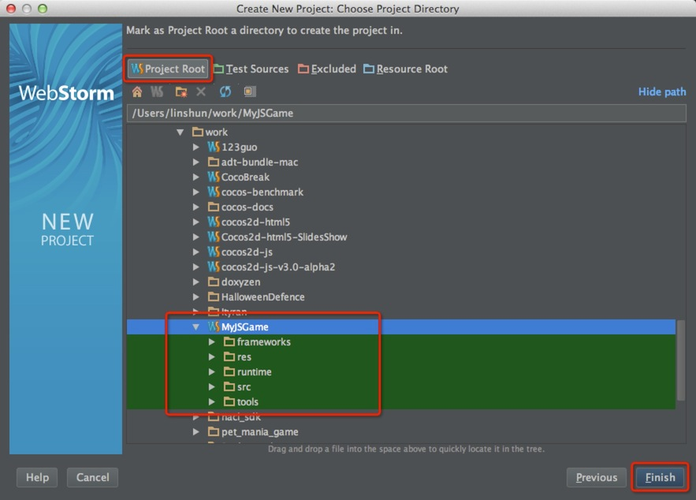
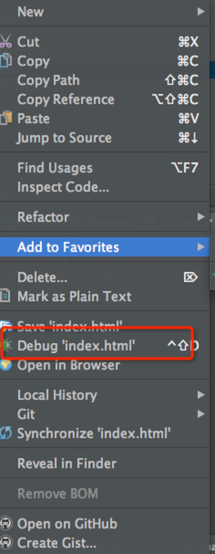
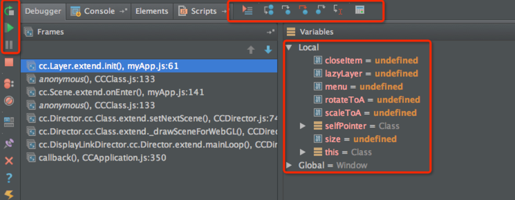

# 搭建 Cocos2d-JS 开发环境

===

在本文中，我将展示如何在 Mac os 10.9(Maverics) 上搭建 Cocos2d-JS 开发环境。

##下载必备的软件包

1. 下载并安装WebStorm7。[WebStorm7](http://www.jetbrains.com/webstorm/download/index.html)目前的稳定版本是7.0.3。为什么我们选择WebStorm？因为它提供了许多功能，如JavaScript代码的语法完成，调试，语法高亮，版本系统集成等，你可以去WebStorm的更多信息的官方网站。

2. 从Cocos2d-x的官方网站下载Cocos2D-JS 3.0alpha版本。[点此处下载](http://cocos2d-x.org/download)。当你下载了的Cocos2D-JS 3.0alpha版本。你应该把它解压缩到一个合适的位置。在我们的例子中，我把它解压在` ~/work/cocos2d-js-v3.0-alpha2`. `~`代表你的主目录路径，这在我们的例子中是 `/Users/linshun`。

**注意：**

你也可以通过GitHub上得到的Cocos2D-JS的前沿版本。这里是的[Cocos2D-JS GitHub的版本库](https://github.com/cocos2d/cocos2d-js)，最新的开发工作在`develop`分支。 

1. 下载并安装Chrome34和[JetBrains-IDE-support](https://chrome.google.com/webstore/detail/jetbrains-ide-support/hmhgeddbohgjknpmjagkdomcpobmllji)扩展。 

好吧，让我们来看看如何配置WebStorm7开发和调试我们的Cocos2D-JS应用。

## 如何创建新工程

Cocos2d-JS 提供了一个控制台工具，使`CH5`和`JSB`应用程序的开发更加简单和方便得多。你可以使用它来创建一个新的项目，其发布到Android，iOS，Mac OS或web，它是非常容易使用。

### 安装Console工具
第一步，在你使用该工具前需要先安装。 请克隆 Cocos2d-JS仓库并跟新所有子模块。在Cocos2d-JS文件夹下打开控制台工具(console)，然后在控制台上运行./setup.py。在安装期间你可能需要提供你的 NDK, Android SDK 和 ANT的路径。 注意该工具是使用python开发的，所以你需要在你的机子上安装python 2.7.5或以后的版本(但是不支持 python3)。

**注意： **
请执行 `source ~/.bash_profile`，使环境设置立即生效。

###创建新工程

```
// 创建一个包含 Cocos2d-x JSB 和 Cocos2d-html5 工程:
cocos new -l js

// 创建一个仅包含 Cocos2d-html5 的工程:
cocos new -l js --no-native

// 在指定的目录创建一个指定名字的工程:
cocos new projectName -l js -d ./Projects
```
在这个教程中，我们使用 `cocos new -l js` 在当前目录创建一个MyJSGame工程。

### 运行该工程

* 使用Websever 运行 Cocos2d-JS 工程

	```
	cd ~/work/MyJSGame
	cocos run -p web

	```
* 使用Cocos2d-x JSB 编译并运行项目

	```
	cd ~/work/MyJSGame
	cocos compile -p ios|android|mac
	cocos run -p ios|android|mac
	```
* 有用的参数

	```
-p platform : 平台可以是 ios|mac|android|web.
-s source : 你的工程目录, 如果不指定当前目录会被使用.
-q : 静默模式, 移除日志消息.
-m mode : debug 或 release 模式, 默认是debug
--source-map: 普通的 source-map 文件. (仅针对Web 平台)
	```
	
## 配置WebStorm 进行Cocos2d-JS开发

首先，你应该启动WebStorm7。如果这是你第一次启动WebStorm，它会要求你选择你的个人偏好，比如选择键盘映射。 

这是我的WebStorm启动截图： 

图1



**注意:**

如果你是第一次启动WebStorm，最近打开工程部分应该为空。

现在，让我尝试用WebStorm进行Cocos2d-JS开发。

1. 打开已经创建好的项目 MyJSGame

	正如我们可以从上面的图片中看到，你应该选择`Create New Project from Exisiting Files`(从已存在的文件创建新项目)

	然后，它会提示你以下选项： 

	图2

	

2. 选择`Source files are in a local directory, no Web server is yet configured`(源文件在本地目录，没有配置web server) 并点击`Next`(下一步)继续

	图3
	
	
3. 在这一步，你应该展开目录树来指定你的MyJSGame源代码放的位置。当你指定了正确的目录，注意Finish按钮仍然是灰色的。

4. 现在，我们应该设置该目录为项目的` Project Root`(根目录)。单击项目根目录按钮，`Finish`(完成)按钮将激活。 

	图4
	
	
5. 恭喜你，你已经成功配置了webstorm 开发 Cocos2d-JS 项目。

## 体验 Cocos2d-JS

当你已经添加了整个的Cocos2D-JS项目目录到WebStorm7。WebStorm将解析所有的Cocos2D-JS源代码。如果你打开​​`MyJSGame/src/myApp.js`，你可以得到的准确的语法自动补全的能力。 

图5
	

如果你有一个第三方JavaScript库在你的Cocos2d-JS游戏应用程序，你也可以把它添加到WebStorm库来解析并启用实时语法自动补全。 

下面是说明：


##(可选) 添加第三方库进行解析

1. 点击`Settings`(设置)按钮启动你工程的设置对话框:

	图6
		
	
2. 在点击`Settings`(设置)菜单后，它将弹出如下的对话框:

	图7：
	
	
	
3. 现在你可以点击 `Add...` 按钮，然后会提示你指定你的javascript库的路径。

	图8
		
	

## 在WebStorm中调试Cocos2d-JS javascript

是时候学习调试Cocos2d-JS代码了。

### 使用JB chrome 扩展连接WebStorm 到 Chrome

1. 右键点击 `~/work/MyJSGame `下的index.html文件，并选择 `Debug 'index.html'`

	图9
	
	
	
2. 现在，它会自动打开你的Chrome浏览器。如果你把你的鼠标chrome上面的JB插件， 
它会告诉你，它已经连接上WebStrom7.0.3： 

	图10
	

**注意：**

这一步很简单，一旦你已经安装了插件 - `“JetBrains IDE support”`。当你单击WebStorm调试菜单，它会自动连接到浏览器。它是相当的方便啊！你也可以点击右侧Chrome浏览器的侧边栏的**JB图标**，它会立即把你带到WebStorm的IDE界面。

### 在WebStorm中调试javascript代码

返回到WebStorm界面，并双击 `MyJSGame/src/myApp.js ` 在代码区展示。

1. 设置断点。用鼠标右键单击myApp.js源代码视窗左边的侧栏。 

	图11
	
	
	
2. 开始调试。 WebStorm会自动启动你的chrome浏览器，并运行示例项目。然后通过点击JB图标回到你的WebStorm。程序将停止在我们刚才设置的断点处。且编辑器将切换到Debug视图： 

	图12
	
	

3. 现在你可以做调试之类的事情，单步跳出，单步进入入，单步跳过，继续执行等。 

##总结 

在本教程中，向你展示了基本的步骤来配置WebStorm7进行Cocos2d-HTML5的开发工作，包括配置语法感知自动补全和调试。过程是相当简单明了。如果你对这个教程有任何疑问或建议，请告诉我们。我们将非常感谢你的贡献。 

##何去何从 

在接下来的教程中，我们将通过内置的Cocos2d-JS测试和示例游戏，告诉你如何设置一个新的Cocos2d-JS项目。
