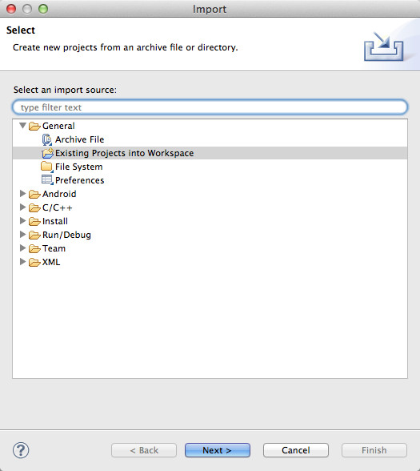
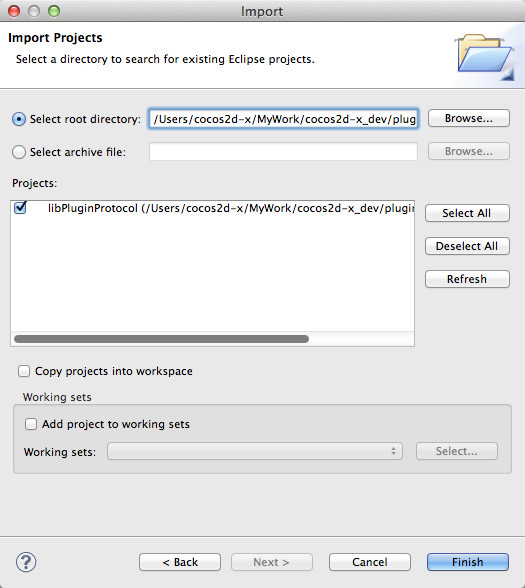
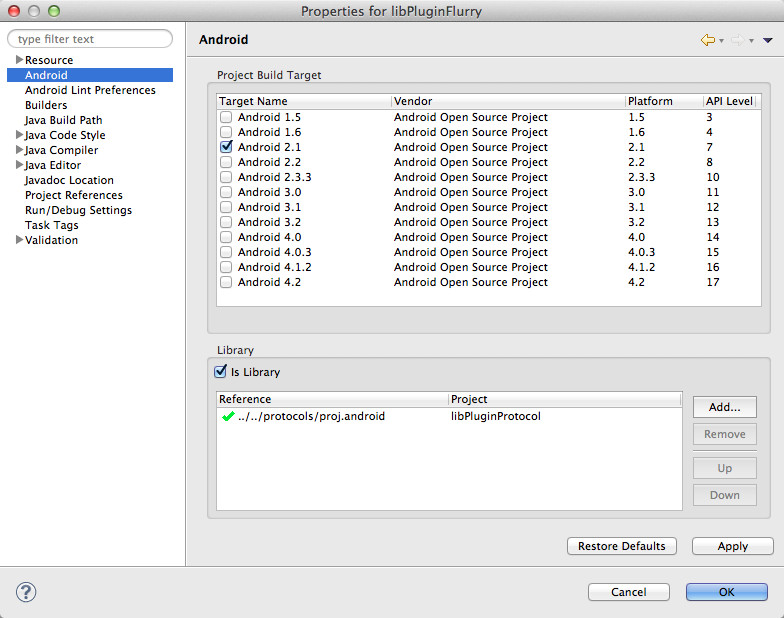

#如何编写自己的android插件

目前plugin-x中定义了4个协议：ProtocolAds, ProtocolAnalytics, ProtocolIAP, ProtocolSocial。编写自己的插件，不需要写任何的c++/jni代码或者javascript绑定代码。我们已经在plugin-x的核心层实现了这些，开发者所要做的就是：

- 新建一个android工程。
- 使用java实现我们定义的接口。

##plugin的文件夹结构
请确保你的plugin文件夹结构类似下图：


- proj.android : 插件的android工程文件夹.
- proj.ios : 插件的ios工具文件夹.

注意：pulish.sh工具的实现会依赖这样的文件夹结构。

##实现插件

###在Eclipse中导入plugin protocol 的安卓工程





###新建一个安卓library工程
使这个工程依赖libPluginProtocal。



工程的文件夹结构类似下图：


1. build.xml : publish.sh脚本使用它，可以从其他插件工程拷贝过来，注意要修改工程名。
2. ForManifest.xml : gameDevGuide.sh使用它. 如果你的插件在AndroidManifest.xml开启了一些额外的权限，需要把他们添加到这个文件中。
3. sdk : 把第三方SDK的jar包放在这里。
4. src : 把你的插件实现代码放在这里。
 
###编写java类实现至少一个接口

这个类应该有一个带有Context参数的构造函数，例如：

```
package org.cocos2dx.plugin;
public class AnalyticsFlurry implements InterfaceAnalytics {
        ...
        public AnalyticsFlurry(Context context) {
        mContext = context;
    }
}
```

你可以覆盖接口中的方法，或者定义自己的方法，例如：

```
@Override
public String getSDKVersion() {
    return "3.2.1";
}

protected void setUserId(String userId) {
    LogD("setUserId invoked!");
    final String curUser = userId;
    PluginWrapper.runOnMainThread(new Runnable() {
        @Override
        public void run() {
            try {
                FlurryAgent.setUserId(curUser);
            } catch(Exception e){
                LogE("Exception in setUserId", e);
            }
        }
    });
}
```

目前plugin-x只支持传递int, float, boolean, String, JSONObject类型的参数，返回值类型只可以是int, float, boolean, String。