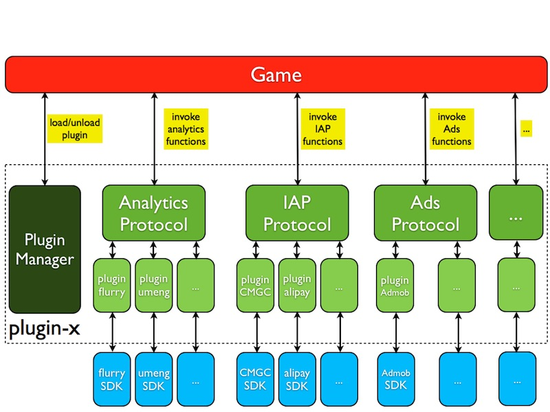
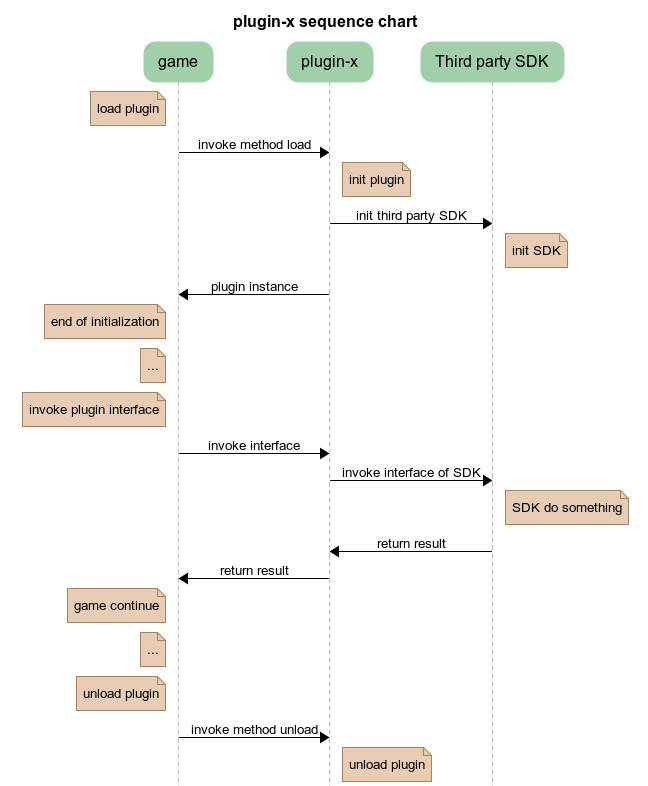

#Plugin-x架构

##什么是Plugin-x
Plugin-x是我们针对目前存在的大量第三方SDK抽象出来的一个协议层，通过plugin-x我们可以简单方便的调用第三方SDK，不用再痛苦地编写JNI代码或者javascript绑定代码。目前plugin-x已经集成了统计，支付，广告，社交等多种第三方SDK，并且用户可以根据自己的需求，集成其他SDK。

##plugin-x的架构
Plugin-x已经在C++层做好了对Objective-C和Java的反射，并且抽象出统计协议，支付协议和广告协议等。要集成一个第三方SDK只需要实现这些协议中的接口即可，也就是编写SDK的插件。用户只需要指定初始化的插件名，然后调用协议层的接口就可以成功调用SDK中相应的方法了。

Plugin-x的整体结构如图所示：

初始化插件，调用插件接口，卸载插件的顺序图如下：

