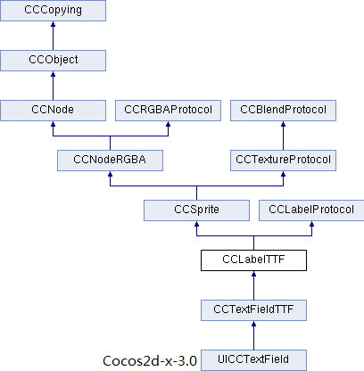

#Improve Label in Cocos2d-x-3.0

Before the Cocos2d-x-3.0 versions,there are three classes that can add text label into layer and sprite,which are CCLabelTTF, CCLabelBMFont and CCLabelAtlas. Nevertheless,the 3.0 version makes some improvements, it keeps the class of original version to compatible with previous version, the function of these class does not change, just a little minor changes in the name of the class and variable names. At the same time, it add a new class which has more features.So there will be four class that can add text label:Label, LabelTTF, LabelBMFont and LabelAtlas. The new Label in v3.0 works with freetype and gives you the same visual effect on different platforms. It's quicker with cache strategy too. Also, it offers tracing, shadow and many more features so be ready to put aside your LabelTTF and LabelBMFont.

changes:

1. Remove the CC prefix of class, struct and macro and other prefixes like Hungarian-naming, such as m, p, etc.
2. Change certain data type of parameters and return values in the member functions. For example, char was replaced by string, unsigned int was replaced by long, etc.
3. Change the name and attribute values ​​of some enum type;
4. Certain member function is modified to constant type,such as,`float getFontSize() const;`, improving the robustness and security of the program.

## Similar changes

### 1.Compare from the inheritance relationship
1.In v3.0 version ,all class have removed the CC prefix and also remove the CCCopying class. Such as:

CCLabelTTF and LabelTTF 

### 2.The definition of Horizontal alignment and vertical alignment is changed

In V2.x version

	static CCLabelTTF * create(const char *string, const char *fontName, float fontSize,
	　　                               const CCSize& dimensions, CCTextAlignment hAlignment, 
	　　                               CCVerticalTextAlignment vAlignment);

In V3.0 version

	static LabelTTF * create(const std::string& string, const std::string& fontName, float fontSize,
	　　                             const Size& dimensions, TextHAlignment hAlignment,
	　　                             TextVAlignment vAlignment);

As the example above, you can see a number of changes in the function after the upgrade version. Firstly, there isn't CC prefix any more; Secondly, char have been replaced by a string type(The string is relatively advanced, more convenient to use, easy to handle, the char of operation is a bit of trouble, but the efficiency is higher); In addition, the type of last two parameters(horizontal and vertical alignment of the text) is also changed, but they are the similar efficacy as the previous version, only the name has changed, as follows:

| |*cocos2d-x-2.x*|*cocos2d-x-3.0*|
|---------------|---------------|---------------|
|horizontal alignment|`typedef enum{kCCTextAlignmentLeft,kCCTextAlignmentCenter,kCCTextAlignmentRight,} CCTextAlignment;`|`enum class TextHAlignment{LEFT,CENTER,RIGHT};`|
|vertical alignment|`typedef enum{kCCVerticalTextAlignmentTop, kCCVerticalTextAlignmentCenter,kCCVerticalTextAlignmentBottom,} CCVerticalTextAlignment;`|`enum class TextVAlignment{TOP,CENTER,BOTTOM};`|

## Different changes
 
LabelBMFont removed the function:

 
	CCBMFontConfiguration* getConfiguration() const;

So can`t called this function to get _configuration(FNT file configuration properties) in v3.0 version.

## Extension
### New Label class

Let's look at hierarchy chart of the Label class :

In chart, LabelTextFormatProtocol is also a new class, it is  similar as LabelProtocol, and they are all pure virtual class, as a interface to store strings. As follows is its inheritance graph:

-----------------------------

Static Public Member Functions of Label:

	static Label* createWithTTF(const std::string& label, const std::string& fontFilePath, int fontSize, int lineSize = 0, TextHAlignment alignment = TextHAlignment::CENTER, GlyphCollection glyphs = GlyphCollection::NEHE, const char *customGlyphs = 0);    
	static Label* createWithBMFont(const std::string& label, const std::string& bmfontFilePath, TextHAlignment alignment = TextHAlignment::CENTER, int lineSize = 0);

 
* CreateWithTTF () can create Label directly through TTF file(TTF is a file extension for a font file developed by Apple. TTF stands for True Type Font. TTF files are currently used by both Apple and Microsoft as a raster font format).

The way of creating Label with this function is similar to the way of creating LabelTTF(previous CCLabelTTF). Differently,  LabelTTF class get through font name to create, but Label class create label directly through ttf file. Look at a piece of code as follows, creating a Label through LabelTTF and Label: 

	auto label1 = LabelTTF::create("Creating label through LabelTTF class by file name", "myFontName", 24);
	label1->setPosition(Point(origin.x, origin.y + visibleSize.height - label1->getContentSize().height));
	label1->setAnchorPoint(Point(0.0f, 0.0f));
    this->addChild(label1);

	auto label2 = Label::createWithTTF("Create label through Label class by .ttf file","fonts/myFontName.ttf", 32);
	label2->setPosition(Point(origin.x, origin.y + visibleSize.height - 80));
	label2->setAlignment(TextHAlignment::LEFT);
	label2->setAnchorPoint(Point(0.0f, 0.0f));
	this->addChild(label2);

running the program:

LabelTTF class uses the system font, if the font name is not given or the system does not exist the font you given, engine will load the default font (Helvetica), as above.

	label2->setAlignment(TextHAlignment::LEFT)；	//Set the text level alignment is aligned to the left

* CreateWithBMFont() can create Label through FNT file,it is similar to create LabelBMFont. Look at a piece of code as follows, creating a Label through LabelTTF and Label: 

.

	auto label3 = LabelBMFont::create("Create label through LabelBMFont class by .fnt file", "fonts/helvetica-32.fnt");
	label3->setAnchorPoint(Point(0.0f, 0.0f));
	label3->setPosition(Point(origin.x, origin.y + visibleSize.height - 120));
	addChild(label3);

	auto label4 = Label::createWithBMFont("Create label through Label class by .fnt file", "fonts/konqa32.fnt");
	label4->setAnchorPoint(Point(0.0f, 0.0f));
	label4->setPosition(Point(origin.x, origin.y + visibleSize.height - 160));
	addChild(label4 );

running the program:

Before using the LabelBMFont class, you need to add the font files, including a PNG file and a FNT file,Label class too. FNT file contains the name of the corresponding picture (picture contains all  characters that you want to draw), the corresponding unicode  of characters, the coordinates, width and height of characters in the picture.

You can change some attributes of your label4 by simply calling the member function like so:

	auto size = label4->getLabelContentSize();
	CCLOG("Label content size: %.2fx%.2f", size.width, size.height);
	auto lineWidth = label4->getMaxLineWidth();
	CCLOG("lineWidth: %.2f", lineWidth);
	auto s = label4->getStringLenght();
	CCLOG("string lenght:%.2f", s);
	label4->setScale(2.0f);							//Changes both X and Y scale factor of the label4
	label4->setColor(Color3B::GREEN);				//Changes the color
	label4->setOpacity(127);						//Changes the opacity. 
	auto CChar = (Sprite*)label4->getLetter(0);		//get the frist letter of label, each letter of the label can be treated like an CCSprite.
	auto jump = JumpBy::create(0.5f, Point::ZERO, 60, 1);
	auto jump_4ever = RepeatForever::create(jump);
	CChar->runAction(jump_4ever);

running the program:

