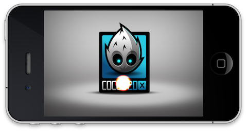

# Particle System粒子系统

## 介绍

“粒子系统”这个词是指一种计算机图形技术，这种技术可以利用大量的小精灵或其他图形对象来模拟某种“模糊毛茸茸”（fussy）的现象，这种画面感用传统的渲染技术（通常是）是很难复制的，通常用来形容高度纷乱复杂的系统、自然现象及/或化学反应过程等。

## Point vs Quad 点和方块

Cocos2d-x较早的版本中有两种粒子系统：方块（Quad）粒子系统和点（Point）粒子系统。

- CCParticleSystemQuad
- CCParticleSystemPoint

方块粒子系统（CCParticleSystemQuad）有以下功能是点粒子系统（CCParticleSystemPoint）所不支持的：

- 旋转粒子：粒子能够围绕轴旋转。“CCParticleSystemPoint”没有这个属性。
- 粒子可以有任意大小。在点粒子系统“CCParticleSystemPoint”中，如果粒子大小大于64，将会当作是64。
- 方块粒子系统整个系统可以使用缩小或放大（scale）属性进行调整。

因为点粒子系统“CCParticleSystemPoint”不支持批量节点“CCParticleBatchNode”，该系统现在已经被移出cocos2d-x粒子系统。

## CCParticleBatchNode

“CCParticleBatchNode”只能给一个纹理（或图像文件或图标集）提供引用。只有包含在纹理中的“CCParticleSystems”粒子系统才能添加到“CCSpriteBatchNode”中。所有添加到“CCSpriteBatchNode”的粒子系统“CCSpriteBatchNode”的“CCParticleSystems”都会在一个OpenGL ES绘制调用中绘制。如果“CCParticleSystems”没有添加到“CCParticleBatchNode”中，则需要对每个粒子系统进行OpenGL ES绘制调用，这样效率会更低。

### 创建方形粒子系统

	CCParticleSystemQuad* m_emitter = newCCParticleSystemQuad();
	m_emitter = CCParticleFire::create();

## 重力模式和半径模式
### 重力模式

重力模式下，粒子可以飞向或飞离中心点。该模式的有点在于可以产生非常动态、充满活力的效果。你可以通过以下代码来设置重力模式：

	// Gravity Mode
	this->m_nEmitterMode = kCCParticleModeGravity;
	
	// Gravity Mode: gravity
	this->modeA.gravity = ccp(0,-90);

### 以下属性仅在重力模式有效

- gravity (a CGPoint) 粒子系统的重力
- speed (a float) 粒子发射的速度
- speedVar (a float) 速度差异
- tangencialAccel (a float) 粒子的偏离加速度
- tangencialAccelVar (a float) 便宜加速度差异
- radialAccel (a float) 粒子的辐射加速度
- radialAccelVar (a float) 辐射加速度差异

### 半径模式

半径模式（Radius Mode）会导致粒子在一个圆圈内旋转。该模式可以用粒子创造出或向里或向外的螺旋效果。半径模式设置代码如下：

	// Radius Mode
	this->m_nEmitterMode = kCCParticleModeRadius;
	
	// Radius Mode: startRadius
	this->modeB.startRadius = 0;
	this->modeB.startRadiusVar = 0;//ccp(0,0);

### 以下属性仅在半径模式有效

- startRadius (a float) 粒子起始半径
- startRadiusVar (a float) 起始半径差异
- endRadius (a float) 粒子结束半径
- endRadiusVar (a float) 结束半径差异
- rotatePerSecond (a float) 每秒钟粒子围绕源位置旋转的角度
- rotatePerSecondVar (a float) 角度差异

## 所有模式通用属性

### 粒子通用属性

- startSize:  粒子起始大小（像素）
- startSizeVar
- endSize: 如果想让起始大小等于最终大小，请使用kCCParticleStartSizeEqualToEndSize 
- endSizeVar
- startColor (a ccColor4F)
- startColorVar (a ccColor4F)
- endColor (a ccColor4F)
- endColorVar (a ccColor4F)
- startSpin. 仅用于 CCParticleSystemQuad
- startSpinVar. 仅用于CCParticleSystemQuad
- endSpin. 仅用于CCParticleSystemQuad
- endSpinVar. 仅用于CCParticleSystemQuad
- life: 短时间内粒子存在的时间
- lifeVar:
- angle: 粒子的起始角度
- angleVar
- positon: (a CGPoint)
- posVar
- centerOfGravity (a CGPoint)

### 系统通用属性

- emissionRate (a float).  每秒发射粒子数量
- duration (a float). 粒子系统存在的秒数时间（与life属性不同）。若要无限长，请使用kCCParticleDurationInfinity
- blendFunc (a ccBlendFunc).  系统中使用的OpenGL混合功能
- positionType (a tCCPositionType). 使用kCCPositionTypeFree（默认1）自由移动粒子。或者使用kCCPositionTypeGrouped成组移动粒子。
- texture (a CCTexture2D).  粒子中用到的纹理

## 样例

cocos2d-x预装一些粒子，用户可在游戏开发中进行个性化设计。预装粒子列表如下：

- cocos2d-x里内置的预制粒子是可以在运行时自定义的.内置粒子列表:
- CCParticleFire: Point particle system. 使用重力模式.
- CCParticleFireworks: Point particle system. 使用重力模式.
- CCParticleSun: Point particle system. 使用重力模式.
- CCParticleGalaxy: Point particle system. 使用重力模式.
- CCParticleFlower: Point particle system. 使用重力模式.
- CCParticleMeteor: Point particle system. 使用重力模式.
- CCParticleSpiral: Point particle system. 使用重力模式.
- CCParticleExplosion: Point particle system. 使用重力模式.
- CCParticleSmoke: Point particle system. 使用重力模式.
- CCParticleSnow: Point particle system. 使用重力模式.
- CCParticleRain: Point particle system. 使用重力模式.

## 参考

[粒子](http://en.wikipedia.org/wiki/Particles)
[Cocos2d粒子系统](http://www.cocos2d-iphone.org/wiki/doku.php/prog_guide:particles)
