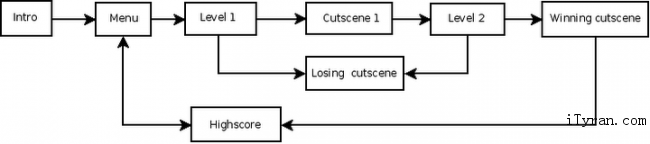

# 导演，场景，层，以及精灵的介绍
----

## Scenes ##

## 场景 ##

场景（对应的是CCScene类，由CCScene类实现器功能）更多是app中一个独立的工作流程。一些人可能会称其为“屏幕”或者“舞台”。你的游戏可以包含多个场景，但是在给定的同一时间段中，只能有一个场景是活跃有效的。

 

例如，游戏中可以有以下几个场景：简介场景，菜单场景，关卡1场景，关卡过渡1场景，关卡2场景，胜利场景，失败场景，分数排行榜场景。在这些场景中，你可以认为每个场景是相互分开的功能模块，用少量的“胶水”代码就可以关联这些场景。例如，当简介场景显示完毕就可以进入到菜单场景，如果玩家在关卡1场景中获得胜利就可以进入到关卡过渡1场景，反之，玩家家在关卡1场景中失败了，那么他就会进入失败场景。下图说明了游戏中场景之间是如何切换的：

一个cocos2d场景是由许多节点组成，这些节点作为子节点被添加到场景中。添加到场景中的子节点都是CCNode的子类，例如CCLayer和CCSprite，它们赋予场景外观表现和行为表现。典型的例子，你可以创建CCLayer的子类并将其添加到一个空白的CCScene实例中，来实现场景。然后，一CCNodes子类形式实现游戏中其他的图形和游戏对象，并将它们作为子节点添加到你创建的CCLayer中。

 

因为场景也是CCNode的子类，它们可以通过手动或者通过执行动作(CCActions)进行(场景)切换。更多信息请参照[动作](http://www.cocos2d-x.org/wiki/Actions)。

 

Cocos2d中提供了CCScene类簇，被称为过渡场景，CCTransitionScene为实现类。这些类为场景之间的转换提供特殊过渡效果——例如渐变，在从侧面滑动，等等。

## Director ##

## 导演 ##

CCDirector是单例对象，负责场景之间的导航。它知道当前那个场景是活动的，并且允许你通过取代当前场景，或者从场景栈中推进一个新的场景来改变场景。当你向栈中推进一个新的场景，CCDirector会暂停前一个场景，但是在内存中仍然保留它，当你将栈顶的场景推出，暂停场景会从最近的状态恢复。

CCDirector还负责初始化OpenGL ES。

## Layers ##

## 层 ##

CCLayer是处理玩家触摸事件的CCNode子类。层知道怎样渲染自己，也可能是半透明的，这样游戏玩家就可以看到当前层下面的其他层。CCLayers在你定义游戏的外观和行为方面非常有用，所以，你应该要花很多编程时间编写CCLayer子类,来完成做你需要实现的。

一般在CCLayer中定义触摸事件的处理者。CCLayer通过实现触摸事件的方法(ccTouchBegan, ccTouchMoved, ccTouchEnded, or ccTouchCancelled) 可以回应玩家的互动。这些触摸事件会传播到场景中的所有层，从前向后，直到某个层截获并处理这些触摸事件。

而复杂的应用程序会要求你定义定制CCLayer子类，cocos2d提供了一些预先定义的层。一些例子包括CCMenu(简单的菜单层)，CCColorLayer(填充色层)，CCLayerMultiplex(可以复用他的子节点，可以每次激活其中一个子节点，同时禁用其他的)。

层可以包含任何CCNode作为子节点，包括CCSprites(精灵), CCLabels(标签)，甚至其他的CCLayer对象。因为层是CCNode子类，层可以通过手动或者使用CCActions进行切换。更多信息请参照[动作](http://www.cocos2d-x.org/wiki/Actions)。

Multiple Layers Example:

Multiple Layers例子：

	CCLayerGradient* layer1 = CCLayerGradient::create(ccc4(255, 0, 0, 255), ccc4(255, 0, 255, 255));
	layer1->setContentSize(CCSizeMake(80, 80));
	layer1->setPosition(ccp(50,50));
	addChild(layer1);
	
	CCLayerGradient* layer2 = CCLayerGradient::create(ccc4(0, 0, 0, 127), ccc4(255, 255, 255, 127));
	layer2->setContentSize(CCSizeMake(80, 80));
	layer2->setPosition(ccp(100,90));
	addChild(layer2);
	
	CCLayerGradient* layer3 = CCLayerGradient::create();
	layer3->setContentSize(CCSizeMake(80, 80));
	layer3->setPosition(ccp(150,140));
	layer3->setStartColor(ccc3(255, 0, 0));
	layer3->setEndColor(ccc3(255, 0, 255));
	layer3->setStartOpacity(255);
	layer3->setEndOpacity(255);
	ccBlendFunc blend;
	blend.src = GL_SRC_ALPHA;
	blend.dst = GL_ONE_MINUS_SRC_ALPHA;
	layer3->setBlendFunc(blend);
	addChild(layer3);

## Sprites ##

## 精灵 ##

Cocos2d中的精灵和其他游戏引擎中的精灵相似。它是可以运动，旋转，缩放，执行动画，并接受其他转换。

CCSprite是精灵的实现类，可以拥有其他的精灵作为子节点。当父节点的精灵改变，子节点也随之改变。

因为精灵是CCNode的子类，可以手动或者使用CCActions改变精灵。更多信息请参照[动作](http://www.cocos2d-x.org/wiki/Actions)。
