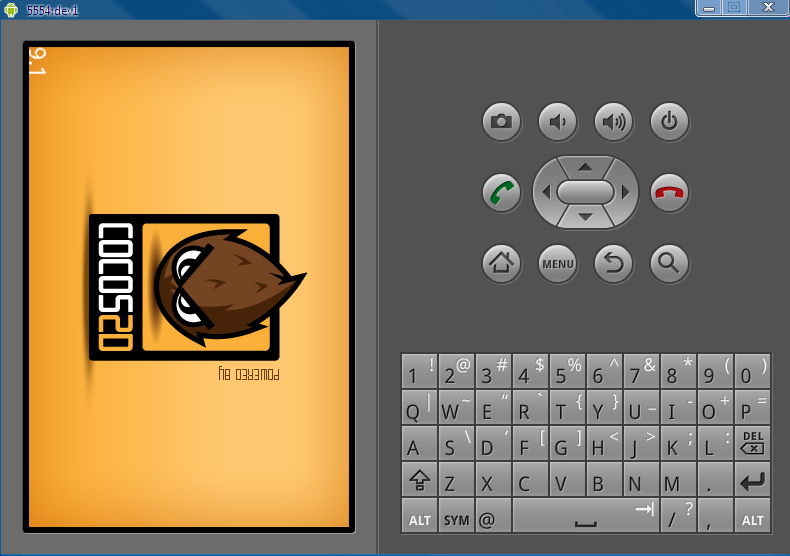

# 如何在NDK R4和R5中运行HelloWorld项目

本文档介绍在Windows或Linux系统中（使用Cygwin）如何利用NDK R4和R5运行HelloWorld样本项目。

## 1. 搭建开发环境

**注意：**

本文档没有介绍如何配置NDK。若需了解更多有关Android NDK及如何下载安装的信息，请参见以下网站：[http://developer.android.com/sdk/ndk/overview.html](http://developer.android.com/sdk/ndk/overview.html)

## 你的NDK版本必须为R4或R5

NDK-R4不支持STL。但我们的引擎需要依赖STL，所以我们要找一个支持STL的版本。该版本已经存在，你可以在以下网站下载：[http://www.crystax.net/android/ndk.php](http://www.crystax.net/android/ndk.php)。  

- 如果你想在crystax.net下载的NDK-R4中编译，请按照步骤1.1.1~1.1.3操作。
- 如果你想在NKD-R5中编译cocos2d-x测试文件，你可以使用Android.mk文件中的默认设置，直接跳到步骤1.2开始操作。


### 修改Cocos2dx/Android.mk文件

将以下代码: 

``` 
	# it is used for Android ndk-r4
	# if you build with nkd-r4, uncomment it 
	# LOCAL_LDLIBS := -L$(LOCAL_PATH)/platform/third_party/android/libraries \ 
	# -lGLESv1_CM -llog -lz \ 
	# -lpng \ 
	# -lxml2 \ 
	# -ljpeg \ 
	# -lskia 
	
	# it is used for ndk-r5 
	# if you build with ndk-r4, comment it 
	# because the new Windows toolchain doesn't support Cygwin's drive 
	# mapping (i.e /cygdrive/c/ instead of C:/) 
	LOCAL_LDLIBS := -L$(call host-path, $(LOCAL_PATH)/platform/third_party/android/libraries) \ 
	-lGLESv1_CM -llog -lz \ 
	-lpng \ 
	-lxml2 \ 
	-ljpeg \ 
	-lskia 
```

换成：

```
	# it is used for ndk-r4 
	# if you build with nkd-r4, uncomment it 
	LOCAL_LDLIBS := -L$(LOCAL_PATH)/platform/third_party/android/libraries \ 
	-lGLESv1_CM -llog -lz \ 
	-lpng \ 
	-lxml2 \ 
	-ljpeg \ 
	-lskia 
	
	# it is used for ndk-r5 
	# if you build with ndk-r4, comment it 
	# because the new Windows toolchain doesn't support Cygwin's drive 
	# mapping (i.e /cygdrive/c/ instead of C:/) 
	# LOCAL_LDLIBS := -L$(call host-path, $(LOCAL_PATH)/platform/third_party/android/libraries) \ 
	# -lGLESv1_CM -llog -lz \ 
	# -lpng \ 
	# -lxml2 \ 
	# -ljpeg \ 
	# -lskia 
```

### 修改HelloWorld/android/jni/helloworld/Android.mk文件

将以下代码：

```
	# it is used for ndk-r4 
	# if you build with nkd-r4, uncomment it
	# LOCAL_LDLIBS := -L$(LOCAL_PATH)/../../libs/armeabi -lcocos2d -llog -lcocosdenshion \ 
	# -L$(LOCAL_PATH)/../../../../cocos2dx/platform/third_party/android/libraries -lcurl 
	
	# it is used for ndk-r5 
	# if you build with ndk-r4, comment it 
	# because the new Windows toolchain doesn't support Cygwin's drive 
	# mapping (i.e /cygdrive/c/ instead of C:/) 
	LOCAL_LDLIBS := -L$(call host-path, $(LOCAL_PATH)/../../libs/armeabi) \ 
	-lcocos2d -llog -lcocosdenshion \ 
	-L$(call host-path, $(LOCAL_PATH)/../../../../cocos2dx/platform/third_party/android/libraries) -lcurl 
```

换成：

```
	# it is used for ndk-r4 
	# if you build with nkd-r4, uncomment it 
	LOCAL_LDLIBS := -L$(LOCAL_PATH)/../../libs/armeabi -lcocos2d -llog -lcocosdenshion \ 
	-L$(LOCAL_PATH)/../../../../cocos2dx/platform/third_party/android/libraries -lcurl 
	
	# it is used for ndk-r5 
	# if you build with ndk-r4, comment it 
	# because the new Windows toolchain doesn't support Cygwin's drive 
	# mapping (i.e /cygdrive/c/ instead of C:/) 
	# LOCAL_LDLIBS := -L$(call host-path, $(LOCAL_PATH)/../../libs/armeabi) \ 
	# -lcocos2d -llog -lcocosdenshion \ 
	# -L$(call host-path, $(LOCAL_PATH)/../../../../cocos2dx/platform/third_party/android/libraries) -lcurl 
```

### 修改build_native.sh文件

将“ANDROID_NDK_ROOT”路径设置为NDK-R4的路径

### 你的Cygwin版本应该在1.7及以上

这点在NDK文档中亦有说明。

### 注意

在为Android平台编程时，推荐使用Eclipse作为集成开发环境（IDE），不仅对cocos2d-x项目如此，对其他应用的开发也是如此，因为谷歌支持Eclipse集成开发环境。本网站的Android指南也是使用Eclipse作为例子，看起来简单易懂。其他集成开发环境（IDE）也可以，但在此不作讨论。

## 2. 编译

改变变量ANDROID_NDK_ROOT和COCOS2DX_ROOT的值，这两个变量的定义在$COCOS2DX_ROOT/HelloWorld/android/build_native.sh文件中有所说明。COCOS2DX_ROOT是指cocos2d-x的目录路径，其中包括Box2D、Chipmunk等库的路径。这部分将介绍如何在没有集成开发环境（IDE）的情况下编译项目。

### Linux平台

编译项目时，只要在Shell中运行**build_native.sh** 即可。在Linux平台中，这条指令的意思即打开一个外壳提示符（shell prompt）如bash。    
例如：

``` 
cd /usr/workspace/cocos2d-x/HelloWorld/android/ 
./build_native.sh 
This assumes that you put cocos2d-x in /usr/workspace, and left HelloWorld in its default location.
```

这意味着你将cocos2d-x放置于**/usr/workspace**路径下，使HelloWorld处于默认位置。


### Windows平台下使用Cygwin

这种方法在Windows平台中也适用，但是你需要用到Cygwin的bash外壳，而不是命令提示符。这是因为**build_native.sh**这个指令是专为Linux设计的shell脚本，它会调用Android-NDK中的一个Linux工具。即便是不使用cocos2d-x创建NDK应用，你还是得从Cygwin中调用ndk_build这个工具。build_native只是将编译项目的过程自动化了而已。

```
bash 
cd /cygdrive/c/cocos2d-x/HelloWorld/android 
./build_native.sh 
```

这意味着你将cocos2d-x放置于 C:/,路径下，使HelloWorld处于默认状态。

## 3. 运行

运行HelloWorld的方法与运行其他NDK样本程序的方法一样。

### 3.1 执行Build Project

这个步骤会自动生成R.java文件，同时还会编译java代码生成 .apk文件。

### 3.2 执行Clean Project

如果需要重新编译本地代码，将.so文件打包进.apk中，你需要执行这一步骤。除非第一次编译，步骤1不会将.so打包至.apk中。

### 3.3执行Run Project

点击项目右键，选择“run as”（运行方式），再选择“Android Application”（Android程序）。记得在运行项目前要启动模拟器。

## 4. Warning警告

在重新编译本地代码后应该执行“clean project”，否则最新的.so文件不会被打包至.apk中。



