# （2012年1月12日更新）如何在Bada系统运行HelloWorld及cocos2d-x测试项目

## 1. 从https://github.com/cocos2d/cocos2d-x网站下载最新cocos2d-x引擎。

## 2.使用Bada SKD 1.0.0及SDK 2.0.2编译所有项目
### 2.1 导入项目

点击'File'->'Import'->'bada'->'bada Application Project'->'Next'。如下图所示。     
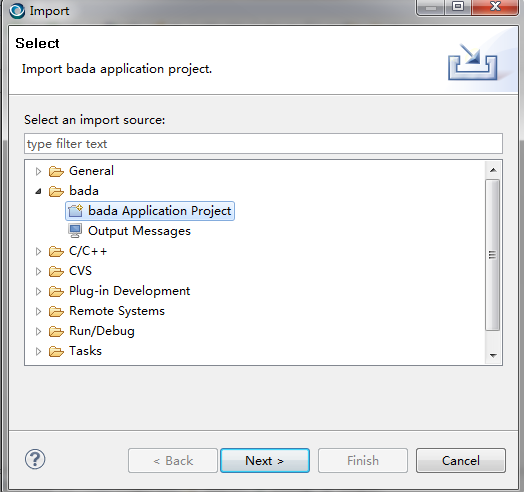

点击“Browse”按钮，选择cocos2d-x根路径，选上那些以“sdk1.0”结尾的项目，点击“finish”。至此，所有Bada 1.0项目均已经导入。

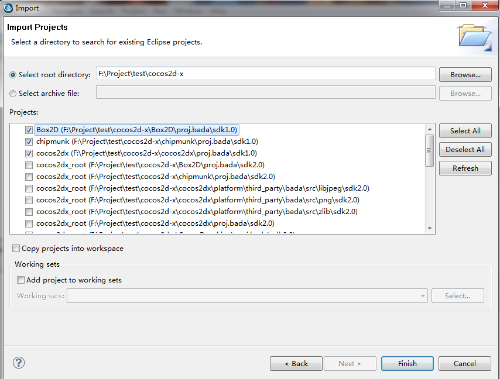

如果你在用Bada SDK 2.0，那请选上以“sdk 2.0”结尾的那些项目。

   

### 2.2 检查SDK路径

默认SDK根目录路径为“C:\bada\1.0.0”和“C:\bada\2.0.2”。如果你的SDK没有安装在此路径或你的语言模型（Model）不是“Wave_LP2”，请右键单击每一个项目，选择“Properties-> bada Build”以改变“SDK根目录路径”。

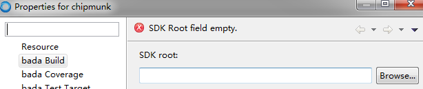       
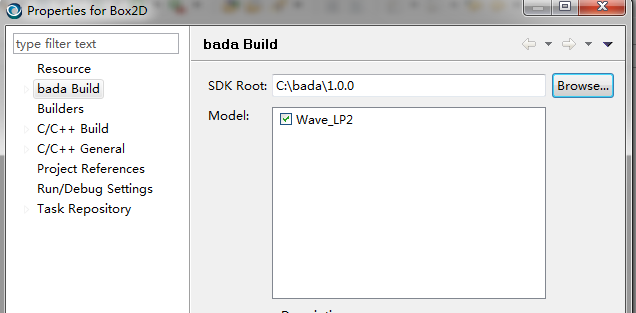

### 2.3 编译所有项目，运行HelloWorld及测试项目

#### 2.3.1 对所有项目修改“cocos2dx_root”路径

右键单击'Box2D' 项目 -> 'New' -> 'Folder' ->'Advanced>>' ->勾上“Link to folder in the file system”->单击“Variables…”->“New”，将“cocos2dx_root”变量值增加到cocos2d-x根目录路径下。单击“OK”，回到“Select Path Variable”对话框，再次单击“OK”，然后回到“New Folder”对话框，不要点击“Finish”，请点击“Cancel”按钮。现在所有项目都有了“cocos2dx_root”变量。然后选择所有项目，按F5键刷新。请记得刷新，否则集成开发环境在编译时无法找到源文件。
（只在cocos2d-1.0.1-x-0.10.0中使用。注意：在SDK 2.0中修改“cocos2dx_root”路径的方法与SDK 1.0相同。不同点在于在SDK 2.0 Bada集成环境中，你需要对编辑所有项目的“cocos2dx_root”变量。）

2012年1月12日更新：Bada SDK 2.0.2及2.0.3不需要设置变量“cocos2dx_root”。

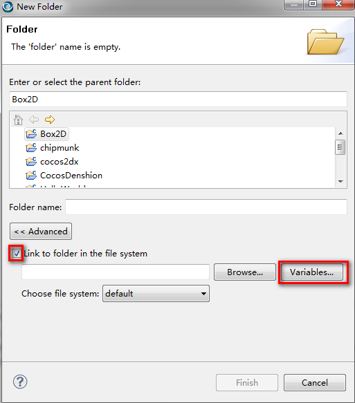    
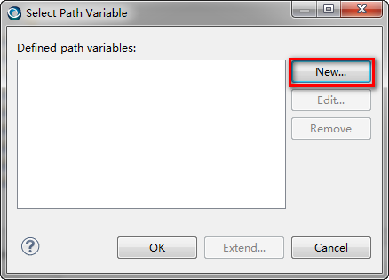    
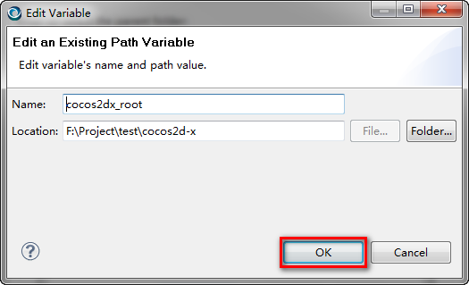     
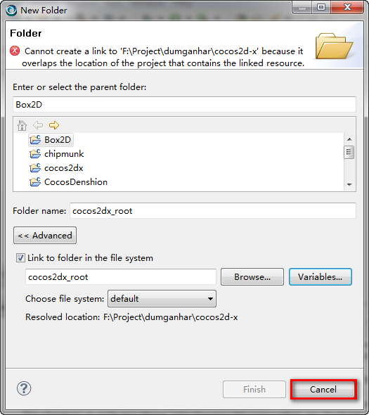    
   

#### 2.3.2 编译项目

默认状态下，编译项目用于“Simulator-Debug”（模拟器调试）之用。如果你想在自己的Bada设备中创建项目，你应该修改所有项目的配置“Build Configurations”。你可以按SHIFT键选择所有项目，单击右键，然后选择“Build Configurations”设置激活状态“Set Active”，如下图所示。

注意：因为Bada 1.0要用到模拟器，所以才会有“Simulator-Debug”、“Target-Debug”以及“Target-Release”选项。而在Bada 2.0中只有“Target-Debug”和“Target-Release”选项。

　　点击“Project”菜单，选择“Build All”，过几分钟后会生成所有库及exe文件。现在你可以尝试运行“HelloWorld”以及“TestCocos2dx”项目。

    
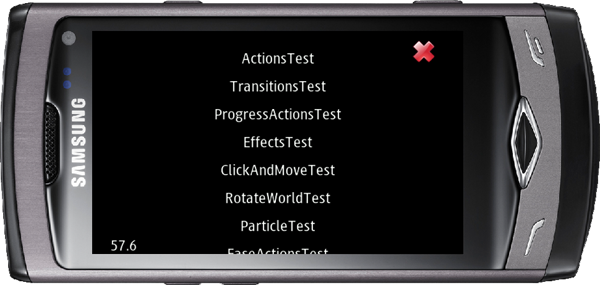

## 3. 编译Wave M（Bada 2.0）库，运行Helloworld及测试项目

如果你想要为Bada 2.0的设备编译库，你应该将每个项目都切换至“HVGA”模式，然后将附件中的文件（libc-newlib.so和libm-newlib.so）放到“C:\bada\2.0.2\Model\WaveHVGA\Target”文件夹中。现在请按照以上步骤编译运行你自己的项目吧！

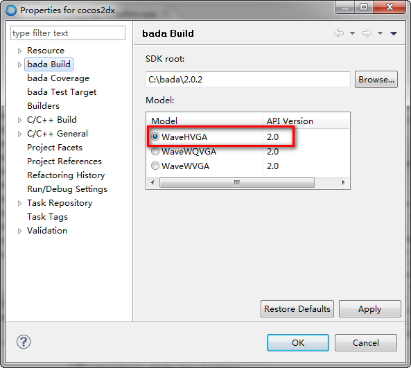   
    
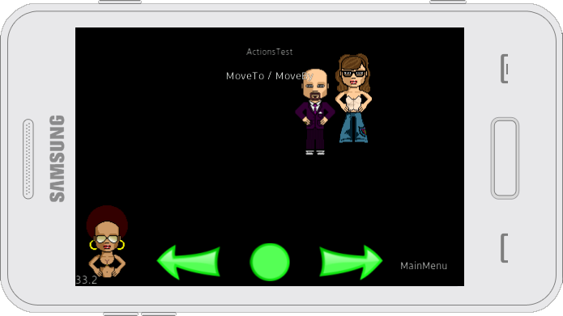 