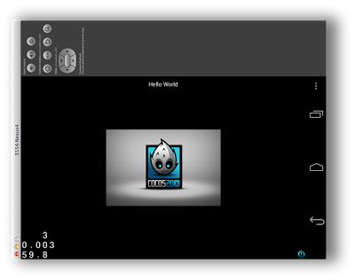
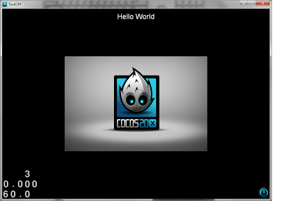

# 如何创建支持多平台的项目

本指南介绍如何创建新项目，如何编译及如何在不同的平台运行项目。

## 快速指南

**注意：以下指南仅对cocos2d-x v3.0-alpha0或更新版本有效。**

1. 下载解压[cocos2d-x](http://www.cocos2d-x.org/download)

2. 运行以下脚本
```
$ cd cocos2d-x/tools/project-creator
$ ./create_project.py -project PROJECT_NAME -package PACKAGE_NAME -language PROGRAMING_LANGUAGE
```

选项：   
-project PROJECT_NAME 项目名称，例如：MyGame   
-package PACKAGE_NAME 资源包名称，例如： com.MyCompany.MyAwesomeGame   
-language PROGRAMING_LANGUAGE 要使用的主要编程语言，应该为[cpp | lua | javascript]   

样本1: ./create_project.py -project MyGame -package com.MyCompany.AwesomeGame    
样本 2: ./create_project.py -project MyGame -package com.MyCompany.AwesomeGame -language javascript

## 详细信息

运行 create-project.py脚本会在 cocos2d-x/projects目录下生成编译游戏所需的文件，可用于iOS、Android、Linux、Mac及Windows系统。    
源代码文件会在所有不同的编译器中共享。每一个平台都有一个各自的编译器，但是注意iOS平台与Mac平台共享一个编译器。    
每个编译器都有各自的要求，并不是一直都能从一个host生成支持所有targets的编译文件。

- builder （编译器）是指编译游戏所需的工具链   
- host（主机）是指运行 builder（编译器）的操作系统     
- target（目标文件）是指支持特定平台的二进制（游戏）文件。   

## iOS及Mac要求

系统要求：

- iOS 5或者更新系统
- OS X 10.7或者更新系统

编译要求：

- OS X 10.7.5或者更新系统（支持10.8及10.9）
- Xcode 4.6.3或更新版本（支持5.0）

其他要求：

- 需要一个有效的 iOS developer account（iOS开发人员账号）以便在设备中测试游戏，同时用于在苹果iOS应用商店发布游戏。如果没有开发人员账号，则只能在iOS模拟器上测试游戏。
- 需要一个有效的 Mac developer account（Mac开发人员账号）以便在苹果Mac应用商店发布游戏。

安装好所有程序之后，你便可以通过以下代码运行并编译已生成的项目：

```
	# This is were your project game was generated
	$ cd cocos2d-x/projects/MyGame/proj.ios_mac
	
	# This will open the Xcode project for your game
	$ open HelloCpp.xcodeproj
```
从Xcode项目有中你可以生成iOS及OS X平台的target目标编译文件。

Xcode项目：    
    
在MAC上运行游戏示意图：    
    
在iOS模拟器上运行游戏：    
    
## Android平台要求
系统要求：

- Android 2.3或更新系统

编译要求：

- OS X 10.7或更新系统
- 或Windows 7或更新系统
- 或Ubuntu 13.04或更新系统[*]（详细信息参看下文）
- 以及
- [Android SDK](http://developer.android.com/sdk/index.html)
- [Android NDK](http://developer.android.com/tools/sdk/ndk/index.html)

其他要求：

- 安装正确的环境变量

**所需环境变量：**    

- COCOS2DX_ROOT：应指向cocos2d-x根目录
- ANDROID_SDK_ROOT：应指向Android SDK根目录
- NDK_ROOT：应该指向Android NDK根目录
- NDK_TOOLCHAIN_VERSION：应该使用的Android NDK工具链版本

此外推荐在路径中增加SDK  tools（工具）和platform-tools（平台工具）。
例如，编辑~/.profile（OS X系统）或 ~/.bashrc （Ubuntu系统）并增加以下几行命令：

```
export NDK_TOOLCHAIN_VERSION=4.8
export NDK_ROOT=~/bin/android-ndk-r9/
export ANDROID_SDK_ROOT=~/bin/adt-bundle-mac-x86_64-20130917/sdk
export COCOS2DX_ROOT=~/progs/cocos2d-x
export PATH="${PATH}:$ANDROID_SDK_ROOT/tools:$ANDROID_SDK_ROOT/platform-tools" 
```

**更新Android项目**

设定完所有变量之后，进入已经创建的项目目录，执行以下命令更新项目文件：

```
	$ cd cocos2d-x/project/MyGame/proj.android/
	
	#
	# Determine which targets are installed
	# As you can see, there is only one target and its name is "android-18" 
	#
	$ android list targets
	Available Android targets:
	----------
	id: 1 or "android-18" 
	     Name: Android 4.3
	     Type: Platform
	     API level: 18
	     Revision: 2
	     Skins: HVGA, QVGA, WQVGA400, WQVGA432, WSVGA, WVGA800 (default), WVGA854, WXGA720, WXGA800, WXGA800-7in
	     ABIs : armeabi-v7a
	
	#
	# Update the project with the correct target
	# ( The following 2 steps should only be done once)
	#
	$ android update project -p ./ --target android-18
	$ android update project -p ../../../cocos2dx/platform/android/java --target android-18
```

现在即可编译项目：

```
	# Builds the c++ code
	$ ./build_native.sh
	
	# Builds some Java files and generates the executable
	$ ant debug
	
	$ cd bin
	
	# Installs the executable on a device (if attached), otherwise on an emulator (if it is running)
	$ adb install MyGame-debug.apk
```

在Android模拟器上运行游戏：    
       
**其他Ubuntu要求：**

- 需要安装Oracle Java
- 如果使用Ubuntu 64位系统，则需要安装ia32 libraries库。

## Windows Builder编译器要求

系统要求：

- Windows 7或更新系统

编译要求：

- Windows或更新系统。
- Visual Studio 2012 Express或更新版本（支持Ultimate终极版和Professional专业版。）

其他要求：

- 需要下载安装 Python 2.7

安装完上述要求程序之后，你便可执行以下命令运行编译已生成的项目：

```

### 项目被创建的位置
C:\> cd cocos2d-x\projects\MyGame\proj.win32


### 打开项目
C:\cocos2d-x\projects\MyGame> start HelloCpp.sln
```

Visual Studio示意图:     
    
在Windows 7上运行游戏    


## Linux编译器要求

系统要求：

- Ubuntu 13.04或更新系统

编译要求：

- Ubuntu 13.04或更新系统
- gcc 4.7 / clang 3.3或更新版本。执行install-deps-linux.sh脚本即会自动安装。

其他要求：

- 只要执行cocos2d-x目录中的install-deps-linux.sh 脚本即可。

例如：  

```
$ cd cocos2d-x
$ ./install-deps-linux.sh
```

安装完上述程序之后，你便可执行以下命令运行编译已生成的项目：

```
	# This is were your project game was generated
	$ cd cocos2d-x/projects/MyGame/proj.linux
	
	# This will compile your game
	$ ./build.sh
	
	# This will run your game
	$ ./bin/debug/MyGameCpp
```

在Linux平台运行游戏：

