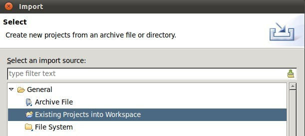
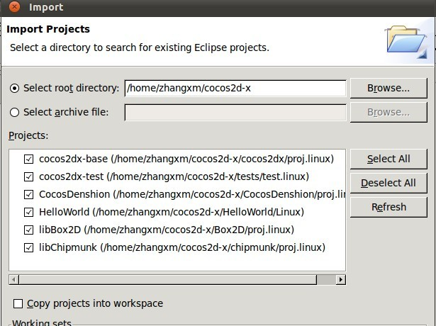

# 如何在Linux平台运行HelloWorld及测试项目

Cocos2d-x引擎自cocos2d-1.0.1-x-0.9.2版本以来支持Linux平台。
本文介绍如何在Linux及Android模拟器中运行HelloWorld及测试项目。
运行环境为Ubuntu 11.04 + eclipse3.7。

## 1. 搭建环境
### 1.1 获取cocos2d-x源代码
a) 执行以下命令从git获取最新的cocos2d-x源代码（不稳定）：

```
git clone https://github.com/cocos2d/cocos2d-x.git
```

b) 从以下网站下载发行版源代码（稳定）：     
[http://www.cocos2d-x.org/projects/cocos2d-x/wiki/Download](http://www.cocos2d-x.org/projects/cocos2d-x/wiki/Download)

### 1.2 安装Android SDK，使用Eclipse作为集成开发环境

安装Android SDK请参见 [http://developer.android.com/sdk/index.html](http://developer.android.com/sdk/index.html)。

请用以下方法安装JDK

```
sudo add-apt-repository "deb http://archive.canonical.com/ lucid partner" 
sudo apt-get update
sudo apt-get install sun-java6-jdk
```

### 1.3. install cdt for eclipse to compile c/c++ codes in eclipse在Eclipse中安装CDT以编译c/c++代码

打开Eclipse依次单击Help -> Install New Software... -> Add...如下图所示。


CDT链接为 [http://download.eclipse.org/tools/cdt/releases/helios](http://download.eclipse.org/tools/cdt/releases/helios)。
### 1.4. install needed libs 安装所需的库
```
sudo apt-get install  libgl1-mesa-dev libglfw-dev freeglut3-dev libzip-dev
```

如果执行该命令遇到问题，可尝试在安装库之前运行以下命令：    
```
sudo apt-get -f
```
## 2. 用makefile运行
首先，编译所有库    
```
cd $COCOS2DX
./build_linux.sh
```

COCOS2DX是cocos2d-x的根目录。用makefile运行很简单。如下：      
```
cd $HELLOWORLD/linux/
make
./HelloWorld
```

HELLOWORLD是helloworld的根目录，在本机环境的路径为“/home/zhangxm/cocos2d-x/HelloWorld”。你可以用相同的方法运行测试项目，很简单吧？

## 3. 用Eclipse运行

首先，导入现存项目，依次单击File -> Import...。如下所示：



然后选择cocos2d-x根目录。



现在你可以编译运行HelloWorld及测试项目。

- 编译    
右键单击HelloWorld项目，选择“Build Project”（编译项目）
- 运行      
右键单击HelloWorld项目，选择“Run as”（运行项目），再选择“Local c/c++ Application”即可运行。

## 4. 在Android模拟器上运行

请参见[如何在NDK R4和R5中运行HelloWorld项目](http://)。