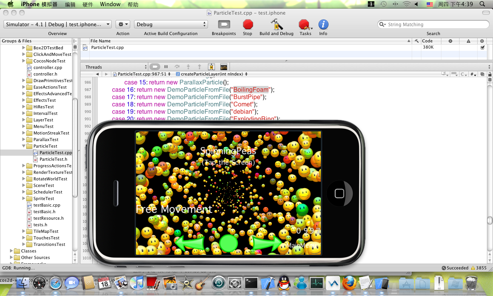

# 如何在iPhone模拟器上运行cocos2d测试项目

本文介绍如何在iPhone模拟器上运行cocos2d测试项目。
## 下载源代码

从Github下载源代码。地址为：[http://github.com/cocos2d/cocos2d-x](http://github.com/cocos2d/cocos2d-x)

下载完成后，你会发现一个“tests/test.iphone”文件夹。进入该文件夹，双击“test.iphone.xcodeproj”文件即可在Xcode中浏览代码。编译运行，便会得到以下结果。[OSX环境部署打开如下，选择Test Cpp iOS编译执行就可以看到效果了cocos2d-x-3.0alpha0-pre/samples/samples.xcodeproj ]
## 说明

“HelloWorld”样本代码已经在以下环境下测试：

机器名称：Mac mini       
操作系统：Mac OS X 10.6.4            
CPU：Intel Core 2 Duo         
Xcode版本：3.2.4         
iOS SDK：4.1 & 3.2        

样本代码在SDK 4.1及3.2上编译。     
其他SDK版本也应该没问题，但不确定。           
如果有什么问题，欢迎在论坛中发帖告知。        
             

