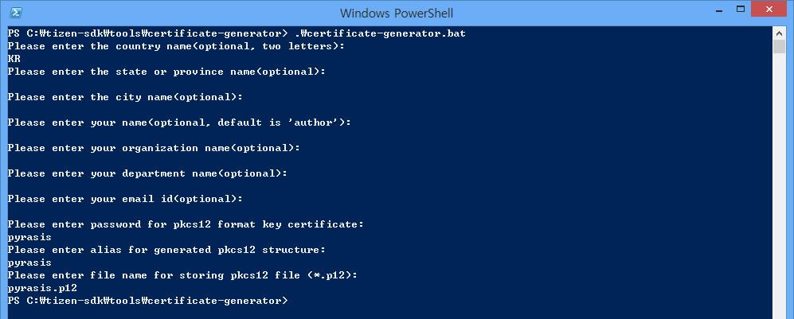
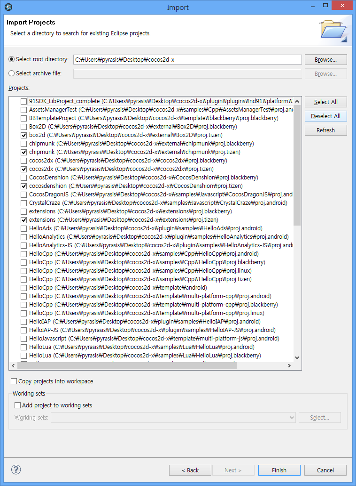
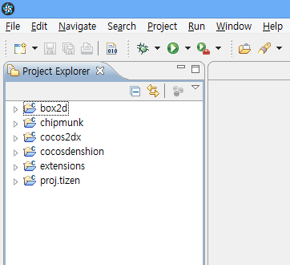
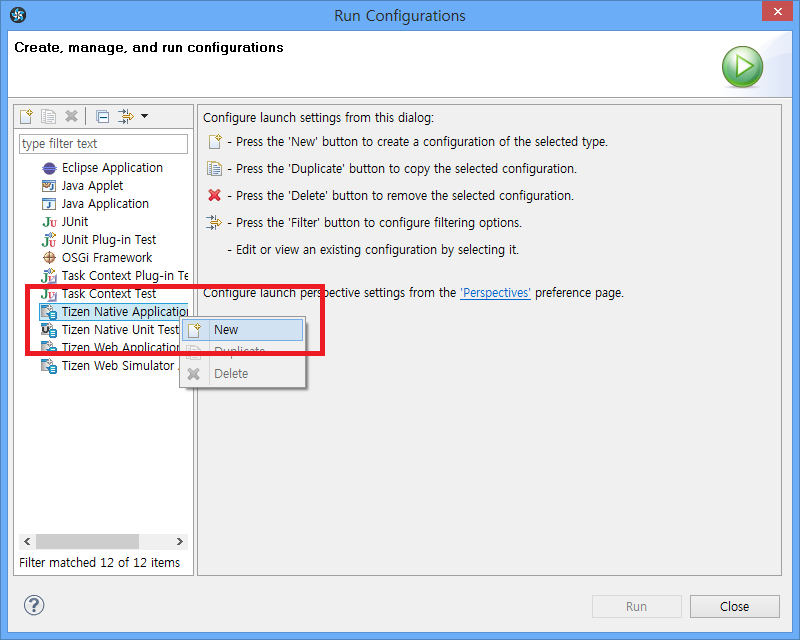
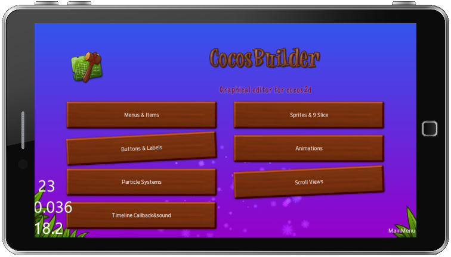
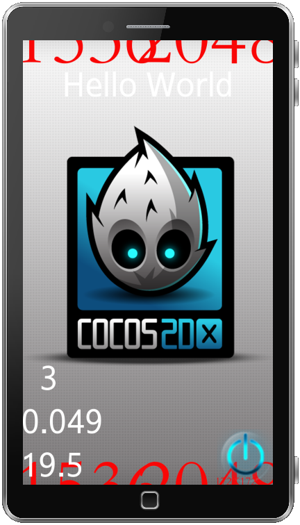

# 如何在Tizen平台中运行HelloWorld及测试项目

取出（check out）开发分支（develop branch）。   

## 1. 从[https://github.com/cocos2d/cocos2d-x](https://github.com/cocos2d/cocos2d-x)下载最新的cocos2d-x引擎
## 2. 创建证书文件    
运行{TIZEN_SDK}/tools/certificate-generator/certificate-generator.bat or .sh文件。  



点击'Window'->'Preference'->'Tizen SDK'->'Secure Profiles'

1. 点击“Add”按钮设置资料
2. 设置“Certificate”（证书）路径
3. 输入密码    

## 3. 用Tizen SDK 2.1编译所有项目
### 3.1 创建工作空间
```
Create Workspace in cocos2d-x/samples/Cpp/{SampleName}
``` 

或者     
```
Create Workspace in cocos2d-x/samples/Cpp/TestCpp
```

如果设置路径不正确，则无法使用断点（breakpoint）

### 3.2 导入项目

点击'File'->'Import'->'Tizen'->'Native Projects'->'Next'

 

点击“Browse”选择cocos2d-x根路径，勾上以“proj.tizen”结尾的项目，点击“Finish”完成。         
      
   
```
cocos2d-x/external/Box2D/proj.tizen
cocos2d-x/external/chipmunk/proj.tizen
cocos2d-x/cocos2dx/proj.tizen
cocos2d-x/CocosDenshion/proj.tizen
cocos2d-x/extenshions/proj.tizen
cocos2d-x/samples/Cpp/TestCpp/proj.tizen
```



### 3.3 复制资源文件

将cocos2d-x/samples/Cpp/HelloCpp/Resources/*.*复制到cocos2d-x/samples/Cpp/HelloCpp/proj.tizen/res目录下。

### 3.4 编译所有项目，运行测试项目

右键单击“proj.tizen”项目，选择“Run as”（运行方式）再选择“Run Configurations”（运行配置）


右键单击“Tizen Native Application”然后选择“New”。



点击“Run”。


TestCpp测试项目正在运行。如图所示。

    
    
    
     
     

如果你是在“cocos2d-x/samples/Cpp/HelloCpp”路径下创建工作空间并导入“proj.tizen”项目，你会看到如下所示。


