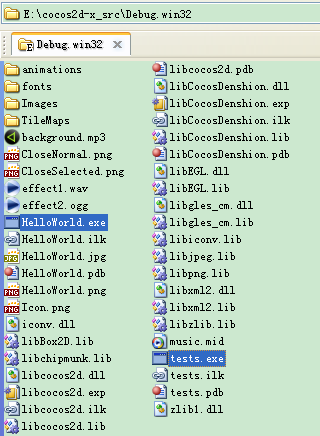
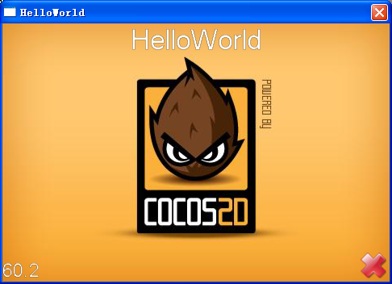
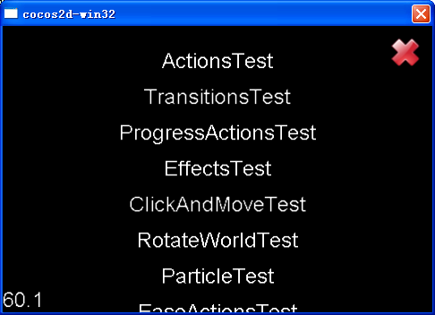
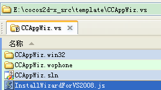
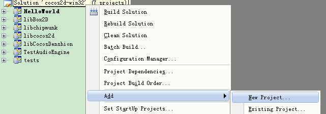
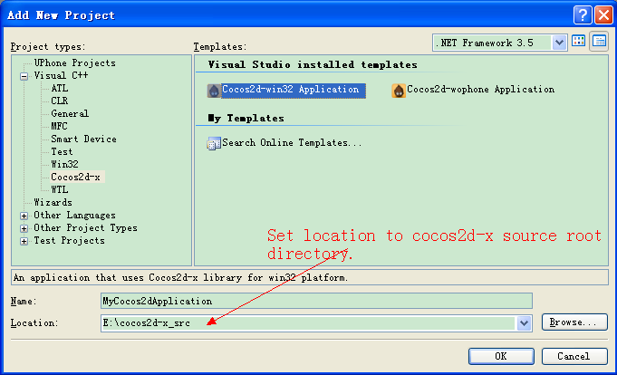
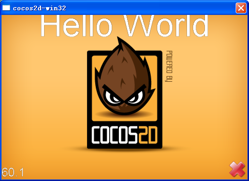

# Visual Studio环境Cocos2d-x Application Wizard用户指南

## 0. Overview概览

- 使用Wizard工具可以生成**Cocos2d-x-win32**项目。
- Wizard支持Visual Studio 2008、Visual Studio 2010(0.8.0及更新版)、Visual C++2008 Express(0.8.0及更新版) 以及Visual C++ 2010 Express(0.8.0及更新版)

## 1. 首先从Github获取cocos2d-x源代码
源码存档请点击：下载。   
源代码库请点击：[https://github.com/cocos2d/cocos2d-x](https://github.com/cocos2d/cocos2d-x)。

## 2. 编译Cocos2d-x Solution文件
###Win32平台

运行“Build-win32.bat ”脚本，该脚本会自动适配vc2008或者vc2010编译solution文件。       
或者打开cocos2d-win32 sln文件，在集成开发环境中编译solution文件。     
cocos2d-win32.vc2008.sln文件用于编译Win32平台的VC2008 solution文件。    
cocos2d-win32.vc2010.sln文件用于编译Win32平台的VC2010 solution文件。

确认（confirm）二进制目标文件（如在Win32平台）
Cocos2d-win32二进制文件在名为“Debug.win32”或“Release.win32”的文件夹。
Cocos2d-wohone二进制文件在PRJ_TG3\LIB\Win32Lib路径下。

运行HelloWorld及测试应用（Win32平台下示例）。

     
 

## 3. 在MSVC++开发环境中安装cocos2d-x Application Wizard

运行“install-templates-msvc.bat”会自动安装cocos2d-x Application Wizard工具。

每个MSVC集成开发环境的脚本文件位于“ \template\msvc\”目录。

以“Express”为后缀的脚本文件用于安装VC++快速版本的Wizard工具。

4. 增加新应用项目

警告：如果想要在自己的solution文件中创建项目（project），请修改项目的输出目录（Output Directory）属性，并将值“$(SolutionDir”换为“..\”。

    
     
    
    

5. 编译运行新Cocos2d-x项目

     
 

