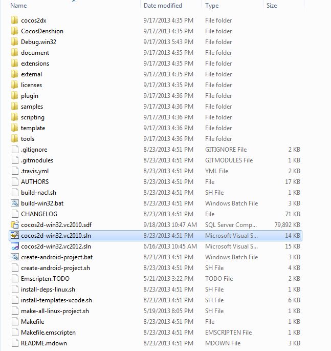
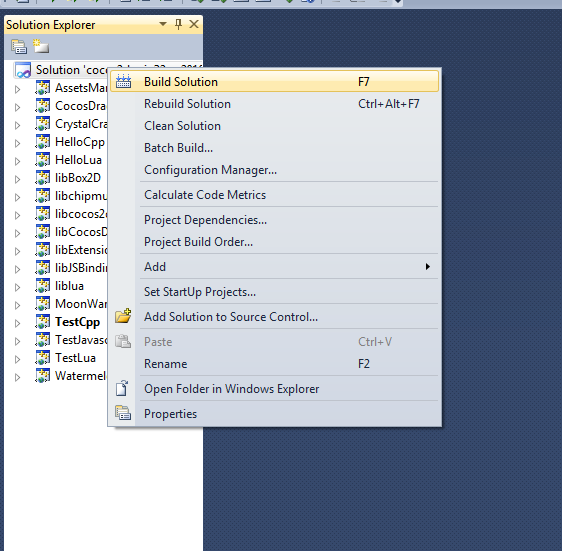
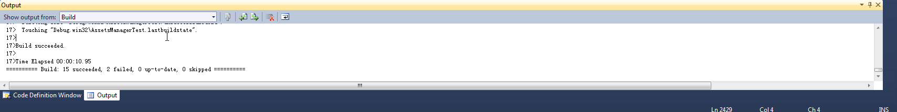
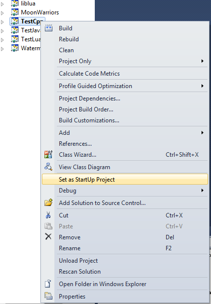
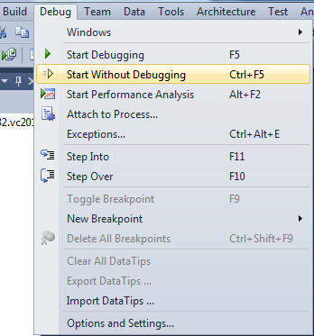
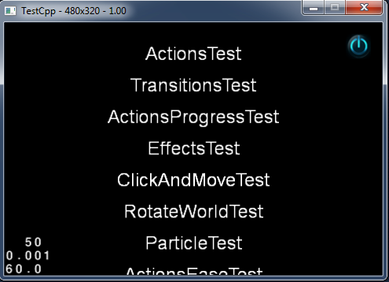
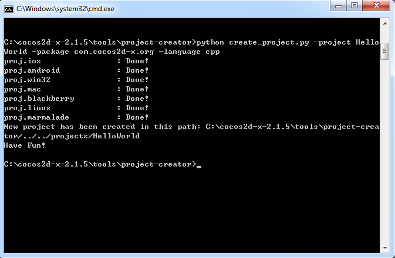
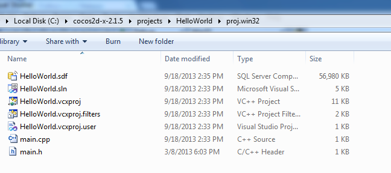

# 搭建WIN32开发环境

**方法：在VS 2010中使用 cocos2d-x 2.15版本引擎。**

### 1. 工具准备

在Windows平台使用cocos2d-x创建游戏之前，首先要搭建开发环境。需要安装工具包括VS 2010、cocos2d-x 2.15版本（下载地址https://code.google.com/p/cocos2d-x/downloads/list）以及phython 2.72版本（下载地址http://www.python.org/download/releases/2.7.2/）。

### 2. 配置

在工作目录下解压下载的cocos2d-x-2.15压缩文件，然后将“cocos2d-win32.vc2010.sln”文件导入至“workingdirectory/cocos2d-x-2.15”下的VS2010中，如下图所示。    
      
然后选择“Build Solution”如下图所示。    
      
大概10分之后，如果在输出窗口（Output Window）看到如下画面，那恭喜编译成功。    
      

### 3. 测试
下面进行测试。选择“TestCpp”然后选择“Set as StartuP Project”如下图所示。

选择“Starting Debugging”如下图所示。

### 4. 创建WIN32平台Cocos2d-x项目。

安装下载的python工具。进入cocos2d-x-2015目录，然后用命令行工具运行“create_project.py”，最后你会看到如下所示。

查看目录你会发现在“Cocos2d-x-2.15”中生成了“projetcs”新文件，同时在“Cocos2d-x-2.15/projects”目录中会出现新建的“HelloWorld”新项目。然后将“proj.win32”文件导入VS2010中即可。祝编程愉快。

