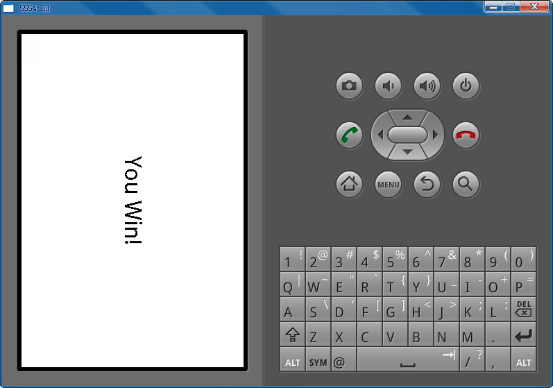
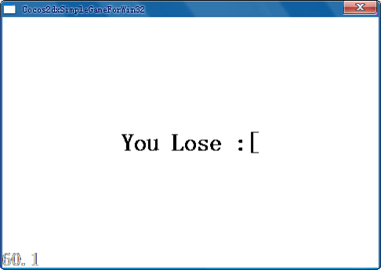

# 第七章——锦上添花技巧部分

以上章节基本可以完成简单的游戏开发，但为了让游戏看起来更专业，我们可以增加一些装饰。

本章将会介绍如何增加新场景。如果怪物全部消灭，可以在屏幕上显示“You Win”（你赢了）的字样。如果有怪物冲出左边屏幕，可以显示“You Lose”（你输了）字样。 

现在介绍如何在Classes目录中创建 “GameOverScene.cpp”和“GameOverScene.h”文件。
## GameOverScene.h

创建“GameOverScene.h”文件：

	#ifndef GAMEOVERSCENEH_
	#define GAMEOVERSCENEH_
	
	#include "cocos2d.h"
	
	class GameOverLayer : public cocos2d::CCLayerColor
	{
	public:
	GameOverLayer():label(NULL) {};
	virtual ~GameOverLayer();
	bool init();
	CREATEFUNC(GameOverLayer);
	
	void gameOverDone();
	
	CC_SYNTHESIZE_READONLY(cocos2d::CCLabelTTF*, _label, Label);
	
	};
	
	class GameOverScene : public cocos2d::CCScene
	{
	public:
	GameOverScene():layer(NULL) {};
	~GameOverScene();
	bool init();
	CREATEFUNC(GameOverScene);
	
	CC_SYNTHESIZE_READONLY(GameOverLayer*, _layer, Layer);
	
	};
	
	#endif // GAMEOVERSCENEH_

*导入提示：*

1. 类成员函数无需在头文件声明便可在.m文件中实现，但是在C++无法这么做，所以在“GameOverScene.h”文件中有“bool init();”部分。
2. “node()”函数用起来很方便，因为这个函数融合了“new”、“ init”及“autorelease”等。但是在C++中没有像“self(objc)”这样的关键字，所以“CCLayer::node()”和“CCScene::node()”函数应该在各自的继承类中实现。“node()”的实现方法也类似，通过构建“LAYER_NODE_FUNC”和“SCENE_NODE_FUNC”这两个宏来实现会更简单。如果要用这两个宏，“init()”函数必须在继承类中实现。
3. 关于构造器（constructor）和“init()”函数。Cocos2d-x不会将objc中的“init()”函数直接导入到C++的构造器中，因为C++构造器没有返回值。在这种情况下，我们得使用“try-catch”（捕获异常）语句来处理异常，但是Android SDK不支持“try-catch”。Cocos2d-x会分两个阶段初始化类，首先调用构造器，然后再在“init()”函数中初始化。这种方法也用于iOS平台界面的设计如“[[NSString alloc] init]”以及三星Bada平台C++类的使用。
4. “_label”和“_layer”的“setter”和“getter”在objc的“@synthesize”中实现。我们已经在“cocos2dx\include\Cocos2dDefine.h”文件中创建了一些宏以模拟“@property”和“@synthesize”。在以上代码中，“CCX_SYNTHESIZE_READONLY”定义只有一个“getter”而没有“setter”的只读成员变量。在C++中，“inline”函数只能在头文件中定义，所以一般而言“@synthesize”是在头文件中实现的。

## GameOverScene.cpp

创建“GameOverScene.cpp ”文件：

	#include "GameOverScene.h"
	#include "HelloWorldScene.h"
	
	using namespace cocos2d;

	bool GameOverScene::init()
	{
		if( CCScene::init() )
		{
			this->_layer = GameOverLayer::create();
			this->_layer->retain();
			this->addChild(_layer);
			
			return true;
		}
		else
		{
			return false;
		}
	}
	
	GameOverScene::~GameOverScene()
	{
		if (_layer)
		{
			_layer->release();
			_layer = NULL;
		}
	}
	
	
	bool GameOverLayer::init()
	{
		if ( CCLayerColor::initWithColor( ccc4(255,255,255,255) ) )
		{
			CCSize winSize = CCDirector::sharedDirector()->getWinSize();
			this->_label = CCLabelTTF::create("","Artial", 32);
			_label->retain();
			_label->setColor( ccc3(0, 0, 0) );
			_label->setPosition(ccp(winSize.width/2, winSize.height/2));
			this->addChild(_label);
			
			this->runAction( CCSequence::create(
	                                CCDelayTime::create(3),
	                                CCCallFunc::create(this, 
	                                callfunc_selector(GameOverLayer::gameOverDone)),
	                                NULL));
			
			return true;
		}
		else
		{
			return false;
		}
	}
	
	void GameOverLayer::gameOverDone()
	{
	    CCDirector::sharedDirector()->replaceScene(HelloWorld::scene());
	}
	
	GameOverLayer::~GameOverLayer()
	{
		if (_label)
		{
			_label->release();
			_label = NULL;
		}
	}

在“GameOverScene.cpp”文件中有两个元素，一个是场景，一个是层。场景可以包括多个层。在本游戏中，只有一个层，在场景中间有“You Win”或“You Lose”的字样，会显示3秒钟。

*导入提示*

1. 注意“GameOverLayer._label”和“GameOverScene._layer”层，这两个层是在objc的属性（@property）中定义的，这意味着这两个层是保留的，因此应该在“dealloc”函数中释放。同理由于在“GameOverLayer”和“GameOverScene”中的“init()”函数中存在“retain()”函数，所以在“~GameOverLayer()”和“~GameOverScene()”函数中应该分别调用“release()”函数来释放。
2. “NSAutoReleasePool”也会在cocos2d-x中移植。这个“Garbage Collector”（垃圾收集器）对C++编程很有帮助，在iOS中的用法相同，更多信息请参考[http://developer.apple.com/library/ios/#documentation/cocoa/reference/foundation/Classes/NSAutoreleasePool_Class/Reference/Reference.html](http://developer.apple.com/library/ios/#documentation/cocoa/reference/foundation/Classes/NSAutoreleasePool_Class/Reference/Reference.html)。             
在cocos2d-x中有两种情况要调用“release()”函数：   
	- 物体被我们手动更新了。如“CCSprite *sprite = new CCSprite();”。     
	- 物体由静态函数创建，如“CCSprite *sprite = CCSprite::spriteWithFile(...)”。在这种情况下，我们不必释放，但是当调用“sprite->retain()”函数时，同时也应该调用“sprite->release()”函数。

什么情况下应该调用“GameOverScene”？当一定数量的怪物被全部消灭或者有一只怪物逃走时。
我们在“HelloWorldScene”中增加一个变量来计算消灭的怪物数量。

	// cpp with cocos2d-x
	protected:
	int _projectilesDestroyed;

然后在“HelloWorld::HelloWorld()”中初始化该变量。

	// cpp with cocos2d-x
	_projectilesDestroyed = 0;

将“GameOverScene.h”文件包含进“HelloWorldScene.cpp”文件中。

	// cpp with cocos2d-x
	#include "GameOverScene.h"    

为循环“HelloWorld::update()”函数，在“targetsToDelete”中执行“removeChild(target)”后，增加以下代码检查赢家情况。

	// cpp with cocos2d-x
	_projectilesDestroyed++;                       
	if (_projectilesDestroyed >= 5)
	{
	  GameOverScene *gameOverScene = GameOverScene::create();
	  gameOverScene->getLayer()->getLabel()->setString("You Win!");
	  CCDirector::sharedDirector()->replaceScene(gameOverScene);
	}

增加以下代码检查“if (sprite->getTag() == 1)”条件下的“spriteMoveFinished()”函数确认输家情况。

	// cpp with cocos2d-x
	GameOverScene *gameOverScene = GameOverScene::create();
	gameOverScene->getLayer()->getLabel()->setString("You Lose :[");
	CCDirector::sharedDirector()->replaceScene(gameOverScene);    

## Android开发注意

为顺利在Android编译，请不要忘了将“GameOverScene.cpp”文件增加到“Android.mk”文件中如：

	LOCAL_SRC_FILES := AppDelegate.cpp \
	HelloWorldScene.cpp \
	GameOverScene.cpp

许多开发人员会忘记这一步，因此在Android编译时遇到错误。

## Linux开发注意

为顺利在Linux编译，请将“GameOverScene.cpp”增加到“proj.linux”目录的“Makefile”中如：

	SOURCES = main.cpp \
	        ../Classes/AppDelegate.cpp \
	        ../Classes/GameOverScene.cpp \
	        ../Classes/HelloWorldScene.cpp

## 尽情享受

现在万事已备，编译并运行，所有的附加效果即会显示，怪物、子弹、背景音乐以及赢输条幅。
至此，整个游戏开发完成！

iPhone界面

android界面

win32界面
 

