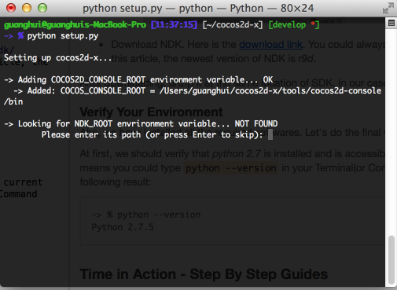
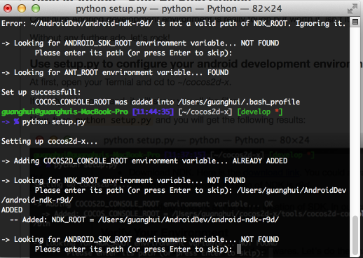

## How to Run Cocos2D-X Samples on Android

Let's take MacOS as an example, the process in win32 and linux is more or less the same.

### Prerequisite

#### Download Cocos2D-X
At first, you should download [cocos2d-x](http://cocos2d-x.org/download) and unzip it. We could simply unzip it on the root directory of your home folder.

Double click the folder *cocos2d-x* and you will find a lot of files and folders. Here it the screenshot:


Before we configuring our development environment, let's download some dependency software at first.

#### Download JDK, SDK and NDK
Since we are trying to develop Android games, so Java is a must have toolkit.

- Open Your Terminal(You can hit Control-Space to open Spotlight and enter "Terminal" plus "Enter" key), input the following commands to verify whether your machine support java or not.

```
java -version
```
If the following lines shown on your Terminal then you may have installed [JDK](http://www.oracle.com/technetwork/java/javase/downloads/index.html) before.

(Note, the java version number maybe different, but it's no problem, cocos2d-x, you could upgrade your java. We recommend you install JDK 1.6 or 1.7)

```
java version "1.7.0_51"
Java(TM) SE Runtime Environment (build 1.7.0_51-b13)
Java HotSpot(TM) 64-Bit Server VM (build 24.51-b03, mixed mode)
```
- Download the Android SDK. If you are using Mac, click [this link](https://developer.android.com/sdk/index.html?hl=sk) to download *ADT Bundle for Mac*.

The bundle includes the newest Android SDK version plus an Eclipse version with Android Development Tool installed. So we don't need to download an extra Eclipse and install
the ADK any more.

After downloading, unzip it at ~/AndroidDev directory. The folder contains two folders: *sdk* and *eclipse*. The first one contains some toolkits and a almost newest Android SDK,
the other is an Eclipse version with ADT installed.

You could launch the Eclipse and install another SDK versions. Here is a sample:


- Download NDK. Here is the [download link](https://developer.android.com/tools/sdk/ndk/index.html). You could always prefer the newest version. When we are writing this article, the newest version of NDK is *r9d*. 

After downloading, unzip it at the same location of SDK. In our case, it is under *~/AndroidDev* directory.


#### Verify Your Environment
Aha, we have installed all the required softwares. Let's do the final verification.

At first, we should verify that *python 2.7* is installed and is accessible under the current user's environment which means you could type `python --version` in your Terminal(or Command Line on win32) and it gives you the following result:

```
-> % python --version
Python 2.7.5
```

If there is a prompt like "command not found: python", you should install it. We recommend you install python with homebrew.

```
brew install python
```
If the homebrew isn't be installed on your computer, please refer to [this link](http://brew.sh/) for more information.

At last, let's install *ant* tools. You are a homebrew user, you can simply type the following command in your terminal to install it:

```
brew install ant
```


### Time in Action - Step By Step Guides
Configure Andriod development environment is really tough but worth it, isn't it? 

Without any further ado, let's rock!
#### Use setup.py to configure your android development environment
At first, open your Termial and cd to *~/cocos2d-x*.

If you type *ls* command, it will show you all the files. 

Now, type ` python setup.py` and you will get the following results:



It added the *COCOS2D_CONSOLE_ROOT* environment variable to point to the *bin* directory under *~/cocos2d-x/tools/cocos2d-console* directory.


And then it looked for an *NDK_ROOT* environment variable. If you haven't configured this environment before, it will prompts you the environment variable is not found and you should enter the path of your NDK.

In our case, we could input `/Users/guanghui/AndroidDev/android-ndk-r9d/`. 

*Caution: You must expand the ~ sign to your own user directory path. Otherwise, the scripts will fail due to error path value.*

Here is the screenshot:



Now it's time to repeat the last procee to configure the *ANDROID_SDK_ROOT*. You can simply input `/Users/guanghui/AndroidDev/adt-bundle-mac-x86_64-20130522/sdk/`. The adt-bundle-mac-x86_64-xxxx, the xxxx number maybe different. So please note this non-trival difference.

If you don't install *ant* program, it will prompt you to install *ant* first.

If all the environment variables are correctly configured, you should let them take effect.

On *nix systems, you could issue the following commands:

```
source ~/.bash_profile
```

on win32 system, you can just close the command line windows and restart it.


#### Use android-build.py to build cocos2d-x samples

Now it's time to compile the built-in samples of cocos2d-x.

At first, you should change your directory to the where the android-build.py scripts lays.

```
cd build
```

and then 

```
python android-build.py -p 10 testcpp
```
Bang! Hit enter and the scripts will handle all the remaining things for you.

Let's over all the parameters to android-build.py. 

If you only type `python android-build.py` in the Terminal, it will give you the following result:


Please read the help information carefully when this is your first time trying to build cocos2d-x.

If all things are going well, you will get the following meesage:


#### How to deploy it on your Android phone via command line
Now it's time to test on your Android phone.

At first, you should enable *[USB Debugging](http://stackoverflow.com/questions/16707137/how-to-find-and-turn-on-usb-debugging-mode-on-nexus-4)* on your phone and then connect your phone via an USB line.

At first, change your directory to the the *bin* directory of *testcpp* android project:

```
cd ~/cocos2d-x/tests/cpp-tests/proj.android/bin
```

(Note:If your current directory is *build*, you could use some relative path like this`cd ../tests/cpp-tests/proj.android/bin`)

Then you could use adb to install the apk to your android phone:

```
adb install TestsDemo-debug.apk
```

If it prompts you the adb is not a command, then you could run the following commands in your Terminal or add this code line into your ~/.bashrc file.

```
 export PATH=$PATH:$ANDROID_SDK_ROOT/tools:$ANDROID_SDK_ROOT/platform-tools
```

If it gives you the following screenshot, congratulations, it's done!


#### Troubleshootings
- After configuring the setup.py file, you still suffer NDK_ROOT not found issue, you maybe miss sourcing the ~/.bash_profile file.

- If you are on Windows pc, you should be careful about the difference of the filesystem conventions.


### In Summary
In this article, we use the MacOS system as our development environment. But it should work well on other platform. 

If you are create a new project with cocos2d-console, you should try [this documentation]() for more help to get it run on your Android phone.

If you have any problems, please post it on the [forum](http://cocos2d-x.org/forums/6).