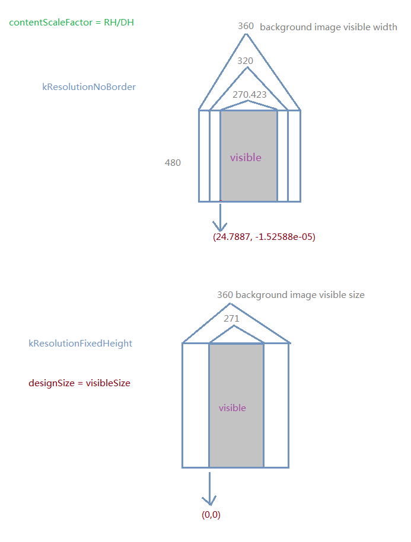

# Detailed explanation of Cocos2d-x Multi-resolution adaptation
---

## Overview
Since Cocos2d-x 2.04 released, Cocos2d-x introduced it’s own solution for multi-resolution. And deprecated some APIs of Retina and proposed a new concept – design resolution.

Below are the related APIs to the multi-resolution adaptation:

	CCEGLView::sharedOpenGLView()->setDesignResolutionSize() //set design resolution size and mode
	CCDirector::sharedDirector()->setContentScaleFactor() //set content scale factor
	CCFileUtils::sharedFileUtils()->setResourceDirectory() //deprecated
	CCFileUtils::sharedFileUtils()->setSearchPaths() //set resource search path
	CCEGLView::sharedOpenGLView()->getFrameSize() //get screen resolution
	CCDirector::sharedDirector()->getWinSize() //get design resolution
	CCDirector::sharedDirector()->getVisibleSize() //get design resolution’s visable area size
	CCDirector::sharedDirector()->getVisibleOrigin() //get origin of the visable area of design resolution

Since cocos2d-2.1beta3-x-2.1.1,

`CCFileUtils::sharedFileUtils()->setResourceDirectory()`

has been replaced by

`CCFileUtils::sharedFileUtils()->setSearchPaths(searchPath)`

From Cocos2d-x 2.1.3, two new resolution policy – kResolutionFixedHeight and kResolutionFixedWidth has add to engine. So there are five policy for multi-resolution now.

Two articles – [Multi_resolution_support](http://www.cocos2d-x.org/projects/Cocos2d-x/wiki/Multi_resolution_support) and [Mechanism_of_loading_resources](http://www.cocos2d-x.org/projects/Cocos2d-x/wiki/Mechanism_of_loading_resources)), in official site give presentation about multi-resolution.

But this article focus on the Cocos2d-x multi-resolution technique from the perspective of engine user, which will give you a fully understanding of how to deal with multi-resolution with Cocos2d-x.

## Evolution from Retina to design resolution

Before Cocos2d-x 2.0.4, Retina is a multi-resolution adaptation solution comes from Cocos2d-iPhone. To support Retina iPhone, Cocos2d-iPhone use suffix “-hd” to distinct normal iPhone resources and Retina iPhone resources. When desinging the game, we actually use point coordinate instead of pixel coordinate. This kind of point as same as the concept of the iOS native App, you don’t have to change your code and you can run your App on Retina iPhone that used run on normal iPhone. Only the picture are vague, but once import the picture with “@2x” extension iOS will load high definition resources automatically to support retina display.

Using point coordinate can solve multi-resolution in some degree. However, as iPhone5 and New iPad released there are five set of resources you need to prepare if you want to fit all kind of iOS devive and it’s very annoying. Point coordinate can not solve the problem and the situation is worse in Android platform.

Design resolution is evolve from point coordinate, which aims block the screen resolution. Sprites will Locate on design resolution. But implement a solution not easy. Cocos2d-x provide a set of relative APIs and five multi-resolution policy. Which kind of policy is what we really need. Let’s explore it together!

## Resource resolution, Design resolution and Screen resolution
> RW is short for Resources width, RH is short for Resources height.
 
> DW is short for Design width, DH is short for Design height.

> SW is short for Screen width, SH is short for Screen height.

In the samples directory of SDK there is a HelloCpp project. And it shows us how to use multi-resolution relative APIs.

Next we take a vertical screen game as example, which has the same configuration with AppMacros.h in HelloCpp, but exchange the width and the height.

Cocos2d-x has the following two logical processes to display picture.

From resource resolution to design resolution, then from design resolution to screen resolution.

As following picture:

API setContentScaleFactor() and setSearchPaths() control the first conversion process. However, setDesignResolutionSize() controls the second conversion process. The final display effect depended on these two processes.

## Transform from resource resolution to design resolution
setSearchPaths() should make appropriate settings depend on the screen resolution, the HellowCpp show us a simple solution but it may not the best.

setContentScaleFactor() decide the scale factor of the picture that effect the final display in screen. But it’s parameter is not according to the width ratio of resource and screen or height ratio of resource and screen. The design of Cocos2d-x engine is trying to prevent developers focus on screen directly, so the factor is width ratio of resource and design or height ratio of resource and design.

setContentScaleFactor() usually has two ways to set parameter. RH/DH or RW/DW different factor has different degree of negative effect.

Look the picture below:

Using height ratio as scale factor, ensure the vertical direction of the background image fully display in design resolution.

Using width ratio as scale factor, ensure the horizontal direction of the background image fully display in design resolution.

## Transform from design resolution to screen resolution
Function setDesignResolutionSize(DW, DH, resolutionPolicy) have three parameters – design resolution width, design resolution height, resolution policy.

First two parameters are easy to understand, but the last one will take us some time.

Let’s take a glance of kResolutionExactFit，kResolutionNoBorder and kResolutionShowAll. And we are going to talk about the new policy later that Cocos2d-x 2.1.3 introduces.

Design resolution of these three policy will not be refine in engine.

Look this picture:

### kResolutionShowAll
> According to the width and height of screen and design resolution to determine the scale factor, choose the smaller value of factor as the scale factor. This can make sure that all the design area can display on screen, but may leave some area black on screen.

### kResolutionExactFit
> Set the width ratio of the screen and design resolution as scale factor in X axis, set the height ratio of the screen and design resolution as scale factor in Y axis. This can make sure the design area cover the whole screen, but the picture maybe stretched.

### kResolutionNoBorder
> According to the width and height of screen and design resolution to determine the scale factor, choose the larger one as the scale factor. This can make sure that one axis can always fully display on screen, but another may scale out of the screen.

kResolutionNoBorder is used to be the Official recommand policy, which not stretch the picture and keep one axis fully display on screen. But with two new policy introduced in Cocos2d-x 2.1.3, the position of kResolutionNoBorder will be replace.

Both kResolutionFixedHeight and kResolutionFixedWidth will correct the design resolution in the engine, to ensure that the design resolution won’t be stretch and full the screen.

As following picture:

### kResolutionFixedHeight
> Keep the height of the design resolution, refine the width of the design resolution according to the screen.

### kResolutionFixedWidth
> Keep the width of the design resolution, refine the height of the design resolution according to the screen.

## Combine two processes
There are two chooses in the first process, and five in the second process. So there are 10 combinations.

Which one to choose? Choose a combination that sacrifice display effect or choose one that sacrifice some display area?

Here i choose a combination, which sacrifice some display area, to show you how these two processes work.

In my game, i need fully display of Y axis of the background picture. However, the X axis can be cut.

To reach this goal, i need the X axis to be cut both in these two processes.

- I choose setContentScaleFactor(RH/DH) for first process.
- Second process have two choice kResolutionNoBorder() or kResolutionFixedHeight().

To demonstrate the difference of kResolutionNoBorder and kResolutionFixedHeight, we need to introduce VisibleOrigin and VisibleSize.

Look at following picture:

For kResolutionNoBorder, design resolution is not same with visable area, when we locate a sprite we need the help of VisibleOrigin and VisibleSize.

However, kResolutionFixedHeight is different, design resolution is equal to visable area, VisibleOrigin is always (0,0). getVisibleSize() = getWinSize()，kResolutionFixedHeight reaches the same result, but simplify the code.

kResolutionFixedHeight and kResolutionFixedWidth are evlove from kResolutionNoBorder, it’s highly recommand you use these two policy in your new project.

## Conclusions
### kResolutionFixedHeight
> This policy is appropriate for the game, which the Y axis needs to be full display, and X axis can be cut.
It should use with setContentScaleFactor(RH/DH)

### kResolutionFixedWidth
> This strategy is appropriate for the game, which the X axis needs to be full display, and Y axis can be cut.
It should use with setContentScaleFactor(RW/DW)

tip:Correctly set the width and height in AppMacros.h and notice the difference of the horizontal screen game and vertical screen game.