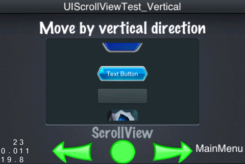
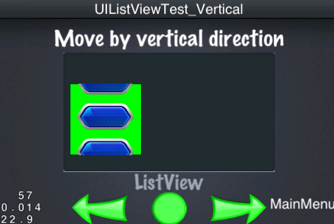

## Usage of Container Layer

GUI widgets can be divided into two general kinds-**Normal Widget** and **Container Widget**. Normal widgets are some common widgets such as UIButton, UILabel, UISlider and UITextField etc. On the other hand, container widgets like UILayout, UIScrollView and UIPageView etc have a common character, that is they can be the container contains other widgets. Even though all the widgets can contain others, but some of them just do one thing like button and label, adding other widgets to them is not a common use. Let's get to know details about how to using these container widgets.

### UILayout (Panel)

Panel as primary container, it's the base to create UI by CocoStudio editor. It's important to know Panel and its properties. The corresponding widget of Panel is named UILayout.

``` c++
    Size widgetSize = m_pWidget->getSize();
    
    UILayout *background = dynamic_cast<UILayout*>(m_pUiLayer->getWidgetByName("background_Panel"));
    
    // Create the layout
    UILayout* layout = UILayout::create();
    layout->setSize(Size(280, 150));
    Size backgroundSize = background->getSize();
    layout->setPosition(Point((widgetSize.width - backgroundSize.width) / 2 +
                            (backgroundSize.width - layout->getSize().width) / 2,
                            (widgetSize.height - backgroundSize.height) / 2 +
                            (backgroundSize.height - layout->getSize().height) / 2));
    m_pUiLayer->addWidget(layout);
    
    UIButton* button = UIButton::create();
    button->setTouchEnabled(true);
    button->loadTextures("cocosgui/animationbuttonnormal.png", "cocosgui/animationbuttonpressed.png", "");
    button->setPosition(Point(button->getSize().width / 2, layout->getSize().height - button->getSize().height / 2));
    layout->addChild(button);
    
    UIButton* textButton = UIButton::create();
    textButton->setTouchEnabled(true);
    textButton->loadTextures("cocosgui/backtotopnormal.png", "cocosgui/backtotoppressed.png", "");
    textButton->setTitleText("Text Button");
    textButton->setPosition(Point(layout->getSize().width / 2, layout->getSize().height / 2));
    layout->addChild(textButton);
    
    UIButton* button_scale9 = UIButton::create();
    button_scale9->setTouchEnabled(true);
    button_scale9->loadTextures("cocosgui/button.png", "cocosgui/buttonHighlighted.png", "");
    button_scale9->setScale9Enabled(true);
    button_scale9->setSize(Size(100, button_scale9->getContentSize().height));
    button_scale9->setPosition(Point(layout->getSize().width - button_scale9->getSize().width / 2, button_scale9->getSize().height / 2));
    layout->addChild(button_scale9);

```

We created a `layout` widget by the code above and then added three widgets to it. `m_pUiLayer` is a UILayer in current scene as we mentioned before. All the UI widgets are put into UILayer and UILayer manages all of them. You can see the result when put them into the scene as following image:


We give a size of the layout by setting "size" value, but we don't get what we want because the color of the layout default is transparent. However, we can set color for this layout:

``` c++ 
    layout->setBackGroundColorType(LAYOUT_COLOR_SOLID);
    layout->setBackGroundColor(Color3B(128, 128, 128));
    
```


You can also set background image as you like:

``` c++
    layout->setSize(Size(280, 150));
    
    layout->setClippingEnabled(true);
    layout->setBackGroundImage("cocosgui/Hello.png");

```


As shown above, we setted the size and background image, but remember call `setClippingEnabled` method to clip by size, you'll see following if you forget call the method:


There other ways to do the same thing:

``` c++
    layout->setBackGroundImageScale9Enabled(true);
    layout->setBackGroundImage("cocosgui/green_edit.png");

```


Using squared images as background image, remember enable this function.

UILayout has three modes to display color.

| LayoutBackGroundColorType | Desription        |
|---------------------------|-------------------|
| LAYOUT_COLOR_NONE         | Transparent, no displaying color |
| LAYOUT_COLOR_SOLID        | Solid, set displaying color |
| LAYOUT_COLOR_GRADIENT     | Displaying gradient color   |

### UIPanel Widget's Layout Strategies

UILayout is for layout, the works above are just changing background image. Following table shows you how to set absolute position manually and other layout schemes:

| LayoutType                | Description       |
|---------------------------|-------------------|
| LAYOUT_ABSOLUTE           | Absolute Layout Scheme |
| LAYOUT_LINEAR_VERTICAL    | Linear Vertical Scheme |
| LAYOUT_LINEAR_HORIZONTAL  | Linear Horizontal Scheme |
| LAYOUT_RELATIVE           | Relative Layout Scheme |

``` c++
    layout->setLayoutType(LAYOUT_LINEAR_VERTICAL);

    // Another way 
    layout->setLayoutType(LAYOUT_LINEAR_HORIZONTAL);

    // Another way 
    layout->setLayoutType(LAYOUT_RELATIVE);
    
```

Note: In addtion to absolute layout scheme, if you set other scheme then UIPanel will ignore the position setting of the inside widget. You can use `UILayoutParameter` to set position in this situation, the layout schemes provide serval parameters-`UILinearLayoutParameter` and `UIRelativeLayoutParameter`. Now show you how to combine these parameters and layout to design UI.

``` c++
    layout->setLayoutType(LAYOUT_LINEAR_VERTICAL);

    // ....The same code to create widget as above 

    UILinearLayoutParameter* lp1 = UILinearLayoutParameter::create();
    lp1->setGravity(LINEAR_GRAVITY_CENTER_HORIZONTAL);
    lp1->setMargin(UIMargin(0, 10, 0, 10));
    
    UILinearLayoutParameter* lp2 = UILinearLayoutParameter::create();
    lp2->setGravity(LINEAR_GRAVITY_CENTER_HORIZONTAL);
    lp2->setMargin(UIMargin(20, 20, 0, 5));
    
    UILinearLayoutParameter* lp3 = UILinearLayoutParameter::create();
    lp3->setGravity(LINEAR_GRAVITY_CENTER_HORIZONTAL);
    lp3->setMargin(UIMargin(0, 10, 0, 10));

    button->setLayoutParameter(lp1);
    textButton->setLayoutParameter(lp2);
    button_scale9->setLayoutParameter(lp3);

```

Following image shows the displaying effect:


Settd three parameters for layout-`UILinearLayoutParameter`, `Gravity` and `Margin`, then setted layout parameters for three UIPanel's inner widgets, so you saw the result above.

Here we used Linear Vertical scheme, but every `Gravity` set as `LINEAR_GRAVITY_CENTER_HORIZONTAL` that is displaying as center horizontally. Margin shows the spacing around the edges, notice that the value of `lp2` is `UIMargin(20, 20, 0, 5)`, which means the spacing from left, top, right and button. When left spacing is 20 you can see `textButton`'s position has little offset to right. Except for the direction, other setting of layout vertical scheme is same as horizontal scheme. And two schemes are called **Linear Layout**, they using the same parameters. Checking out following layout:

``` c++
    layout->setLayoutType(LAYOUT_RELATIVE);

    //...Widget creating code should be here

    UIRelativeLayoutParameter* rp1 = UIRelativeLayoutParameter::create();
    rp1->setAlign(RELATIVE_ALIGN_PARENT_TOP_RIGHT);
    
    UIRelativeLayoutParameter* rp2 = UIRelativeLayoutParameter::create();
    rp2->setAlign(RELATIVE_ALIGN_PARENT_LEFT_CENTER_VERTICAL);
    
    UIRelativeLayoutParameter* rp3 = UIRelativeLayoutParameter::create();
    rp3->setAlign(RELATIVE_ALIGN_PARENT_RIGHT_BOTTOM);
    
    button->setLayoutParameter(rp1);
    textButton->setLayoutParameter(rp2);
    button_scale9->setLayoutParameter(rp3);

```


Here created three layout properties, and setted different `Align` parameters.

### UIScrollView

In addition to layout container, scroll view is always been used, it can enlarge the displaying widget and it's very useful when content elements increased. You can set different direction as you like.

``` c++
    UIScrollView* scrollView = UIScrollView::create();
    scrollView->setTouchEnabled(true);
    scrollView->setSize(Size(280, 150));        
    Size backgroundSize = background->getContentSize();
    scrollView->setPosition(Point((widgetSize.width - backgroundSize.width) / 2 +
                           (backgroundSize.width - scrollView->getSize().width) / 2,
                           (widgetSize.height - backgroundSize.height) / 2 +
                           (backgroundSize.height - scrollView->getSize().height) / 2));


    m_pUiLayer->addWidget(scrollView);

    UIImageView* imageView = UIImageView::create();
    imageView->loadTexture("cocosgui/ccicon.png");
    
    float innerWidth = scrollView->getSize().width;
    float innerHeight = scrollView->getSize().height + imageView->getSize().height;
    
    scrollView->setInnerContainerSize(Size(innerWidth, innerHeight));    

    imageView->setPosition(Point(innerWidth / 2, imageView->getSize().height / 2));
    scrollView->addChild(imageView);

    // Add some other widgets for scrollview
    
```



As the image shows, we created a ScrollView widget and added some inner elements to it. The content is too much that out of the display area, in this situation we can drag the view up and down to show the content.

**Note**: imageView's position is setted outside of scrollview, besides you can call the scrollview's setInnerContainerSize method resize the content displaying area. Checking boundary when draging.

If horizontal drag is setted, then we just need to set InnerContainerSize's width larger than widget's, height equal to widget's. In this way you can drag it horizontally.

### UIListView

ListView inherited from ScrollView, so ScrollView's characters also can be shown in ListView. Let's see the difference between ListView and ScrollView:

``` c++
    UIListView* lv = UIListView::create();
    UIButton* model = UIButton::create();
    model->loadTextures("cocosgui/animationbuttonnormal.png", "cocosgui/animationbuttonpressed.png", "");
    lv->setItemModel(model);
    
    for (int i=0; i<20; i++)
    {
        lv->pushBackDefaultItem();
    }
    lv->setItemsMargin(10);
    lv->setGravity(LISTVIEW_GRAVITY_CENTER_HORIZONTAL);
    lv->setSize(Size(100, 100));
    lv->setBackGroundColorType(LAYOUT_COLOR_SOLID);
    lv->setBackGroundColor(Color3B::GREEN);
    lv->setPosition(Point(100, 100));
    m_pUiLayer->addWidget(lv);

```



As shown above, it's the implementation like ScrollView. There are twenty buttons can be draged, by setting every element's space with `ItemsMargin` and `Gravity` make them displaying in the center horizontally.

`lv->setItemModel(model)` setted Default Item for ListView, then added twenty times this Default Item by a for loop. Notice that it doesn't mean the same model has been added twenty times but there are twenty new object which are the clone of the original model.

`pushBackDefaultItem()` is not the only item that can be added to ListView, there are others:

| Method                                        | Description           |
|-----------------------------------------------|-----------------------|
| pushBackDefaultItem()                         | Add a Default Item    |
| insertDefaultItem(int index)                  | Insert a sorted Default Item   |
| pushBackCustomItem(UIWidget* item)            | Add a new Item        |
| insertCustomItem(UIWidget* item, int index)   | Insert a new Item     |

Some method to add Item already described in above table, now introduce you some delete and get method:

| Method                        | Description                   |
|-------------------------------|-------------------------------|
| removeItem(int index)         | Remove a Item                 |
| removeLastItem()              | Remove the last Item          |
| getItem(unsigned int index)   | Get a Item by Index           |
| getItems()                    | Get all the Items and return Array  |
| getIndex(UIWidget *item)      | Get a Item's Index            |


### UIPageView

We talked about ScrollView and some widget can display list, still PageView can display entire page one time. Moreover, it can auto align-just like when you turning the over page it will help you done it.

``` c++
    UIPageView* pageView = UIPageView::create();
    pageView->setTouchEnabled(true);
    pageView->setSize(Size(240, 130));
    Size backgroundSize = background->getContentSize();
    pageView->setPosition(Point((widgetSize.width - backgroundSize.width) / 2 +
                              (backgroundSize.width - pageView->getSize().width) / 2,
                              (widgetSize.height - backgroundSize.height) / 2 +
                              (backgroundSize.height - pageView->getSize().height) / 2));
    
    for (int i = 0; i < 3; ++i)
    {
        UILayout* layout = UILayout::create();
        layout->setSize(Size(240, 130));
        
        UIImageView* imageView = UIImageView::create();
        imageView->setTouchEnabled(true);
        imageView->setScale9Enabled(true);
        imageView->loadTexture("cocosgui/scrollviewbg.png");
        imageView->setSize(Size(240, 130));
        imageView->setPosition(Point(layout->getSize().width / 2, layout->getSize().height / 2));
        layout->addChild(imageView);
        
        UILabel* label = UILabel::create();
        label->setText(CCString::createWithFormat("page %d", (i + 1))->getCString());
        label->setFontName(font_UIPageViewTest);
        label->setFontSize(30);
        label->setColor(Color3B(192, 192, 192));
        label->setPosition(Point(layout->getSize().width / 2, layout->getSize().height / 2));
        layout->addChild(label);
        
        pageView->addPage(layout);
    }
    pageView->addEventListenerPageView(this, pagevieweventselector(UIPageViewTest::pageViewEvent));
    
    m_pUiLayer->addWidget(pageView);

```


As shown, a PageView object created and size is "Size(240, 130)", which is display area. We added three same UILayout and each of them has the same size "Size(240, 130)" so PageView can display the entire content of a Item one time. You can added what you need in UILayout, then add a page by `pageView->addPage(layout)`. You should remember you have to add `UILayout` object or its derived class object.

Although PageView implemented scroll, it is not inherited from ScrollView but UILayout. It implemented `UIScrollInterface`, this makes it such property. So does ScrollView.

Every single widget make a GUI scene, the container is the skeleton, acorrding to its layout to reach out expectation. Using Panel, ScrollView, ListView and PageView can make a better and friendly GUI.
