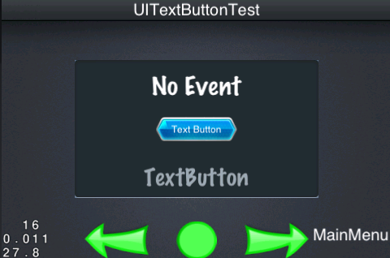

## Introduction to Regular Widgets

We introduced the basic usage of UIButton before to control a display content of UILabel. UIImageView is easy to use, and GUI also provides us some other useful widgets such as UITextButton, UICheckBox and UISlider etc.

### UITextButton

``` c++
    UIButton* textButton = UIButton::create();
    textButton->setTouchEnabled(true);
    textButton->loadTextures("cocosgui/backtotopnormal.png", "cocosgui/backtotoppressed.png", "");
    textButton->setTitleText("Text Button");
    textButton->setPosition(Point(widgetSize.width / 2.0f, widgetSize.height / 2.0f));
    textButton->addTouchEventListener(this, toucheventselector(UITextButtonTest::touchEvent));        
    m_pUiLayer->addWidget(textButton);

```



As button, it has to support touch event. Then call `loadTextures` method to load image. Notice the third parameter is the display image when button is unenabled. Let's focus on the fouth parameter, checking out following method's prototype:

`void loadTextures(const char* normal,const char* selected,const char* disabled,TextureResType texType = UI_TEX_TYPE_LOCAL);`

The last parameter is image type, default as `UI_TEX_TYPE_LOCAL`, which means using normal image. On the other hand, the other `UI_TEX_TYPE_PLIST` is using the resource from plist, and this decide to use `Sprite` or `SpriteFrame` creating displaying sprite. We can also use squared picture, remember setting `Size`.

``` c++
    UIButton* textButton = UIButton::create();
    textButton->setTouchEnabled(true);
    textButton->setScale9Enabled(true);
    textButton->loadTextures("cocosgui/button.png", "cocosgui/buttonHighlighted.png", "");
    textButton->setSize(Size(180, textButton->getContentSize().height * 1.5f));
    textButton->setTitleText("Text Button scale9 render");
    textButton->setPosition(Point(widgetSize.width / 2.0f, widgetSize.height / 2.0f));
    textButton->addTouchEventListener(this, toucheventselector(UITextButtonTest::touchEvent));        
    m_pUiLayer->addWidget(textButton);
        

```


### UICheckBox

We also see a widget in web page-checkbox, it allows you choose more than one item.

``` c++
    UICheckBox* checkBox = UICheckBox::create();
    checkBox->setTouchEnabled(true);
    checkBox->loadTextures("cocosgui/check_box_normal.png",
                           "cocosgui/check_box_normal_press.png",
                           "cocosgui/check_box_active.png",
                           "cocosgui/check_box_normal_disable.png",
                           "cocosgui/check_box_active_disable.png");
    checkBox->setPosition(Point(widgetSize.width / 2.0f, widgetSize.height / 2.0f));
    
    checkBox->addEventListenerCheckBox(this, checkboxselectedeventselector(UICheckBoxTest::selectedEvent));
    
    m_pUiLayer->addWidget(checkBox);

```


There are not too much properties in here, but many images loaded-two status images, two unenabled status images and pressed image. These five images build a checkbox, setting callback method by `addEventListenerCheckBox`:

``` c++
    void UICheckBoxTest::selectedEvent(Object* pSender,CheckBoxEventType type)
    {
        switch (type) {
            case gui::CHECKBOX_STATE_EVENT_SELECTED:
                m_pDisplayValueLabel->setText(CCString::createWithFormat("Selected")->getCString());
                break;
            case gui::CHECKBOX_STATE_EVENT_UNSELECTED:
                m_pDisplayValueLabel->setText(CCString::createWithFormat("Unselected")->getCString());
                break;
            default:
                break;
        }
        
    }

```

There are two statuses for a checkbox-selected and unselected. It chages its status when it is touched, we can call some callback functions to do something. As shown, when the status changed, it will call the function to inform the checkbox.


### UISlider

It's a good choice to choose slider if you want to add a widget controling the volume.

``` c++
    UISlider* slider = UISlider::create();
    slider->setTouchEnabled(true);
    slider->loadBarTexture("cocosgui/sliderTrack.png");
    slider->loadSlidBallTextures("cocosgui/sliderThumb.png", "cocosgui/sliderThumb.png", "");
    slider->loadProgressBarTexture("cocosgui/sliderProgress.png");
    slider->setPosition(Point(widgetSize.width / 2.0f, widgetSize.height / 2.0f));
    slider->addEventListenerSlider(this, sliderpercentchangedselector(UISliderTest::percentChangedEvent));
    m_pUiLayer->addWidget(slider);

```


We take different ways to load images, `loadBarTexture` for slider background image and `loadSlidBallTextures` for  three statuses image of slider. That is the center ball can be draged. However, `loadProgressBarTexture` method displaying the progress of the slider. It also has callback function, which can be used for record current status:

``` c++
    void UISliderTest::percentChangedEvent(Object *pSender, SliderEventType type)
    {
        if (type == SLIDER_PERCENTCHANGED)
        {
            UISlider* slider = dynamic_cast<UISlider*>(pSender);
            int percent = slider->getPercent();
            m_pDisplayValueLabel->setText(CCString::createWithFormat("Percent %d", percent)->getCString());
        }
    }

```

By dynamic cast pSender to get UISlider, then get the percentage of UISlider to save UI resource by using squared picture.

### UILoadingBar

In contrast to the slider is a progress bar, one of them is controling progress manually then return value and the other is seting vaule manually then update displaying. For example, when we loading some image resource the progress can show us the loading progress. Following is one usage:

``` c++
    UILoadingBar* loadingBar = UILoadingBar::create();
    loadingBar->setName("LoadingBar");
    loadingBar->loadTexture("cocosgui/sliderProgress.png");
    loadingBar->setPercent(0);
    
    loadingBar->setPosition(Point(widgetSize.width / 2.0f, widgetSize.height / 2.0f + loadingBar->getSize().height / 4.0f));
    m_pUiLayer->addWidget(loadingBar);

```


We did some intialize work above, if you want to get new value in real time then you need to update the value by `setPercent` method. When run a scene, we call the `scheduleUpdate();` and implement `update` method ensuring it can be called every frame. Following code should be in `update` method:

``` c++
    void UILoadingBarTest_Left::update(float delta)
    {
        m_nCount++;
        if (m_nCount > 100)
        {
            m_nCount = 0;
        }
            
        UILoadingBar* loadingBar = dynamic_cast<UILoadingBar*>(m_pUiLayer->getWidgetByName("LoadingBar"));
        loadingBar->setPercent(m_nCount);
    }

```
It's a inreasement number start from zero, you can see from left to right the length of process bar is increasing. If you want the process bar's length increasing from right from left, you can set `loadingBar->setDirection(LoadingBarTypeRight);` and this widget support squared picture.

### UILabelAtlas

UILabelAtlas can display number label that jointed by images:

``` c++
    UILabelAtlas* labelAtlas = UILabelAtlas::create();
    labelAtlas->setProperty("1234567890", "cocosgui/labelatlas.png", 17, 22, "0");
    labelAtlas->setPosition(Point((widgetSize.width) / 2, widgetSize.height / 2.0f));        
    
    m_pUiLayer->addWidget(labelAtlas);

```


The usage of this widget is very simple, Label is not efficient in old version so LabelAtlas is a good substitution but in version 3.0 Label has been improved a lot. Here we choose Atlas because we can custom it to get better displaying effect. 

###UILabelBMFont

In addition to UILabelAtlas, you can also display a label by UILabelBMFont.

``` c++
    UILabelBMFont* labelBMFont = UILabelBMFont::create();
    labelBMFont->setFntFile("cocosgui/bitmapFontTest2.fnt");
    labelBMFont->setText("BMFont");
    labelBMFont->setPosition(Point(widgetSize.width / 2, widgetSize.height / 2.0f + labelBMFont->getSize().height / 8.0f));
    m_pUiLayer->addWidget(labelBMFont);

```


Just like UILabelAtlas, UILabelBMFont store the disply information by a image, but Atlas is smaller than BMFont. You can set the parameters of the cutting, but BMFont has to be with a ".fnt" file. There are many information in it, and it also provide many display effect.

### UITextArea

Text area widget can help us solve some problems such as auto wrap and so on. It's important for design a flexible UI.

``` c++
    UILabel* textArea = UILabel::create();
    textArea->setTextAreaSize(Size(280, 150));
    textArea->setTextHorizontalAlignment(TextHAlignment::CENTER);
    textArea->setText("TextArea widget can line wrap");
    textArea->setFontName("AmericanTypewriter");
    textArea->setFontSize(32);
    textArea->setPosition(Point(widgetSize.width / 2, widgetSize.height / 2 - textArea->getSize().height / 8));
    m_pUiLayer->addWidget(textArea);        
        
```


You need to know the size of a text area, and its alignmet(Use `setTextHorizontalAlignment` to set the align mode: Left, Right and Center), display content, font size and font etc.

### UITextField

Text Field is a very important widget, it can call device's input system to recive user's input content such as user name and password in a login scene.

``` c++
    UITextField* textField = UITextField::create();
    textField->setTouchEnabled(true);
    textField->setFontName(font_UITextFieldTest);
    textField->setFontSize(30);
    textField->setPlaceHolder("input words here");
    textField->setPosition(Point(widgetSize.width / 2.0f, widgetSize.height / 2.0f));
    textField->addEventListenerTextField(this, textfieldeventselector(UITextFieldTest::textFieldEvent));
    m_pUiLayer->addWidget(textField);

```


Setted properties and enabled touch, then wait user's touch event to done the text input work. `setPlaceHolder` can remind user to input when the widget don't show anything. Notice that the callback functions here have many statuses:

``` c++
    void UITextFieldTest::textFieldEvent(Object *pSender, TextFiledEventType type)
    {
        switch (type)
        {
            case TEXTFIELD_EVENT_ATTACH_WITH_IME:
            {
                UITextField* textField = dynamic_cast<UITextField*>(pSender);
                Size screenSize = CCDirector::getInstance()->getWinSize();
                textField->runAction(CCMoveTo::create(0.225f,
                                                      Point(screenSize.width / 2.0f, screenSize.height / 2.0f + textField->getContentSize().height / 2.0f)));
                m_pDisplayValueLabel->setText(CCString::createWithFormat("attach with IME")->getCString());
            }
                break;
                
            case TEXTFIELD_EVENT_DETACH_WITH_IME:
            {
                UITextField* textField = dynamic_cast<UITextField*>(pSender);
                Size screenSize = CCDirector::getInstance()->getWinSize();
                textField->runAction(CCMoveTo::create(0.175f, Point(screenSize.width / 2.0f, screenSize.height / 2.0f)));
                m_pDisplayValueLabel->setText(CCString::createWithFormat("detach with IME")->getCString());
            }
                break;
                
            case TEXTFIELD_EVENT_INSERT_TEXT:
                m_pDisplayValueLabel->setText(CCString::createWithFormat("insert words")->getCString());
                break;
                
            case TEXTFIELD_EVENT_DELETE_BACKWARD:
                m_pDisplayValueLabel->setText(CCString::createWithFormat("delete word")->getCString());
                break;
                
            default:
                break;
        }
    }

```

First, it have four event type:

| Event Type                            | Description       |
|---------------------------------------|---------------|
| TEXTFIELD_EVENT_ATTACH_WITH_IME       | Enable trigger when input |
| TEXTFIELD_EVENT_DETACH_WITH_IME       | Trigger when event end    |
| TEXTFIELD_EVENT_INSERT_TEXT           | Trigger when insert text  |
| TEXTFIELD_EVENT_DELETE_BACKWARD       | Trigger when delete text  |

Accroding to the event type, we can get widget's content or change widget's properties in real time. We can set widget's max text length by `textField->setMaxLength(3);`.

In a login scene, we usually design a user name box and a password box, and the widget absoluetely support password box's property:

``` c++
    textField->setPasswordEnabled(true);
    textField->setPasswordStyleText("*");

```

Enable password mode first, and then set a substitute character.
