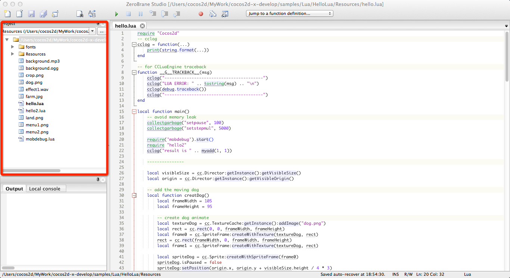
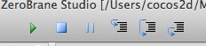

How to Remote Debug Lua via ZeroBrane Studio
===========================================
ZeroBrane Studio is a lightweight Lua IDE.Because it can run on `Windows`,`Mac OSX` and `Linux` and support `on-device debugging`,so it often is used to debug Lua.Now,Cocos2d-x imported `LuaSocket` module to support ZeroBrane Studio(except `Linux`).We described in detail how to use ZeroBrane Studio to debug based on  android device and iOS simulator through `HelloLua` test case.

### Version

* Cocos2d-x Version 3.0 Beta2

### Dubugging on iOS Simulator

#### Environments

* ZeroBrane Studio (0.39; MobDebug 0.542)
* Mac OS X 10.9
* Xcode 5.01

1. Copy `ZeroBrane Studio.app/Contents/ZeroBraneStudio/lualibs/mobdebug/mobdebug.lua` into `cocos2d-x/samples/Lua/HelloLua/Resources` folder. If you are using cocos2d-x v3.0 beta2 or higher version, this step has been done by engine.

2. Open `cocos2d-x/build/cocos2d_samples.xcodeproj` via Xcode, add `mobdebug.lua` into HelloLua target manually, then add debugger code into `HelloLua/Resources/hello.lua`. Only one line of code need to be insert: ``require('mobdebug').start()`. Insert this line of code in front of `require "hello2"`.

```lua
local function main()
    ...
    require('mobdebug').start() --<-- only insert this line
    require "hello2"
    cclog("result is " .. myadd(1, 1))
    ...
end    
```

3. Now run Zerobrane Studio, click `...` button at the top-left corner, just below `Project`. Then select `cocos2d-x/samples/Lua/HelloLua/Resources` folder. This step will import HelloLua/Resources into ZeroBrane's current project. As the screenshot:



4. Open `hello.lua`，click the space beside line numbers to insert a break point.


5. Then `Start Debugger Server` from the menu of ZeroBrane Studio.


6. Switch to Xcode, build and run HelloLua iOS.Then you can see the break point will be triggered in ZeroBrane(`Switch to Visual Studio 2012 based on Windows`).


7. You can run step in, step out, step over etc. from debug toolbar easily. But pay attention that, a line such as `local visibleSize = cc.Director:getInstance():getVisibleSize()` need to be stepped over 3 times to goto the next line. It seems that because we have 2 funcion calls in this line.



8. Click`View->Watch Window`, open the watch window, then add variables you want to watch:


9. Click `View->Stack Window`, you can see stacks info here


### Dubugging on Android Device

#### Environment

* ZeroBrane Studio (0.39; MobDebug 0.542)
* Android Developer Tools
* HTC G17

The steps are similar to debugging on iOS simulator. The only differences are how to add debugger codes. For Android device(the same to IPhone and IPad), we need to add:

```lua
local function main()
    ...
    require('mobdebug').start("192.168.1.110")
    require "hello2"
    cclog("result is " .. myadd(1, 1))
    ...
end
```

Note that `192.168.1.110` is your mac's IP addess. You need to connect this android device to the same IP segment, otherwise the debugger won't work properly. 


