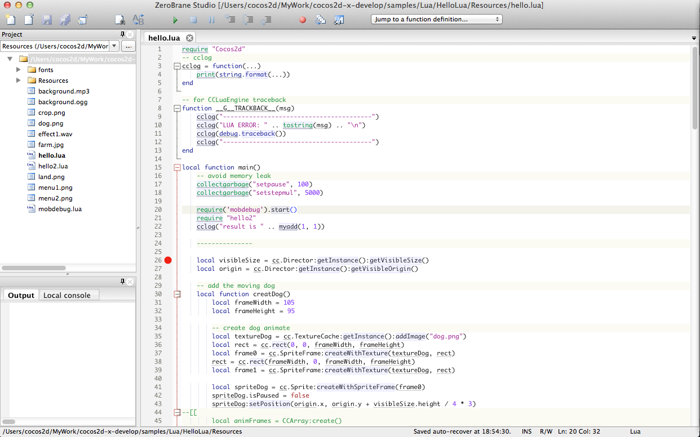

使用ZeroBrane Studio调试Cocos2d-x的LuaScript
===========================================

### 测试版本

* Cocos2d-x Version 3.0 Beta2

### 测试例子

* HelloLua

### iOS模拟器调试

#### 测试环境

* ZeroBrane Studio (0.39; MobDebug 0.542)
* Mac OS X 10.9
* Xcode 5.01

1.在ZBS文件夹中找到mobdebug.lua,将该模块加入HelloLua/Resources下
2.`hello.lua`添加debugger调用的指令，如下:

```
local function main()
	...
	require('mobdebug').start() --<-- this line
    require "hello2"
    cclog("result is " .. myadd(1, 1))
    ...
end
    
```
3.运行ZBS,将HelloLua的Resources导入到Project下，如图所示:


4.打开hello.lua,加入断点：



5.ZBS开启Debugger Server:


6.XCode运行HelloLua iOS测试例,触发断点:


7.通过Bebug工具栏，进行相应操作:


8.点击`View->Watch Window`,打开Watch Window,添加要观察的变量:


9.点击`View->Stack Window`,还可以看到相应的堆栈信息:


### Android真机调试

#### 测试环境

* ZeroBrane Studio (0.39; MobDebug 0.542)
* Android Developer Tools
* HTC G17

Android真机调试的流程和iOS模拟器调试，基本相同，主要的区别在于`hello.lua`添加debugger调用的指令，如下:

```
local function main()
	...
	require('mobdebug').start("192.168.1.110", 8172)
    require "hello2"
    cclog("result is " .. myadd(1, 1))
    ...
end
```

其中，`192.168.1.110`为PC的IP地址，`8172`为ZBS开启Debugger server服务的端口号,测试手机的wifi IP需要与PC的IP地址同一网段，否则无法调试。但对于真机调试。不论哪一种调试操作，ZeroBrane0.39都会响应一个断点响应后直接运行程序。


