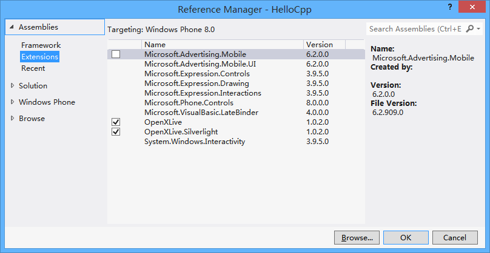

# Windows Phone 8上调用第三方库SDK

## 简介

cocos2d-x wp8平台上支持xaml后，方便了第三方Sdk的调用。本文以OpenXLive这个第三方sdk为例，介绍如何在XAML工程中集成该sdk。本文参考网上一些资源[http://www.cnblogs.com/zhxilin/archive/2013/03/20/2971331.html](http://www.cnblogs.com/zhxilin/archive/2013/03/20/2971331.html "WinRT组件（C++）中调用C#类库")、[http://www.cnblogs.com/zhxilin/archive/2013/12/26/3492412.html](http://www.cnblogs.com/zhxilin/archive/2013/12/26/3492412.html "在Cocos2d-x中使用OpenXLive")，但在上面做了一些补充和修改，代码均在gitbub上个人仓库OpenXLive分支中，链接：[https://github.com/koowolf/cocos2d-x/tree/OpenXLive](https://github.com/koowolf/cocos2d-x/tree/OpenXLive)，详细集成教程见下文。

## 准备OpenXLive库

下载OpenXLive SDK：[http://developer.openxlive.net/](http://developer.openxlive.net/)，安装或手动添加dll。打开HelloCpp工程，右键选择"Add Reference",在Reference Mangager中通过"Extensions"页面添加，或者在"Browse"手动添加本地下载的dll。如下图：



在app.xaml中初始配置OpenXLive的Session可以参考安装或者下载的OpenXLive帮助文档。

## 准备OpenXLive调用接口

在HelloCppComponent中添加ICallback.h文件，并在里面实现ICallback interface。添加回掉事件处理函数和调用接口。代码如下：

``` c++
namespace PhoneDirect3DXamlAppComponent
{
	namespace OpenXLiveHelper
	{
		// An asynchronous completed event argument, similar with OpenXLive.Feature.AsyncProcessResult.
		public ref class CompletedEventArgs sealed
		{
		public:
			CompletedEventArgs(bool ReturnValue, int ErrorCode, Platform::String^ ErrorMessage)
			{
				this->ReturnValue = ReturnValue;
				this->ErrorCode = ErrorCode;
				this->ErrorMessage = ErrorMessage;
			}

			property bool ReturnValue;
			property int ErrorCode;
			property Platform::String^ ErrorMessage;
		};
		// A callback interface for C# code to implement.
		public interface class ICallback
		{
			// Submit a score completed event.
			event Windows::Foundation::EventHandler<CompletedEventArgs^>^ OnSubmitCompleted;
			void Leaderboard_Submit(Platform::String^ leaderboardKey, int score);

			//... other event and other function
		};
	}
}
```

## c#中实现ICallback接口

在HelloCpp工程中添加XLiveCallback.cs代码文件，定义类XLiveCallback实现ICallback接口。如下：

``` c++

namespace PhoneDirect3DXamlAppComponent
{
    /// <summary>
    /// A callback class that implements the WinRT Component interface ICallback.
    /// All methods provided will be called throught the ICallback interface in native code.
    /// </summary>
    public class XLiveCallback : ICallback
    {
        public event EventHandler<CompletedEventArgs> OnAwardComplted;
        public event EventHandler<CompletedEventArgs> OnSubmitCompleted;

        public void Leaderboard_Submit(string leaderboardKey, int score)
        {
			// call sdk function direct
                Leaderboard lb = new Leaderboard(XLiveGameManager.CurrentSession, leaderboardKey);
                lb.SubmitScoreCompleted += new AsyncEventHandler(lb_SubmitScoreCompleted);
                lb.SubmitScore(score);
        }

        void lb_SubmitScoreCompleted(object sender, AsyncEventArgs e)
        {
            if (OnSubmitCompleted != null)
            {
				// call back direct
                OnSubmitCompleted(sender, new CompletedEventArgs(e.Result.ReturnValue, e.Result.ErrorCode, e.Result.ErrorMessage));
            }
        }
		// other call sdk function...
    }
}
```
Leaderboard即为OpenXLive中的类。Leaderboard_Submit函数调用该类，并用lb_SubmitScoreCompleted完成调用，函数内用OnSubmitCompleted实现回调。注意，这里仅当Leaderboard_Submit在opengl界面里面直接调用，才能直接回调OnSubmitCompleted事件处理函数，从调用到回调函数都是在同一个线程中执行，如果lb.SubmitScore运行时间较长，会导致界面出现卡顿的现象。在下文中将介绍如何使用Ui线程（主线程）和其他普通线程。

## 在WinRT组件中实现调用代理

在HelloCppComponent中创建XLiveDelegate托管类，方便C++和C#中调用。

``` c++

namespace PhoneDirect3DXamlAppComponent
{
	namespace OpenXLiveHelper
	{
		public ref class XLiveDelegate sealed
		{
		public:
			XLiveDelegate(void);

			void SetCallback(ICallback^ callback);

			property static ICallback^ GlobalCallback;
		};
	}	
}
```
这里以static保存实现了ICallback的类实例，SetCallback函数在c#中调用。如果在C++中多次使用到XLiveDelegate类，可以使用单例模式来创建XLiveDelegate。SetCallback函数调用可以在HelloCpp工程里的MainPage的DrawingSurface_Loaded中实现，如下：

``` c++
				XLiveDelegate XLiveDelegate = new XLiveDelegate();
                XLiveDelegate.SetCallback(new XLiveCallback());
```

## 游戏逻辑中调用并处理回掉函数

这里为了测试方便，直接在HelloWorld类的menuCloseCallback函数中调用OpenXLive的sdk,并实现回调。

``` c++
		XLiveDelegate^ m_XLiveDelegate = ref new XLiveDelegate();		
		m_XLiveDelegate->GlobalCallback->OnSubmitCompleted += ref new Windows::Foundation::EventHandler<CompletedEventArgs^>(
			[this](Platform::Object^ sender, CompletedEventArgs^ args){
			// deal with your call back action
		});
		m_XLiveDelegate->GlobalCallback->Leaderboard_Submit("xxxxxxxxxxxxxxxxxxxxxxxxxxxxxxxxxx", 100);	
```
在该函数中实现了OnSubmitCompleted回调函数，并且调用Leaderboard_Submit来调用OpenXLive的sdk。

## 不同线程处理

游戏渲染界面所处线程并非主线程，以上代码是在游戏界面中直接实现调用的，为同步操作，如果Sdk处理时间长会导致界面运行不流畅。可以使用主线程(即xaml页面所处线程)来调用Sdk，也可以创建一个任务来处理。修改以上的Leaderboard_Submit函数处理代码。

``` c++
		public void Leaderboard_Submit(string leaderboardKey, int score)
        {
			// get the UI thread (ie. the Main Thread) to let the worker thread (ie. opengl thread) work normally.
            Deployment.Current.Dispatcher.BeginInvoke(() =>
            {
                Leaderboard lb = new Leaderboard(XLiveGameManager.CurrentSession, leaderboardKey);
                lb.SubmitScoreCompleted += new AsyncEventHandler(lb_SubmitScoreCompleted);
                lb.SubmitScore(score);
            });
        }
```

Deployment.Current.Dispatcher.BeginInvoke可以获取主线程，并在里面实现调用sdk。也可以使用任务来调用，如下：

``` c++
		public void Leaderboard_Submit(string leaderboardKey, int score)
        {
            //common worker thread
            System.Threading.Tasks.Task.Run(async () =>
            {
                Leaderboard lb = new Leaderboard(XLiveGameManager.CurrentSession, leaderboardKey);
                lb.SubmitScoreCompleted += new AsyncEventHandler(lb_SubmitScoreCompleted);
                lb.SubmitScore(score);
            });
        }
```

但是用其他线程来调用SDK并不完整，这里回调的时候也使用了其他线程，当回调函数里面使用了游戏逻辑里的东西，比如画界面，会带来多线程不安全问题。最好回调时候能够切回游戏逻辑所处的线程，所以下一步进行回调处理。

## 回调处理

在Direct3DInterop实现文件中，可以发现，所有的点击、按键处理事件通过mInputEvents的事件队列来处理，只要向该线程投递该事件，然后由ProcessEvents函数来处理该事件。这样，我们定义一个OpenXLiveEvent类继承InputEvent，如下：

``` c++
namespace PhoneDirect3DXamlAppComponent
{
	class OpenXLiveEvent : public InputEvent
	{
	public:
		OpenXLiveEvent(Object^ sender, CompletedEventArgs^ args, Windows::Foundation::EventHandler<CompletedEventArgs^>^ handler);
		virtual void execute(Cocos2dRenderer ^ renderer);

	private:
		Object^ m_sender;
		CompletedEventArgs^ m_args;
		Windows::Foundation::EventHandler<CompletedEventArgs^>^ m_handler;
	};
}

```
在OpenXLiveEvent构造函数中，最后一个参数是EventHandler类型参数，避免了通过Cocos2dRenderer层层转发。因为在handler中已实现了回调函数，在execute实现中直接Invoke调用即可。如下：

``` c++
	void OpenXLiveEvent::execute( Cocos2dRenderer ^ renderer )
	{
		m_handler->Invoke(m_sender, m_args);
	}

```

在Direct3DInterop类中，添加OnOpenXliveEvent响应函数。如下：

``` c++
void Direct3DInterop::OnOpenXliveEvent(Object^ sender, CompletedEventArgs^ args, Windows::Foundation::EventHandler<CompletedEventArgs^>^ handler)
{
	std::lock_guard<std::mutex> guard(mMutex);
	std::shared_ptr<OpenXLiveEvent> e(new OpenXLiveEvent(sender, args, handler));
	mInputEvents.push(e);
}
```

只要handler事件处理函数有不同的实现，就可以调用OnOpenXliveEvent这个函数，比如可以再实现一个OnAwardComplted来调用。相应的，修改
直接回调函数lb_SubmitScoreCompleted的代码：
``` c++
		void lb_SubmitScoreCompleted(object sender, AsyncEventArgs e)
        {
            if (OnSubmitCompleted != null)
            {
                m_d3dInterop.OnOpenXliveEvent(sender, new CompletedEventArgs(e.Result.ReturnValue, e.Result.ErrorCode, e.Result.ErrorMessage), OnSubmitCompleted);
            }
        }
```

在XLiveCallback中设置并保存Direct3DInterop实例的函数，在MainPage的DrawingSurface_Loaded函数中调用SetCallback保存：
``` c++
		public void SetDirect3DInterop(Direct3DInterop d3dInterop)
        {
            m_d3dInterop = d3dInterop;
        }
```

以上代码整个调用过程就完成了，假如需要在通过MainPage调用其它xaml页面，可以用SetMainPage在XLiveCallback中保存该MainPage类实例，如：
``` c++
		public void SetMainPage(PhoneApplicationPage mainPage)
        {
            m_MainPage = mainPage;
        }

        private void CallToShowPage()
        {
            // get the UI thread (ie. the Main Thread) to let the worker thread (ie. opengl thread) work normally.
            Deployment.Current.Dispatcher.BeginInvoke(() =>
            {
                m_MainPage.NavigationService.Navigate(new Uri("/Page1.xaml", UriKind.Relative));
            });
        }
```