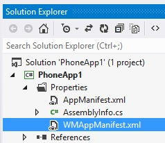

# Windows Phone 8上调用第三方库SDK

## 简介

cocos2d-x wp8平台上支持xaml后，方便了第三方Sdk的调用。本文以微软的广告这个第三方sdk为例，介绍如何在XAML工程中集成该sdk。微软官方文档：[http://msdn.microsoft.com/en-US/library/advertising-mobile-windows-phone-8-adcontrol-visual-designer%28v=msads.20%29.aspx](http://msdn.microsoft.com/en-US/library/advertising-mobile-windows-phone-8-adcontrol-visual-designer%28v=msads.20%29.aspx " Integrating the AdControl")，不过这种方式是在xaml页面上直接添加控件，本文介绍如何通过c++调用在c#页面里面添加控件，及对c#控件事件的回调在c++里面进行响应处理，即c++和c#的互相调用。代码均在gitbub上个人仓库adcontrol分支中，链接：[https://github.com/koowolf/cocos2d-x/tree/adcontrol](https://github.com/koowolf/cocos2d-x/tree/adcontrol "adcontrol")，详细集成教程见下文。

## 下载Microsoft Advertising SDK for Windows Phone 

下载链接：[http://www.microsoft.com/en-us/download/details.aspx?id=8729](http://www.microsoft.com/en-us/download/details.aspx?id=8729 "SDK ")，下载完成后手动安装.msi文件。打开HelloCpp工程，右键选择"Add Reference",在Reference Mangager中通过"Extensions"页面添加，或者在"Browse"手动添加本地下载的dll。如下图：


## 配置WMAppManifest.xml
在**Solution Explorer**=〉**Properties** 里面，打开**WMAppManifest.xml**



选择**Capabilities **，勾选 **ID_CAP_IDENTITY_USER**、 **ID_CAP_MEDIALIB_PHOTO**、**ID_CAP_PHONEDIALER**


## 准备AdControl调用接口

在HelloCppComponent中添加ICallback.h文件，并在里面实现ICallback interface。添加回掉事件处理函数和调用接口。代码如下：

``` c++
namespace PhoneDirect3DXamlAppComponent
{
	namespace AdControlHelper
	{
		// An asynchronous completed event argument
		public ref class CompletedEventArgs sealed
		{
		public:
			CompletedEventArgs(bool ReturnValue, int ErrorCode, Platform::String^ ErrorMessage)
			{
				this->ReturnValue = ReturnValue;
				this->ErrorCode = ErrorCode;
				this->ErrorMessage = ErrorMessage;
			}

			property bool ReturnValue;
			property int ErrorCode;
			property Platform::String^ ErrorMessage;
		};
		// A callback interface for C# code to implement.
		public interface class ICallback
		{
			// Submit a score completed event.
			event Windows::Foundation::EventHandler<CompletedEventArgs^>^ OnBannerRefreshed;
			event Windows::Foundation::EventHandler<CompletedEventArgs^>^ OnBannerReceivedFailed;
			void CreateBannerAd();

			// switch bottombar in mainpage to add or remove panel
			void SwitchBottomBar();

			//... other event and other function
		};
	}
}
```

## c#中实现ICallback接口

在HelloCpp工程中添加AdControlCallback.cs代码文件，定义类AdControlCallback实现ICallback接口。如下：

``` c++

namespace PhoneDirect3DXamlAppComponent
{
    /// <summary>
    /// A callback class that implements the WinRT Component interface ICallback.
    /// All methods provided will be called throught the ICallback interface in native code.
    /// </summary>
    public class AdControlCallback : ICallback
    {
        public event EventHandler<CompletedEventArgs> OnBannerRefreshed;
        public event EventHandler<CompletedEventArgs> OnBannerReceivedFailed;

        public void SwitchBottomBar()
        {
            m_MainPage.SwitchBottomBar();
            if (bAdCreated == false)
            {
                 CreateBannerAd();
                 bAdCreated = true;
            }            
        }

        //Create the Ad at runtime and add to the container
        public void CreateBannerAd()
        {
            Deployment.Current.Dispatcher.BeginInvoke(() =>
            {
                // ApplicationID = "test_client", AdUnitID = "Image480_80", 

                AdControl adControl = new AdControl("test_client",   // ApplicationID
                                                    "Image480_80",   // AdUnitID
                                                    true);           // isAutoRefreshEnabled
                // Make the AdControl size large enough that it can contain the image
                adControl.Width = 480;
                adControl.Height = 80;
                adControl.AdRefreshed += new EventHandler(adControl_AdRefreshed);
                adControl.ErrorOccurred += new EventHandler<Microsoft.Advertising.AdErrorEventArgs>(AdView_AdRequestFailed);

                m_MainPage.AddBannerAd(adControl);
            });
        }

        private void adControl_AdRefreshed(object sender, EventArgs e)
        {
            //if (OnBannerReceivedFailed != null)
            //{
            //    OnBannerReceivedFailed(sender, new CompletedEventArgs(true, (int)errorCode.ErrorCode,h "Failed to receive ad with error " + errorCode.ToString()));
            //}
            if (OnBannerRefreshed != null && m_d3dInterop != null)
            {
                m_d3dInterop.OnAdControlEvent(sender, new CompletedEventArgs(true, 200, "Received ad successfully"), OnBannerRefreshed);
            }
        }
    }
}
```
AdControl为Microsoft.Advertising.Mobile.UI中的类，需要添加命名空间：using Microsoft.Advertising.Mobile.UI;。CreateBannerAd函数调用该类，并用adControl_AdRefreshed完成调用，函数内用OnBannerRefreshed实现回调。注意，这里仅当CreateBannerAd在opengl界面里面直接调用，才能直接回调OnBannerRefreshed事件处理函数，因为这边涉及到一些UI类调用，需要使用Deployment.Current.Dispatcher.BeginInvoke执行，使用这个Dispatcher可以与MainPage.xaml页面处于同一线程中，即MainThread中执行，如果使用上面注释掉的代码，会产生一些不可预期的错误，OnAdControlEvent相关代码在下文中将介绍。对于一些调用，如果从调用到回调函数都是在同一个线程中执行，如果调用sdk运行时间较长，会导致游戏界面出现卡顿的现象。
m_MainPage.SwitchBottomBar() 及 m_MainPage.AddBannerAd(adControl) 的调用在下面实现。

## 修改MainPage.xaml

直接打开MainPage.xaml页面文件，修改ContentPanel内代码，添加StackPanel，这里将stackContainer的Visibility属性设置为Collapsed不可见，后面将在stackContainer添加AdControl控件

``` c++
		<!--ContentPanel - place additional content here-->
        <Grid x:Name="ContentPanel" Grid.Row="1" Margin="12,0,12,0">

            <DrawingSurface x:Name="DrawingSurface" Loaded="DrawingSurface_Loaded" Margin="0,0,0,0"  />

            <!-- Container where the adcontrol will be added at run time-->
            <StackPanel x:Name="stackContainer" Height="0" VerticalAlignment="Bottom" Visibility="Collapsed">
            </StackPanel>

        </Grid>
```

在MainPage.xaml.cs里面添加SwitchBottomBar函数，调用时，将显示stackContainer，并且修改DrawingSurface大小。添加AddBannerAd函数，添加AdControl控件到stackContainer显示

``` c++
        // add to the container
        public void AddBannerAd(AdControl adView)
        {
            Dispatcher.BeginInvoke(() =>
            {
                this.stackContainer.Children.Add(adView);
            });            
        }

        public void SwitchBottomBar()
        {
            Dispatcher.BeginInvoke(() =>
            {
                bool bIsVisible = Visibility.Visible == this.stackContainer.Visibility;
                this.stackContainer.Visibility = (bIsVisible ? Visibility.Collapsed : Visibility.Visible);

                // reMargin DrawingSurface
                Thickness srcMargin = this.DrawingSurface.Margin;
                srcMargin.Bottom = bIsVisible ? 0 : 100;
                this.DrawingSurface.Margin = srcMargin;

                // reHeight stackcontainer
                this.stackContainer.Height = bIsVisible ? 0 : 100;
            });
        }
```

## 在WinRT组件中实现调用代理

在HelloCppComponent中创建**AdControlDelegate**托管类，方便C++和C#中调用。

``` c++

namespace PhoneDirect3DXamlAppComponent
{
	namespace AdControlHelper
	{
		public ref class AdControlDelegate sealed
		{
		public:
			AdControlDelegate(void);

			void SetCallback(ICallback^ callback);

			property static ICallback^ GlobalCallback;
		};
	}
}
```
这里以static保存实现了**ICallback的类实例**，SetCallback函数在c#中调用。如果在C++中多次使用到**AdControlDelegate**类，可以使用单例模式来创建AdControlDelegate。SetCallback函数调用可以在HelloCpp工程里的MainPage的DrawingSurface_Loaded中实现，如下：

``` c++
				AdControlDelegate adDelegate = new AdControlDelegate();
				AdControlCallback adObj = new AdControlCallback();
                adDelegate.SetCallback(adObj);
```

## 游戏逻辑中调用并处理回掉函数

在HelloWorld添加一个测试按钮，并实现按钮点击调用函数menuCallbackBottom，在menuCallbackBottom函数中调用sdk，并实现回调函数OnBannerReceivedFailed。

``` c++
	AdControlDelegate^ AdControlObj = ref new AdControlDelegate();
	AdControlObj->GlobalCallback->OnBannerReceivedFailed += ref new Windows::Foundation::EventHandler<CompletedEventArgs^>(
		[this](Platform::Object^ sender, CompletedEventArgs^ args){
			Platform::String ^platform_string = args->ErrorMessage;
			const wchar_t* wide_chars = platform_string->Data();
			char chars[512];
			wcstombs(chars, wide_chars, 512);
			pResponseLabel->setString(chars);
	});
	AdControlObj->GlobalCallback->SwitchBottomBar();
```
在该函数中实现了OnBannerReceivedFailed回调函数，并且调用SwitchBottomBar来调用sdk。

## 不同线程处理

游戏渲染界面所处线程并非主线程，以上代码是在游戏界面中直接实现调用的，为同步操作，如果Sdk处理时间长会导致界面运行不流畅。可以使用主线程(即xaml页面所处线程)来调用Sdk，也可以创建一个任务来处理。如上面介绍过的Deployment.Current.Dispatcher.BeginInvoke调用，
Deployment.Current.Dispatcher.BeginInvoke可以获取主线程，并在里面实现调用sdk。也可以使用任务来调用，如下：

``` c++
        //Create the Ad at runtime and add to the container
        public void CreateBannerAd()
        {
            //common worker thread
            System.Threading.Tasks.Task.Run(async () =>
            {
                // ApplicationID = "test_client", AdUnitID = "Image480_80", 

                AdControl adControl = new AdControl("test_client",   // ApplicationID
                                                    "Image480_80",   // AdUnitID
                                                    true);           // isAutoRefreshEnabled
                // Make the AdControl size large enough that it can contain the image
                adControl.Width = 480;
                adControl.Height = 80;
                adControl.AdRefreshed += new EventHandler(adControl_AdRefreshed);
                adControl.ErrorOccurred += new EventHandler<Microsoft.Advertising.AdErrorEventArgs>(AdView_AdRequestFailed);

                m_MainPage.AddBannerAd(adControl);
            });
        }

```

但是用其他线程来调用SDK并不完整，这里回调的时候也使用了其他线程，当回调函数里面使用了游戏逻辑里的东西，比如画界面，会带来多线程不安全问题。最好回调时候能够切回游戏逻辑所处的线程，所以下一步进行回调处理。

## 回调处理

在Direct3DInterop实现文件中，可以发现，所有的点击、按键处理事件通过mInputEvents的事件队列来处理，只要向该线程投递该事件，然后由ProcessEvents函数来处理该事件。这样，我们定义一个AdControlEvent类继承InputEvent，如下：

``` c++
namespace PhoneDirect3DXamlAppComponent
{
	class AdControlEvent : public InputEvent
	{
	public:
		AdControlEvent(Object^ sender, CompletedEventArgs^ args, Windows::Foundation::EventHandler<CompletedEventArgs^>^ handler);
		virtual void execute(Cocos2dRenderer ^ renderer);

	private:
		Object^ m_sender;
		CompletedEventArgs^ m_args;
		Windows::Foundation::EventHandler<CompletedEventArgs^>^ m_handler;
	};
}

```
在AdControlEventt构造函数中，最后一个参数是EventHandler类型参数，避免了通过Cocos2dRenderer层层转发。因为在handler中已实现了回调函数，在execute实现中直接Invoke调用即可。如下：

``` c++
	void AdControlEvent::execute( Cocos2dRenderer ^ renderer )
	{
		m_handler->Invoke(m_sender, m_args);
	}
```

在Direct3DInterop类中，添加OnAdControlEvent响应函数。如下：

``` c++
void Direct3DInterop::OnAdControlEvent(Object^ sender, CompletedEventArgs^ args, Windows::Foundation::EventHandler<CompletedEventArgs^>^ handler)
{
	std::lock_guard<std::mutex> guard(mMutex);
	std::shared_ptr<AdControlEvent> e(new AdControlEvent(sender, args, handler));
	mInputEvents.push(e);
}
```

只要handler事件处理函数有不同的实现，就可以调用OnAdControlEvent这个函数，比如可以再实现一个OnBannerReceivedFailed来调用。相应的，修改直接回调函数AdView_AdRequestFailed的代码：
``` c++
        private void AdView_AdRequestFailed(object sender, Microsoft.Advertising.AdErrorEventArgs e)
        {
            //if (OnBannerReceived != null)
            //{
            //    OnBannerReceived(sender, new CompletedEventArgs(true, 200, "Received ad successfully"));                
            //}

            if (OnBannerReceivedFailed != null && m_d3dInterop != null)
            {
                m_d3dInterop.OnAdControlEvent(sender, new CompletedEventArgs(true, (int)e.ErrorCode, "Received ad failed" + e.Error.Message), OnBannerReceivedFailed);
            }
        }      
```

在AdControlCallback中设置并保存Direct3DInterop实例的函数，在MainPage的DrawingSurface_Loaded函数中调用SetCallback保存：
``` c++
		public void SetDirect3DInterop(Direct3DInterop d3dInterop)
        {
            m_d3dInterop = d3dInterop;
        }
```

以上代码整个调用过程就完成了，假如需要在通过MainPage调用其它xaml页面，可以用SetMainPage在AdControlCallback中保存该MainPage类实例，如：
``` c++
        public void SetMainPage(MainPage mainPage)
        {
            m_MainPage = mainPage;
        }

        private void CallToShowPage()
        {
            // get the UI thread (ie. the Main Thread) to let the worker thread (ie. opengl thread) work normally.
            Deployment.Current.Dispatcher.BeginInvoke(() =>
            {
                m_MainPage.NavigationService.Navigate(new Uri("/Page1.xaml", UriKind.Relative));
            });
        }
```
如果有点击按钮，弹出整个全屏页面的情况，便可以使用上面的CallToShowPage方法。

## 运行效果


