# Effects 效果

## 介绍

效果是一种特殊的动作。跟一般的属性修改如不透明度、位置、旋转或大小不一样的是，效果修改的是一种新的属性：网格属性（grid property）。

网格属性就像一个矩阵网络，由众多横竖的线构成的网络，组成各种方形或矩形。

这些特殊动作会将任何的“CocosNode”对象（层、场景、精灵等）绘制于网格，你可以通过移动该网格的顶点（vertice）来改变这个网格。

网格分两种：瓷砖式网格和非瓷砖式网格。两种网格的不同点在于瓷砖网格由单独的个体瓷砖组成，而非瓷砖网格由顶点组成。

以下为Ripple3D动作的示意图，采用的是一个Grid3D（非瓷砖）网格：

 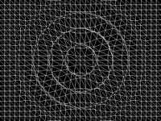

以下为一个淡出动作FadeOutTR示意图，采用的是TiledGrid3D（瓷砖）网格： 

 

## 如何使用？

跟其他动作一样，效果也是由“runAction”来执行，例如：

	// Create an sprite
	CCSprite* grossini = CCSprite::create("grossini.png");
	grossini->runAction(CCLiquid::create(4, 20, ccg(10,10), 5));

液体效果（Liquid）跟其他网格动作一样会接受网格参数。你可以通过增加网格尺寸调整效果的质量，但网格更大意味着帧数越少（FPS）。

效果是“IntervalAction”动作，所以你可以把效果当成其他动作一样使用，例如：

	// create a Lens3D action
	CCActionInterval* lens = CCLens3D::create(ccp(240,160),240,ccg(15,10),8);
	
	// create a Waved3D action
	CCActionInterval* waves = CCWaves3D::create(18,80,ccg(15,10),10);
	
	// create a sequence an repeat it forever
	grossini->runAction(CCRepeatForever::create((CCSequence*)CCSequence::create(waves, lens, NULL ) ) );

以下列表为V2.1.0版本中存在的Grid3D（非瓷砖）动作：

|Shaky3D|Waves3D|FlipX3D|FlipY3D|
|-------|-------|-------|-------|
|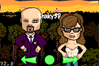|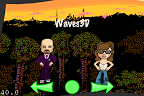|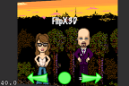||

|Lens3D|Liquid|Waves|Twirl|
|------|------|-----|-----|
|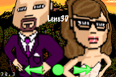|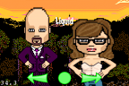|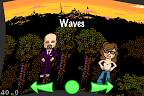||

|Ripple3D|
|--------|
||

以下列表为现有的TiledGrid3D（瓷砖）动作。

|ShakyTiles3D|ShatteredTiles3D|ShuffleTiles|FadeOutTRTiles|
|------------|----------------|------------|--------------|
||||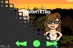|

|FadeOutBLTiles|FadeOutUpTiles|FadeOutDownTiles|TurnOffTiles|
|--------------|--------------|----------------|------------|
|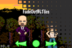||||

|WavesTiles3D|JumpTiles3D|SplitRows|SplitCols|
|------------|-----------|---------|---------|
|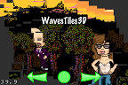|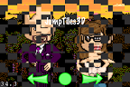||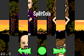| 
			
### 参考

cocos2d-iphone [Introduction to cocos2d’s effects](http://www.cocos2d-iphone.org/archives/40)
。
