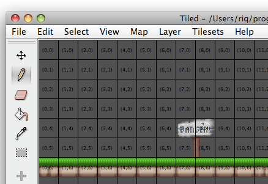
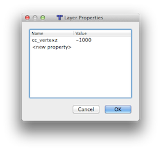
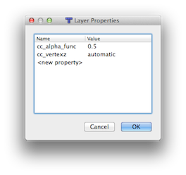
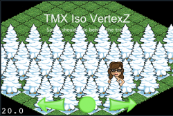
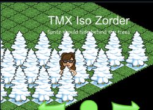
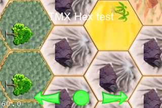

# Tiled Map 瓷砖地图

## 瓷砖地图

瓷砖地图的制作很简单，不管你是在开发RPG游戏、平台游戏还是突破风格（Breakout）的游戏，瓷砖地图跟Cocos2D-x配合起来非常灵活。Cocos2D-x支持由开源瓷砖地图编辑器（Tiled Map Editor）制作并以TXM格式保存的地图。
## TMX瓷砖地图格式
Cocos2d支持瓷砖地图编辑器制作的TXM瓷砖地图。
### 瓷砖地图编辑器分两个版本

- 一个是运行于Mac OS X、Windows及Linux平台的Java应用，为稳定版。

- 一个是支持几乎所有java版本功能的QT（本地）应用。本指南撰写时，最新QT版本为0.4.0，支持除六边形地图以外的所有功能。

使用哪个版本很大程度上取决于你自己。不过我们建议使用QT版本，从现在起QT版本是瓷砖地图开发的主线，但有些人还是喜欢使用Java版本，因为并不是所有旧功能都已经完全移植到QT版本中。

### Ray教你如何使用瓷砖制作游戏地图

如何使用Cocos2D制作瓷砖地图

## Cocos2d支持以下TMX地图
### 方向
- 直角地图
- 等体积地图
- 六边形地图（不支持边在左右两侧或上下两侧，好像瓷砖地图编辑器也不支持）

### 瓷砖(Tiles)

- 不支持嵌入瓷砖（如嵌入图像的瓷砖集）
- 只支持嵌入瓷砖集（如嵌入瓷砖集，而不是图像）
- 每层支持最多1个瓷砖集
###层(Layers)

- 层数量无限制，随用户自己定
- 每层内部由“CCTMXLayer”代表（为“CCSpriteSheet”的子类。）
- 每个瓷砖都会由一个“CCSprite”来代表（其父类为“CCTMXLayer”）
###对象组

支持瓷砖对象组（Tiled objectGroup）
## 坐标和GIDS
### 坐标

在瓷砖编辑器中使用的坐标系统为一张64 X 32的地图：

左上角坐标为原点（0,0）
右下角坐标为（63,31）

### GIDA

瓷砖GID就是瓷砖的全球标识符（Global Identifier），为无符号整数，从1到瓷砖数量的数字。

         
如果有5个不同的瓷砖那么标识符如下：

- 瓷砖0标识符为GID1
- 瓷砖1标识符为GID2
- 瓷砖2标识符为GID3
- 以此类推

GID0用于代表空瓷砖。

## 如何创建TMX节点

	// create a TMX map
	CCTMXTiledMap *map = CCTMXTiledMap::create("TileMaps/iso-test-vertexz.tmx");
	
	addChild(map, 0, kTagTileMap);
	
	// All the tiles by default will be aliased. If you want to create anti-alias tiles, you should do:
	
	// iterate over all the "layers" (atlas sprite managers)
	
	// and set them as 'antialias' 
	
	CCArray * pChildrenArray = map->getChildren();
	
	CCSpriteBatchNode* child = NULL;
	
	CCObject* pObject = NULL;
	
	CCARRAY_FOREACH(pChildrenArray, pObject)
	{
	        child = (CCSpriteBatchNode*)pObject;
	
	        if(!child)
	            break;
	
	        child->getTexture()->setAntiAliasTexParameters();
	}

## 如何获取/增加/删除/修改瓷砖

在特定坐标中获取一块瓷砖（CCSprite）：

	CCTMXLayer* layer = map->layerNamed("Layer 0");
	
	CCSprite *tile0 = layer->tileAt(ccp(1,63));

获取特定坐标的瓷砖GID：

	unsigned int m_gid = layer->tileGIDAt(ccp(0,63));

在特定坐标设置一个新瓷砖的GID：

	layer->setTileGID(m_gid, ccp((float)3, (float)3));
	// To remove a tile at a certain coordinate
	layer->removeTileAt( ccp(5.0, 5.0) );

重复一层：

	CGSize s = layer->getLayerSize();
	
	for( int x=0; x<s.width;x++) {
	        for( int y=0; y< s.height; y++ ) {
	                unsigned int tmpgid = layer->tileGIDAt(ccp(x,y));
	                layer->setTileGID(tmpgid+1,ccp(x,y));
	        }
	}

## Z指令和深度缓冲

信息对等体积及直角地图有效，对六边形地图无效。

如果游戏需要根据精灵的Y轴位置在特定瓷砖后/前放置精灵（常用情况即为等体积地图，在一些直角地图中也有用），这时你有两个选择：

- 使用OpenGL ES深度缓冲
- 使用多TMX层及Z指令（z-order）
- 
## 使用深度缓冲

要用2个TMX层来创建地图，这点非常重要。

- 一个背景层如草
- 一个前景层如树

草层将会位于精灵背后，所以vertexZ顶点值应该尽可能底如-1000。树层的话，不同的瓷砖应该有不同的vertexZ顶点值。位于底部瓷砖树层的vertexZ值应该比顶部瓷砖的要高。

 

所以操作步骤如下：

- 打开瓷砖编辑器
- 选择背景层（如草）
- 依次选择“Tiled”、“Layer”、“Layer Properties”
- 增加“cc_vertexz = -1000”
- 选择前景层（如树）
- 依次选择“Tiled”、“Layer”、“Layer Properties”
- 增加“cc_vertexz = automatic”

## 样例

| | |
|--------------|-------------|
||等体积地图vertexZ样例。本地图有2层：“树”和“草”。树层设置的顶点值是 “cc_vertex=automatic”，而草层为“cc_vertexz=-1000”|
||直角地图vertexZ样例。本地图有2层：“树”和“草”。树层顶点值为“cc_vertexz=automatic”和“cc_alpha_func=0.5”，草层为“cc_vertexz=-1000”|

## 使用多TMX层及Z指令

地图每层都会自动被赋予zOrder值，所有无需再在TMX编辑器中增加任何层属性。将精灵当成子类增加到TMX地图中，你便可以动态地在地图各层内放置精灵。

	CCSprite m_tamara = CCSprite::create(tamara.png);
	CCPoint p = m_tamara->getPosition();
	p = CC_POINT_POINTS_TO_PIXELS;
	float newZ = -(p.y+32) /16;
	m_tamara->setVertexZ( newZ );

## 截屏

| | |
|--------------|-------------|
||带3D投影及反走样（anti-aliased）瓷砖的直角地图。本图瓷砖通过“spritesheet-fixer”工具“固定”。即便使用3D投影和反走样瓷砖也不会出现假象。|
||直角地图。地图瓷砖大小小于瓷砖编辑区域。|
||支持2D投影及走样瓷砖的等体积地图|
||支持2D投影及走样瓷砖的直角地图。边为左右走向。不支持上下走向的边（暂不）。|

## 参考

[Cocos2d-iphone tiled\_maps ](http://www.cocos2d-iphone.org/wiki/doku.php/prog_guide:tiled_maps)

[使用瓷砖编辑器制作简单地图](http://sourceforge.net/apps/mediawiki/tiled/index.php?title=Creating_a_simple_map_with_Tiled)

[如何使用cocos2d制作瓷砖地图游戏](http://www.raywenderlich.com/1163/how-to-make-a-tile-based-game-with-cocos2d)