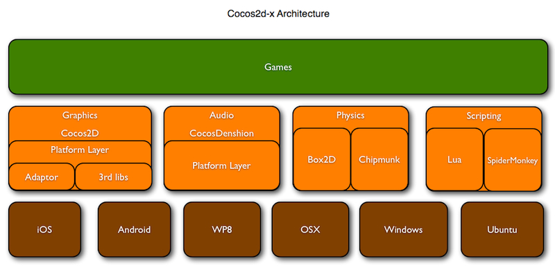
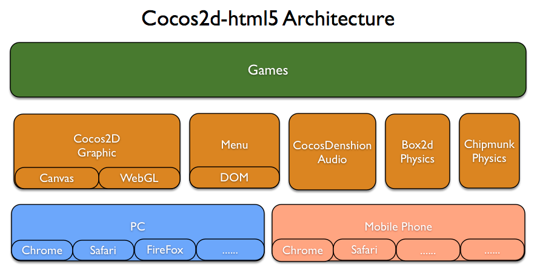

# 架构和目录结构        

## 1. Cocos2d-x
### 1.1 架构   
    

### 1.2目录结构 

从github下载Cocos2d-x repo资源包后，或解压稳定版ZIP压缩包后，就会看到如下的目录结构：  

|目录名称  |  说明 |
|---------------|----------------------------------------------------------|
|CocosDenshion	 | 音频支持。注意：Android平台中背景音乐和短音效所使用的系统API不同。|
|cocos2dx	 | Cocos2d-x框架的主目录。|
|document	 | 你可以下载doxygen文档系统，利用该系统打开本文档文件夹内的doxygen.config文件，然后再生成离线API文档。|
|extensions	 | 如果需要更多图形用户界面的控制功能、网络访问、CocosBuilder支持甚至2.5D功能，你可以使用using namespace cocos2d::extension。|
|external	 | 包括box2d及Chipmunk库。|
|licenses	 | cocos2d依赖很多其他开源项目。所有授权许可文件都在这个目录。|
|samples	 	 | **重要！这是你该开始用到的文件。**从Cpp/HelloCpp开始学习，你会在TestCpp中发现所有类的用法。lua和js样本也在这个目录。|
|scripting	 | 我知道你不喜欢C++，写起来太复杂。没问题，我们有Lua和Javascript。Scripting文件夹包括来自火狐的lua官方引擎和SpiderMonkey引擎。|
|template	 | 该目录包括在不同集成开发环境及不同平台中创建Cocos2d-x新项目的模板。这里汇集了数量庞大覆盖各种开发环境和平台的模板！|
|tools	 	 | 包括将C++绑定至lua及javascript的脚本文件。|
|CHANGELOG	 | 作者修订记录文档。|
|cocos2d-win32.vc2010.sln	 | 配套Visual Studio 2010打开。注意：VS 2008自Cocos2d-x v2.0版本以来就不再支持。|
|cocos2d-win32.vc2012.sln	 | 配套Visual Studio 2012打开。|
|create-android-project.bat	 | 在Windows平台运行。具体用法请参考如何用脚本创建Android项目。|
|create-android-project.sh	 | 在Linux或OS X平台运行。具体用法请参考如何用脚本创建Android项目。|
|install-templates-msvc.bat	 | 执行该文件安装后，你可以在Visual Studio中创建空的Cocos2d-x项目。|
|install-templates-xcode.sh	 | 执行该文件安装后，你可以在Xcode中创建空的Cocos2d-x项目。|

## 2. Cocos2d-html5
### 2.1 架构

### 2.2 目录结构

|目录 |	说明|
|---------------|----------------------------------------------------------|
|CocosDenshion	 |	音频支持。注意：你至少需要两种音频格式以支持所有浏览器。|
|cocos2d	 |	主目录，包括所有主目录文件及与Cocos2d-x及Cocos2d-iPhone一样的API。平台兼容性佳！|
|box2d	 |	V2.1a版本的Box2dweb Physics引擎。|
|chipmunk	 |	无版本号的Chipmunk Physic引擎|
|Demo	 |	包括几个demo程序，你可以从这些demo程序入手。|
|extensions	 |	如果需要更多图形用户界面的控制功能、EditBox、CocosBuilder支持、CocoStudio支持或任何第三方库，都在这里。|
|HelloHTML5Wrold |		预备的一个Hello World程序，你可以从这入手。|
|lib	 |	包括一个MIN版本的引擎，当你使用ant工具运行/cocos2d/build.xml文件时，会将所有引擎文件打包成一个文件。|
|licenses	 |	cocos2d依赖很多其他开源项目。所有授权许可文件都在这个目录。|
|samples	 |	你可在Test文件中发现所有类的用法。该目录还包括样本游戏。所有测试样本和游戏样本均可以在JSB中运行。重要！这是你该开始用到的文件。|
|template	 |	用于创建Cocos2d-html5新项目的模板。|
|tools	 |	包括JSDoc及Closure Compiler编译器。|
|index.html	 |	Cocos2d-html5索引文件。|
|AUTHORS	 |	作者列表|
|CHANGELOG	 |	该文件记录上述各位作者的修订记录。|

## 3. Javascript绑定

跨平台虽然很好，但还不够好。用C++语言编程不仅超级慢，C++代码还无法在网络浏览器中运行。这就是为什么我们选择增加Javascript绑定功能。通过JSB我们可以将javascript代码打包至：

1. Cocos2d-x+SpiderMonkey上的本地应用，SpiderMonkey能将javascript代码解析成C语言。
2. Cocos2d-html5上的网页应用。

     
我们在Cocos2d-iphone、Cocos2d-x 和Cocos2d-html5框架中使用的API组合是一样的。所以，我们可以百分之百在本地Cocos2d-x或Cocos2d-iphone中创建javascript游戏。当你要在浏览器上运行时，你只需要将引擎切换至Cocos2d-html5，而无需修改源代码。

优势：

1. 编码速度要比C++快得多
2. 无需处理野指针、引用计数及内存泄露的问题
3. 跨越本地及网络平台
4. 在线更新

