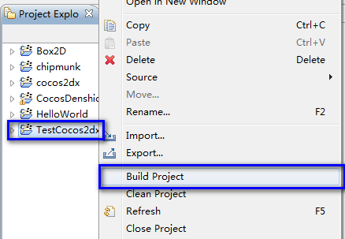

# 如何在黑莓平板系统中运行HelloWorld及测试项目

## 搭建QNX及Cocos2d-x开发环境

1. 从[https://github.com/cocos2d/cocos2d-x](https://github.com/cocos2d/cocos2d-x)下载最新cocos2d-x引擎，解压至你的文件夹如C:\cocos2d-x。
2. 从[https://bdsc.webapps.blackberry.com/native/download/](https://github.com/cocos2d/cocos2d-x)下载黑莓NDK及模拟器并安装。
3. 点击桌面名为“BlackBerry Native SDK for Tablet OS 1.0”的图标启动QNX集成开发环境。
4. 导入cocos2d-x项目     
单击菜单，选择'File' --> 'Import...'-->'General'-->'Existing Projects into workspace'-->'Next'
选择'Select root directory:________[Browse...]'，点击“浏览”（Browse）选择步骤1下载的文件夹，然后点击“OK”。
选择所有后缀为“C:\cocos2d-x\****\proj.qnx”的项目，点击“完成”（Finish）。至此，所有QNX项目已经导入至工作室。

    
———————————————————     
     
———————————————————    
    
———————————————————    
   

## 编译项目

右键单击“TestCocos2dx”然后选择“Build Project”如上图所示，几分钟后编译完成。
如果遇到编译错误，你可能需要编译Cocos2dx及其他项目。

## 运行应用

首先，根据[https://bdsc.webapps.blackberry.com/native/documentation/getting_started.html](https://bdsc.webapps.blackberry.com/native/documentation/getting_started.html)内容配置黑莓本地SDK及模拟器。
然后右键单击“TestCocos2dx”，选择“Run as”（运行方式），再选择“1.BlackBerry Tablet OS C/C++ application”即可运行。