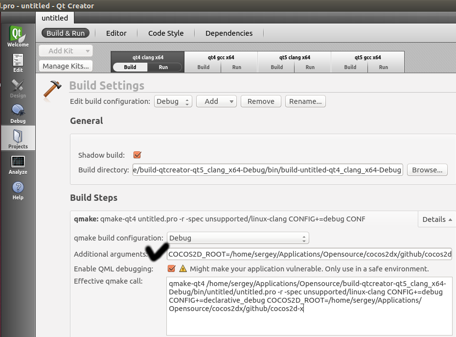

# Linux平台搭建QtCreator项目

注意：本文介绍cocos2dx 3.x版本引擎支持的功能，可与Github中的开发工具分支（git branch）配套使用。

## 功能
在**MyGame.pro** 中增加两行代码即可将完全集成cocos2d-x及其模块。

- Required（必填）行包括项目中新增的路径及宏定义。
- Slelected（选填）行包括即将被编译或链接至项目的cocos2d-x模块。

## 基本结构

总的来说，在你的项目文件中要包含cocos2dx.pri文件。如果你是单独的开发人员不需要协作的话，使用绝对路径将该文件包含（include）至项目即可。如下所示：     
```
1include(/home/user/Applications/cocos2d-distribution/cocos2dx/proj.linux/cocos2dx.pri)
```

如果你把cocos2d与游戏都放在代码库中，请使用相对路径包含该文件。    
```
1include(../3rdparty/cocos2d/cocos2dx/proj.linux/cocos2dx.pri)
```

或者定义变量COCOS2D_ROOT再使用该变量来包含文件。如下所示：    
```
1# (Optioal) if variable is not set, search environment variable.
2isEmpty(COCOS2D_ROOT):COCOS2D_ROOT=$$(COCOS2D_ROOT)
3
4include($$COCOS2D_ROOT/cocos2dx/proj.linux/cocos2dx.pri)
```

在这种方法下，研发人员应该在其个人的项目设置中设定COCOS2D_ROOT变量。    


## 其他模块
在包含cocos2dx.pri文件之前设定COCOS2D_MODULES变量。例如：     
```
1COCOS2D_MODULES += extensions box2d CocosDenshion
2include($$COCOS2D_ROOT/cocos2dx/proj.linux/cocos2dx.pri)
```

变量模块包括：

1. box2d –集成Box2D物理学引擎
2. chipmunk –集成另一个物理学引擎，不能与Box2D一起使用。
3. extensions- 各种扩展如网络、GUI（图形用户界面）、AssetsManagers（资产管理）等
4. CocosDenshion –音频引擎

注意：Linux平台中的CocosDenshion音频引擎有两个音频后端——OpenAL和FMOD。FMOD对非商用用户免费，但对商用及开源游戏开发用户则需要授权，所以默认使用OpenAL。如果想用FMOD，则需要在包含cocos2dx.pri文件之前设置以下这个变量：     
```
1COCOS2D_USE_FMOD = 1
```

## 运行应用

QtCreator不会自动复制项目新增的资源及来自assets文件夹的资源。你也无法将这些资源放到QRC文件中（因为cocos2d-x不支持Qt）。这时你有两个选择：

- 使用CCFileUtils设置定制资源路径。以下例子使用命令行加自变量（command-line arguments）获取资源（当然你也可以自己硬件编码的字符串）    
```
1std::vector<std::string> searchPaths;
2for (int i = 1; i < argc; ++i)
3    searchPaths.push_back(argv[i]);
4CCFileUtils::sharedFileUtils()->setSearchPaths(searchPaths);
```
- 使用默认路径`../../../Resources/`。该路径与放置可执行文件的文件夹相连（默认为build编译目录）。你可以将资源复制到这个文件夹（别忘了先新建文件夹！）或者使用以下命令创建软连接： `ln -s /path/to/real/resource/folder link_name.`。