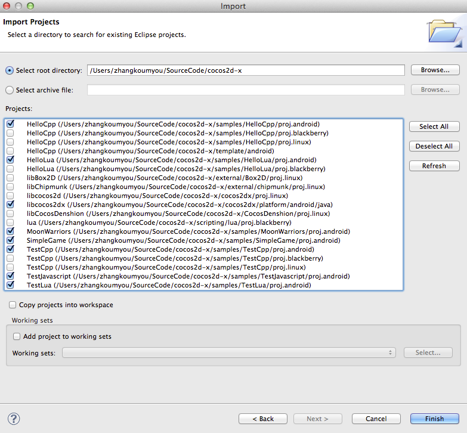

# 如何在Android平台中编译运行HelloWorld

请参见[如何在NDK R4和R5中运行HelloWorld项目](../manual/framework/native/getting-started/setting-up-development-environments/android-and-NDK/how-to-run-helloworld-on-ndk-r4-and-r5/zh.md)。

本指南仅介绍R4和R5之间的不同点。

该不同点在于如何通过Eclipse新建Android项目。

在gles20 branch中所有java文件如Cocos2dxMusic都会移至cocos2dx/platform/android/java目录下。这是一个独立的Eclipse项目，该项目被所有样本引用。
所以我们应该按照如下步骤用Eclipse创建Android项目。
1. 点击File -> Import...

2. 点击“Next”，将“root directory”设置为cocos2dx根目录，然后便可导入所有Android项目。

    
3. 点击“Finish”完成项目导入。   
现在即已导入cocos2dx提供的所有Android项目。     
希望本指南对你有帮助。

**因为libcocos2dx（cocos2dx提供的java文件）被所有样本引用，所以在运行样本前应该编译该文件。**