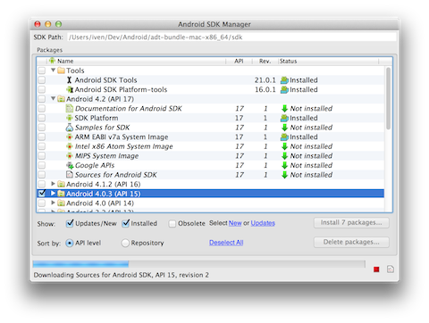
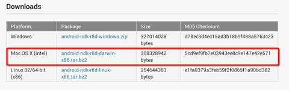
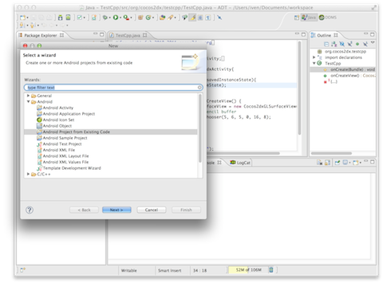
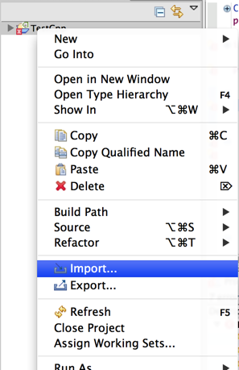
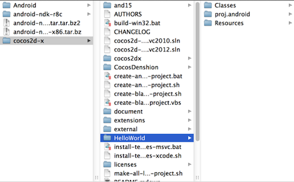
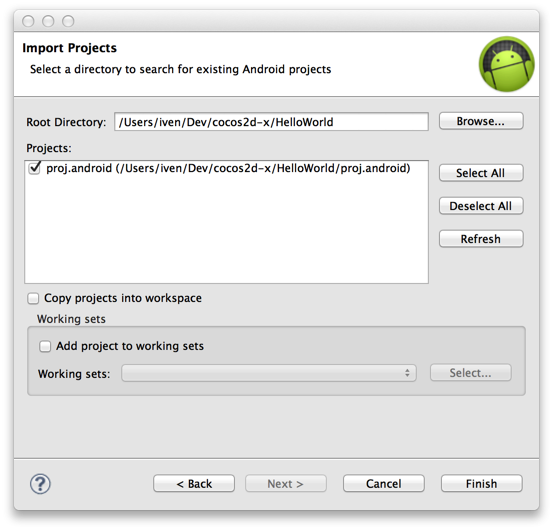
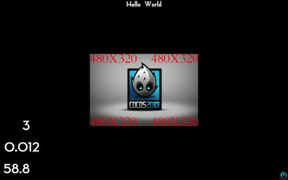

#  Mac OSX平台搭建Android开发环境

## 测试环境：

- Cocos2d-x版本号：Cocos2d-2.0-x-2.0.4
- OS X版本号：10.8
- NDK版本号：android-ndk-r8b
- 设备：Android 4.0.3（支持2.3版本及以上）

## 下载最新Cocos2d-x

- 从Cocos2d-x官方网站下载最新的Cocos2d-x。
- 解压ZIP文件。本指南中解压库的存放位置如下：    
```
1/Users/iven/dev/cocos2d-x
```
## JDK

检测JDK是否安装，版本是否大于1.6.0。打开终端，输入：    
```
1java -version
```

MacOS X会自动下载JDK，如图所示。    
       
你会看到如下所示信息：         
```
1java version "1.6.0_37" 
2Java(TM) SE Runtime Environment (build 1.6.0_37-b06-434-11M3909)
3Java HotSpot(TM) 64-Bit Server VM (build 20.12-b01-434, mixed mode)
```

检查完后，便可开始设置Mac的Android开发环境。
## 搭建ADT Bundle及现存集成开发环境
用Eclipse下载ADT： [http://developer.android.com/sdk/index.html#download](http://developer.android.com/sdk/index.html#download)。

解压ZIP文件（名字为“adt-bundle-<os_platform>.zip”），保存至适当位置如主目录的“Development”（开发）目录。

打开adt-bundle-<os_platform>/eclipse/目录并启动Eclipse。
就这样！至此集成开发环境已经加载了Android开发人员（Android Developer Tools）工具插件，SDK已经准备就绪。

       
### 在MBP Retina电脑中安装Eclipse
如果你用的是配备Retina显示屏的MacBook Pro电脑，注意原装Eclipse不支持Retina显示屏，但是可以使用简单的技巧启动Retina支持功能。（本方法来自：[https://bugs.eclipse.org/bugs/show_bug.cgi?id=382972](https://bugs.eclipse.org/bugs/show_bug.cgi?id=382972)）

1. 在Eclipse.app上执行“Show package contents”
2. 编辑Contents/Info.plist文件。
3. 就在以下代码上方        
```
1</dict>
2</plist>
```     
增加以下代码         
```
1<key>NSHighResolutionCapable</key>
2<true/>
```
4. 将Eclipse.app应用移至一个新文件夹（清除OS X中info.plist文件的缓存），然后再移回旧文件夹。
5．启动Eclipse即可，已支持Retina显示屏。

## 获取Android SDK
### 从Android SDK Manager中下载SDK
在Android Manager中检查你要用到的所有工具及Android API。最好也检查一下Extras。检查完毕之后，点击“Install Packages”（安装资源包），此时会出现一个对话框。点击“Accept All”（全部接受）然后点击“Install”（安装）开始安装。等待安装结束即可。如下图所示。    
    
## 获取NDK
从[http://developer.android.com/tools/sdk/ndk/index.html](http://developer.android.com/tools/sdk/ndk/index.html)中下载Mac版本的Android NDK。

解压NDK并将其放到一个可访问的位置，最好放到与Android SDK Root相同的文件夹中。本指南中，Android NDK存放路径为Users/iven/Dev/android-ndk-r8c，同时该路径也为Android NDK Root路径。    
         
至此集成开发环境已经加载Android开发人员工具（Android Developer Tools）插件，SDK准备就绪。

现在已经准备好用Cocos2d-x来开发跨平台游戏。但是我们还得做一些小修改，以便后续顺利开发。打开终端，输入以下命令：     
```
1export ANDROID_SDK_ROOT="/Users/iven/Dev/android/Users/iven/Dev/Android/adt-bundle-mac-x86_64/sdk" 
2export NDK_ROOT="/Users/iven/Dev/android-ndk-r8c" 
```

不要忘了改变Android SDK Root及Android NDK Root的值，后面将会用到这些变量。
## 编译及运行测试demo
### 命令行

进入/Users/iven/Dev/cocos2d-x/samples/Cpp/TestCpp/proj.android目录，执行以下命令生成build_native.sh文件：
```
 1IvenYangtekiMacBook-Pro:proj.android iven$ ./build_native.sh 
 2NDK_ROOT = /Users/iven/Dev/android-ndk-r8c
 3
 4COCOS2DX_ROOT = /Users/iven/Dev/cocos2d-x/samples/Cpp/TestCpp/proj.android/../../../..
 5APP_ROOT = /Users/iven/Dev/cocos2d-x/samples/Cpp/TestCpp/proj.android/..
 6APP_ANDROID_ROOT = /Users/iven/Dev/cocos2d-x/samples/Cpp/TestCpp/proj.android
 7Using prebuilt externals
 8make: Entering directory `/Users/iven/Dev/cocos2d-x/samples/Cpp/TestCpp/proj.android'
 9
10...
11
12Compile++ thumb : cocos_extension_static <= LocalStorageAndroid.cpp
13Prebuilt : curl.a <= /Users/iven/Dev/cocos2d-x/samples/Cpp/TestCpp/proj.android/../../../../cocos2dx/platform/third_party/android/prebuilt/libcurl/libs/armeabi/
14StaticLibrary : libextension.a
15StaticLibrary : libtestcppcommon.a
16SharedLibrary : libtestcpp.so
17Install : libtestcpp.so => libs/armeabi/libtestcpp.so
18make: Leaving directory `/Users/iven/Dev/cocos2d-x/samples/Cpp/TestCpp/proj.android'
```

### 选择Testcpp Eclipse项目

从现存代码中选择Eclipse Android项目（/Users/iven/Dev/cocos2d-x/samples/Cpp/TestCpp/proj.android）

        
在设备中编译并运行（执行“Build && Run”）该测试demo（Test demo）

注意：编译过程中可能出现如下错误：     
```
1Cocos2dxGLSurfaceView cannot be resolved to a typeTestCpp.java/TestCpp/src/org/cocos2dx/testcppline 38Java Problem
2Cocos2dxGLSurfaceView cannot be resolved to a typeTestCpp.java/TestCpp/src/org/cocos2dx/testcppline 38Java Problem
3Cocos2dxActivity cannot be resolved to a typeTestCpp.java/TestCpp/src/org/cocos2dx/testcppline 34Java Problem
4Cocos2dxGLSurfaceView cannot be resolved to a typeTestCpp.java/TestCpp/src/org/cocos2dx/testcppline 37Java Problem
5Cocos2dxActivity cannot be resolved to a typeTestCpp.java/TestCpp/src/org/cocos2dx/testcppline 31Java Problem
```

你可以通过导入另一个项目（in this tutorial is /Users/iven/Dev/cocos2d-x/cocos2dx）来修复该错误。





现在，在设备中再次编译并运行（build & run）便会得到以下结果。


## 创建HelloWorld

至此我们已经为Mac电脑搭建好了环境，即可以用Cocos2d-x来进行跨平台开发了。下一步是在Eclipse中创建一个跨平台项目，当然是用Cocos2d-x引擎。

将create-android-project.sh文件前面的代码换成如下：     
```
1NDK_ROOT_LOCAL="/Users/iven/Dev/android-ndk-r8c" 
2ANDROID_SDK_ROOT_LOCAL="/Users/iven/Dev/Android/adt-bundle-mac-x86_64/sdk" 
```

进入cocos2d-x根目录，运行以下命令生成create-android-project.sh文件并创建名为“HelloWorld”的新Android项目。   
```
 1IvenYangtekiMacBook-Pro:Cocos2d-x iven$ /Users/iven/Dev/cocos2d-x/create-android-project.sh 
 2use global definition of NDK_ROOT: /Users/iven/Dev/android-ndk-r8c/tools
 3use global definition of ANDROID_SDK_ROOT: /Users/iven/Dev/Android/adt-bundle-mac-x86_64/sdk
 4Input package path. For example: org.cocos2dx.example
 5org.cocos2dx.HelloWorld
 6Now Cocos2d-x supports Android 2.2 or upper version
 7Available Android targets:
 8----------
 9id: 1 or "android-15" 
10     Name: Android 4.0.3
11     Type: Platform
12     API level: 15
13     Revision: 3
14     Skins: HVGA, QVGA, WQVGA400, WQVGA432, WSVGA, WVGA800 (default), WVGA854, WXGA720, WXGA800
15     ABIs : armeabi-v7a
16----------
17id: 2 or "android-17" 
18     Name: Android 4.2
19     Type: Platform
20     API level: 17
21     Revision: 1
22     Skins: HVGA, QVGA, WQVGA400, WQVGA432, WSVGA, WVGA800 (default), WVGA854, WXGA720, WXGA800, WXGA800-7in
23     ABIs : armeabi-v7a
24input target id:
251
26input your project name:
27HelloWorld
```

完成HelloWorld项目创建之后，你会在cocos2d-x根目录看到该项目。如下图所示。



在终端运行“helloworld/proj.android/build_native.sh”：    
```
1Compile thumb : chipmunk_static <= cpSweep1D.c
2Compile thumb : chipmunk_static <= cpVect.c
3StaticLibrary : libchipmunk.a
4StaticLibrary : libextension.a
5SharedLibrary : libgame.so
6Install : libgame.so => libs/armeabi/libgame.so
7make: Leaving directory `/Users/iven/Dev/cocos2d-x/helloworld/proj.android'
8IvenYangtekiMacBook-Pro:Cocos2d-x iven$ 
```
### 导入helloworld Eclipse项目

在“Existing Code”中选择“Eclipse Android Project”（ /Users/iven/Dev/cocos2d-x/helloworld/proj.android）

 

在设备中运行该应用以编译并安装。



至此便完成了在Mac平台上搭建Android开发环境。希望本指南对你有帮助并祝编码愉快。