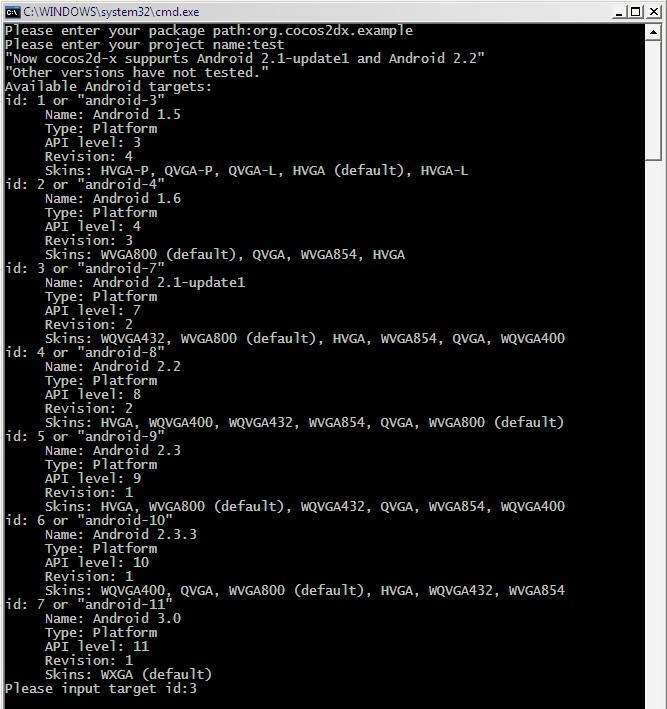
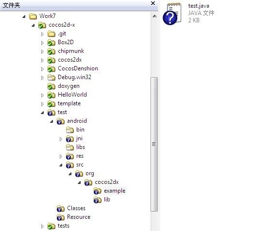

# 如何用脚本创建Android项目

本文档介绍如何利用BAT批量文件（Windows平台）或shell脚本（Linux或Mac平台）创建Android项目。脚本文件版本号为0.8.2.

自Cocos2d-1.0.1-x-0.12.0版本以来，你可创建支持lua、chipmunk或box2d的项目。用法如下：

- Windows平台     
编辑create-android-project.bat批量文件，在endlocal & _CYGBIN\bash --login "%_CYGSCRIPT%" _CURRENTDIR _PROJECTNAME _NDKROOT _PACKAGEPATH "windows".后面加上[-b|--box2d]、 [-l|--lua]或[-c|chipmunk]，如下所示：
```
endlocal & %_CYGBIN%\bash --login "%_CYGSCRIPT%" %_CURRENTDIR% %_PROJECTNAME% %_NDKROOT% %_PACKAGEPATH% "windows" -l
```
或者
```
endlocal & %_CYGBIN%\bash --login "%_CYGSCRIPT%" %_CURRENTDIR% %_PROJECTNAME% %_NDKROOT% %_PACKAGEPATH% "windows" --lua
```
如果你想创建支持lua及box2d的项目，你可以增加参数，如下所示：      
```
endlocal & %_CYGBIN%\bash --login "%_CYGSCRIPT%" %_CURRENTDIR% %_PROJECTNAME% %_NDKROOT% %_PACKAGEPATH% "windows" -l -b
```
或者
```
endlocal & %_CYGBIN%\bash --login "%_CYGSCRIPT%" %_CURRENTDIR% %_PROJECTNAME% %_NDKROOT% %_PACKAGEPATH% "windows" --lua --box2d
```
- linux平台    
在Linux平台上你可以在运行create-android-project.sh时传递参数，用法如下：
```
cd $COCOS2DX_ROOT
./create-android-project.sh [-b|--box2d] [-l|--lua] [-c|chipmunk]
```

## 1. Windows平台

运行create-android-project.bat文件创建Android项目。该批量文件应该在cocos2dx根目录下激活。    
**你可以根据自己的开发环境在create-android-project.bat文件中改变一些宏。**  
   
```set _CYGBIN=F:\cygwin\bin ```       
cygwin bin路径    
```set _ANDROIDTOOLS=D:\android-sdk\tools```     
android sdk工具路径    
```set _NDKROOT=E:\android-ndk-r4-crystax```
ndk根目录    

创建Android项目时，需要输入资源包路径（package path）、目标ID（target id）及项目名称（project name）。    
     
图1-1 
### 1.1 目标ID（target id）

如果你不懂什么是“目标ID”（target id），请使用android.bat文件获取可用目标列表。或参见这篇文章：
 [http://developer.android.com/guide/developing/tools/android.html](http://developer.android.com/guide/developing/tools/android.html)

**不同开发环境下的目标ID （target id）不同，请确保输入有效的目标ID (target id)。**在本文撰写时，cocos2dx支持Android 2.1-update1、Android 2.2以及Android 3.0。其他版本尚未测试。

### 1.2 项目名称（project name）
执行.bat文件会在cocos2dx根目录下创建一个叫“项目名称”（project name）的目录。默认的活动（activity）也会被命名为与项目名称一样的名称。如图1-2，输入“test”作为项目名称，目录图如下所示：   

    
图1-2


### 1.3 资源包路径（Package path）
资源包路径（package path）即为执行启动活动（activity）的java文件资源包的名称。在例子中，输入名称为“org.cocos2dx.example”。所以test.java文件位于in test/android/src/org/cocos2dx/example路径下。资源包名字同时也用于AndroidMenifest.xml文件中。
该资源包路径应该是唯一的，否则你的应用可能会被其他Android应用覆盖(override)。这种事情常有发生，不仅在Android开发当中，在Java开发中也是如此，所以一般使用反向域名来作名称。如果你的域名是**google.com**，那通常情况下你的资源包路径为**com.google**。

### 1.4 编译项目
运行test/android目录下的build_native.sh文件编译本地代码（C/C++代码）。

 
图1-3

## 2. Linux/Mac平台

根据自己的开发环境在create-android-project.sh文件中改变一些宏。如下所示：

```NDK_ROOT="/workspace/android-dev/android-ndk-r5" ```    
ndk根目录     
```ANDROID_SDK_ROOT="/workspace/android-dev/android-sdk-mac_86" ```     
android sdk根目录

运行create-android-project.sh创建android项目。该文件应该在cocos2dx根目录下激活。

创建Android项目时，需要输入资源包路径（package path）、目标ID（target id）以及项目名称（project name）。这些参数的意义同Windows平台下的意义相同（参见1.1及1.2章节）。编译项目的方法也与Windows平台下的方法相同（参见1.4章节）。

**重要注意事项**
如果你在运行任何shell脚本时遇到“Permission denied”（无许可权限）错误时，可尝试使用chmod命令修复该问题。比如……