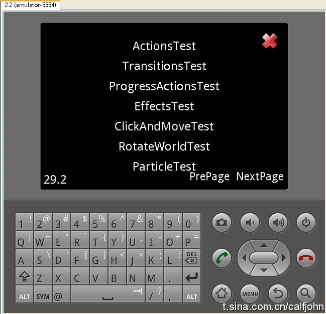
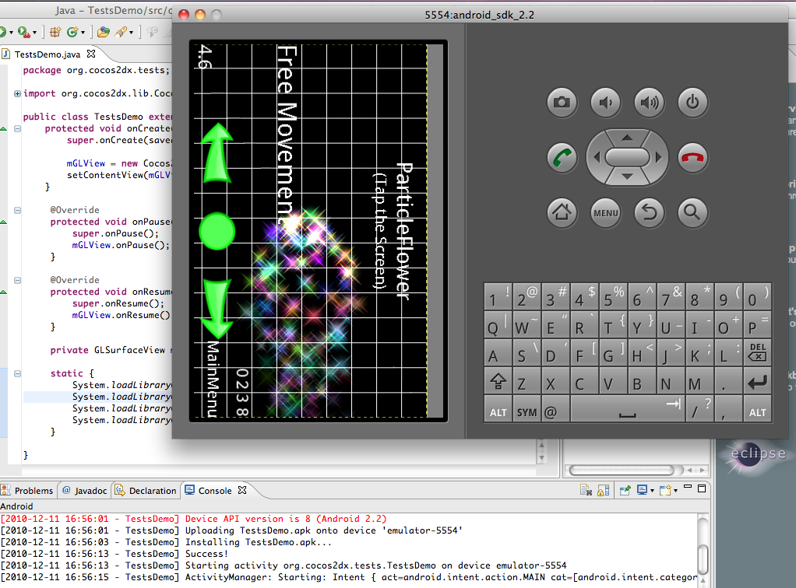

# 如何在Android NDK中运行测试项目

本文档介绍如何在Android SDK中运行测试项目。        
本开发环境为Windows+cygwin，当然也可在Linux系统中进行。
## 1. 搭建开发环境
本文档不介绍如何搭建NDK开发环境。若需了解相关信息请参考[http://developer.android.com/](http://developer.android.com/)。以下为一些注意事项。
### 1.1 NDK版本必须为R4或R5

谷歌提供的NDK-R4不支持STL，但我们的引擎需要依赖STL，所以应该找到一个支持STL的版本。用户可在以下网站下载该版本：[http://www.crystax.net/android/ndk.php](http://www.crystax.net/android/ndk.php)。

- 如果想在crystax.net下载的NDK-R4中编译，请按照步骤1.1.1~1.1.3操作。     
- 如果想在NDK-R5中编译Cocos2d-x测试项目，你可以使用android.mk文件中的默认设置，直接从步骤1.2开始。    
#### 1.1.1 修改cocos2dx/Android.mk文件

将以下代码    

```
	# it is used for ndk-r4
	# if you build with nkd-r4, uncomment it   
	# LOCAL_LDLIBS := -L$(LOCAL_PATH)/platform/third_party/android/libraries \
	#                -lGLESv1_CM -llog -lz \
	#                -lpng \
	#                -lxml2 \
	#                -ljpeg \
	#                -lskia
	
	# it is used for ndk-r5  
	# if you build with ndk-r4, comment it   
	# because the new Windows toolchain doesn't support Cygwin's drive
	# mapping (i.e /cygdrive/c/ instead of C:/)  
	LOCAL_LDLIBS := -L$(call host-path, $(LOCAL_PATH)/platform/third_party/android/libraries) \
	                 -lGLESv1_CM -llog -lz \
	                 -lpng \
	                 -lxml2 \
	                 -ljpeg \
	                 -lskia
```

替换为

```
	# it is used for ndk-r4
	# if you build with nkd-r4, uncomment it   
	LOCAL_LDLIBS := -L$(LOCAL_PATH)/platform/third_party/android/libraries \
	                -lGLESv1_CM -llog -lz \
	                -lpng \
	                -lxml2 \
	                -ljpeg \
	                -lskia
	
	# it is used for ndk-r5  
	# if you build with ndk-r4, comment it   
	# because the new Windows toolchain doesn't support Cygwin's drive
	# mapping (i.e /cygdrive/c/ instead of C:/)  
	# LOCAL_LDLIBS := -L$(call host-path, $(LOCAL_PATH)/platform/third_party/android/libraries) \
	#                 -lGLESv1_CM -llog -lz \
	#                 -lpng \
	#                 -lxml2 \
	#                 -ljpeg \
	#                 -lskia
```
#### 1.1.2 修改tests/test.android/jni/tests/Android.mk文件

将以下代码

```
	# it is used for ndk-r4
	# if you build with nkd-r4, uncomment it   
	# LOCAL_LDLIBS := -L$(LOCAL_PATH)/../../libs/armeabi \
	#                -lGLESv1_CM \
	#                -lcocos2d -lcocosdenshion -llog \
	#                -lbox2d -lchipmunk \
	#                -L$(LOCAL_PATH)/../../../../cocos2dx/platform/third_party/android/libraries -lcurl
	
	# it is used for ndk-r5    
	# if you build with ndk-r4, comment it   
	# because the new Windows toolchain doesn't support Cygwin's drive
	# mapping (i.e /cygdrive/c/ instead of C:/)    
	LOCAL_LDLIBS := -L$(call host-path, $(LOCAL_PATH)/../../libs/armeabi) \
	                -lGLESv1_CM \
	                -lcocos2d -llog -lcocosdenshion \
	                -lbox2d -lchipmunk \
	                -L$(call host-path, $(LOCAL_PATH)/../../../../cocos2dx/platform/third_party/android/libraries) -lcurl
```

替换为
```
	# it is used for ndk-r4
	# if you build with nkd-r4, uncomment it   
	LOCAL_LDLIBS := -L$(LOCAL_PATH)/../../libs/armeabi \
	                -lGLESv1_CM \
	                -lcocos2d -lcocosdenshion -llog \
	                -lbox2d -lchipmunk \
	                -L$(LOCAL_PATH)/../../../../cocos2dx/platform/third_party/android/libraries -lcurl
	
	# it is used for ndk-r5    
	# if you build with ndk-r4, comment it   
	# because the new Windows toolchain doesn't support Cygwin's drive
	# mapping (i.e /cygdrive/c/ instead of C:/)    
	# LOCAL_LDLIBS := -L$(call host-path, $(LOCAL_PATH)/../../libs/armeabi) \
	#                -lGLESv1_CM \
	#                -lcocos2d -llog -lcocosdenshion \
	#                -lbox2d -lchipmunk \
	#                -L$(call host-path, $(LOCAL_PATH)/../../../../cocos2dx/platform/third_party/android/libraries) -lcurl
```

#### 1.1.3 修改build_native.sh文件。

将“`ANDROID_NDK_ROOT`”设置为NDK-R4路径。
### 1.2 We use eclipse as the IDE 本机使用Eclipse为集成开发环境

使用其他集成开发环境也没有问题，但在此不再介绍。
### 1.3 Cygwin版本号应该为1.7或更高

这部分在谷歌文档中已有介绍。
### 1.4 测试项目可在2.0及以上版本运行
## 2. 下载源代码
这里假设用户已经搭建好NDK开发环境，并能够运行NDK中的样本程序。如果未搭建好环境，请认真参见谷歌文档或咨询相关人员。这部分比较简单，无须担心。现在下载NDK-R4及Cocos2d-x源代码。    
NDK-R4源代码地址为：[http://www.crystax.net/android/ndk.php](http://www.crystax.net/android/ndk.php)     
Cocos2d-x源代码地址为：[https://github.com/cocos2d/cocos2d-x](https://github.com/cocos2d/cocos2d-x)
## 3. Compiling 编译
改变变量“`ANDROID_NDK_ROOT `”和“`COCOS2DX_ROOT`”的值，这两个变量在`$COCOS2DX_ROOT/tests/test.android/build_native.sh`文件定义。“`COCOS2DX_ROOT`”指Cocos2d-x路径，包含Box2D及chipmunk等目录。
运行“`build_native.sh`”文件编译本地代码。如果用的是Windows+cygwin，请参见以下步骤：    
 
```
Run cygwin
Enter the directory of Tests/test.android
./build_native.sh
```
## 4. 运行

运行测试项目的方法与运行其他NDK样本程序的方法一样。这里以Eclipse为例。
### 4.1 执行“Build Project”

本步骤会自动生成R.java文件，同时也会编译java代码生成.apk文件。
### 4.2 执行“Clean Project”

如果要重新编译本地代码，并想把.so文件打包至.apk文件，那么需要进行这一步。步骤一不会将.so文件打包至.apk文件，除非是首次编译。
### 4.3 执行“Run Project”

右键单击项目，选择“run as”（运行方式）然后选择“Android Application”。不要忘了在运行前要启动模拟器。

## 5. 关于资源路径

Cocos2d-x运行时会从.apk文件中解压资源文件，所以应该用“CCFileUtils::setResourcePath()”设置.apk文件的路径。因为资源应该放到一个特定的文件夹，然后再被打包至.apk文件中，所以我们把资源文件放到assets文件夹。这就是为什么要在$COCOS2DX_ROOT/tests/AppDelegate.cpp使用“CCFileUtils::setRelativePath("assets")”。

为什么不在源代码中使用“assets/Images/xxx.png”？因为测试代码可以在不同的平台运行，而其他平台如iOS则不用将资源文件放到assets文件夹中。

## 6. Warning 警告
### 6.1 清除项目

请在重新编译本地代码前执行“clean project”，否则最新的.so文件不会被打包至.apk文件中。
### 6.2 一些测试用例会在模拟器上出现错误，但是在真实的机器中不会出错。

           

