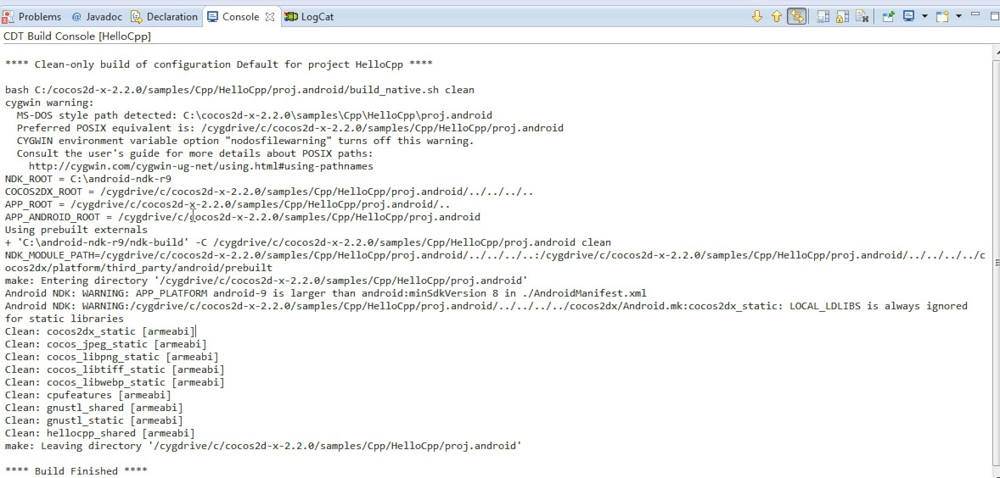
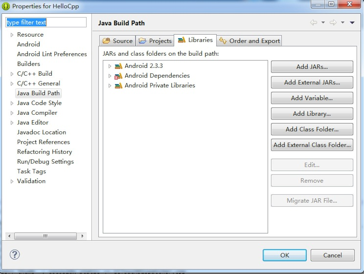

# 如何在Windows 7平台搭建Cocos2d-x Android开发环境

**注意：**本指南主要以cocos2d-x 2.x版本引擎为例。因为cocos2d-x 3.x引擎不需要安装cygwin即可编译Android样本程序，欲了解更多信息可参见本贴。

在Windows 7平台搭建Android Cocos2D-x开发环境不难，但因为框架更新频繁，许多用户在使用过程中还是会遇到很多问题。希望本指南对用户有好处。

**建议：**为避免安全相关问题，所有操作请在管理员身份下进行，在运行命令时，请确保以管理员身份打开控制台（console）。      
本指南将介绍如何在Windows 7平台搭建cocos2d-x Android开发环境。本指南操作要求一台搭载Windows 7平台及安装Visual Studio 2010的电脑。最好拥有快速稳定的网络，因为在指南操作中需要下载许多软件包。

### 下载cocos2d-x 2.2引擎

**注意：**目前最新版本的引擎为cocos2d-x 2.2。     
用户可以登陆[cocos2d-x](http://www.cocos2d-x.org/) 官方网站下载最新稳定版的cocos2d-x。如图所示。  
   


点击导航栏的“Download”（下载）后你会看到如下下载页面：


从图中可以看出，官网有两个版本可供下载，一个为cocos2d-x 2.2，另一个为cocos2d-x 3.0 pre-alpha0。

在本指南中，将会以cocos2d-x 2.2为例。
（注意：如果你想要下载旧版的cocos2d-x，可点击“looking for an old versoin?”链接。但本人强烈推荐使用最新版本的cocos2d-x，新版引擎有很多新功能，修复了旧版的很多问题。）

右键单击“Download”链接选择“save link as…”（将链接保存为…），然后将压缩文件保存至适当的位置。本机保存位置为C:\cocos2d-x-2.2.0.。    
  
（更新：请不要将cocos2d-x文件夹放置c:\下，因为会导致很多优先级别（privilege）相关的问题。可尝试将该文件夹放到其他盘如D:\及E:\等等。）


### cocos2d-x新手入门
看到上图红色划线部分了吗？双击这个名为“cocos2d-win32.vs2010.sln”的文件，然后会自动启动Visual Studio 2010。
现在你便可以将HelloCpp项目当作默认启动项目来编译，按CTRL-F5运行样本程序。如果编译没有什么错误，同时运行成功的话，你会看到如下画面。


祝贺你！你已成功在Windows 7平台中运行cocos2d-x引擎。接下里介绍如何配置Android开发环境。

### 配置Android开发环境

因为我们是针对Android开发，所以我们需要安装的第一个软件包绝对是JDK。如果你用的是64位的Windows 7，那应该下载以下版本软件64 bit JDK for windows 64bit，当前最新64位Windows 7版本的JDK为jdk-7u45-windows-x64.exe。
下载完成之后，安装JDK。安装完成之后，最好设置一个名为“JAVA_HOME”的环境变量，在本机为：C:\Program Files\Java\jdk1.7.0_45。

（(注意：如果在设置环境变量过程中遇到问题，请参考本帖寻求帮助。）
现在请下载Android SDK。Android SDK包括以下应用，这些均用于开发Android应用。

- Eclipse + ADT插件
- Android SDK Tools
- Android Platform-tools
- 最新Android平台
- 用于模拟器的最新Android系统镜像

下载Android SDK大概需要几分钟时间，主要看用户的网络速度。下载之后解压，并将其放置于C:\adt-bundle-windows-x86_64目录下。在C:\adt-bundle-windows-x86_64\eclipse文件夹中会有一个eclipse.exe程序，本机在桌面上创建了该程序的快捷方式。

现在用户可以双击桌面的快捷方式启动Eclipse，同时会出现一个即时对话框，要求设置默认工作区（workspace）。选择“OK”接受默认设置即可。

在导入样本Android项目之前，需要设置一个名为“ANDROID_SDK”新的环境变量，将其值设为“C:\adt-bundle-windows-x86_64\sdk”。

接下来要安装cygwin。本机安装路径为C:\cygwin64\bin。下载之后请用cygwin安装以下软件包。
1autoconf, automake, binutils, gcc-core, gcc-g++, gcc4-core, gcc4-g++, gdb, pcre, pcre-devel, gawk, make

现在请将cygwin的bin文件夹添加到系统PATH路径后面。本机还在系统路径后面添加了Android平台工具。本机的PATH环境变量如下所示：
1C:\cygwin64\bin;C:\adt-bundle-windows-x86_64\sdk\platform-tools;C:\adt-bundle-windows-x86_64\sdk\tools;

安装完成之后，还要安装“Android NDK”软件包，用户可前往下载链接。下载完成之后，解压，并将其放置到C:\android-ndk-r9路径，设置另一个名为“NDK_ROOT”同时指向url的环境变量。

最后便可启动Eclipse然后导入cocos2d-x文件夹中的样本Android项目。操作步骤如下：

- 右键点击“Package Explorer”并选择“Import…”
- 当出现对话框时，选择“Exsiting Android project into workspace”（将现有Android项目导入工作区）。


现在选择C:\cocos2d-x-2.2.0\samples\Cpp\HelloCpp\proj.android为导入文件夹，之后便会看到如下画面。



你可能会到如图所示红线部分“Package Explorer”的错误：


这是因为缺少cocos2d-x Android JNI桥接库（bridge library）。解决方法：导入另一个Android项目，项目位置为“C:\cocos2d-x-2.2.0\cocos2dx\platform\android”。导入项目之后，错误即会消失，如下图所示。


### 测试Cocos2d-x Android NDK环境

这次将切换使用终端，而不是Windows CMD命令工具。打开目录“c:\cygwin64”，双击“Cygwin.bat”文件。这是会出现一个终端，你可以使用bash命令来定位cocos2d-x Android项目。

操作如下：    

```
cd /cygdrive/c/cocos2d-x-2.2.0/samples/Cpp/HelloCpp/proj.android/
```

再执行以下命令：    

```1./build_native.sh```

如果没有错误出现，那恭喜你，Windows 7平台cocos2d-x Android开发环境已经正在运行。

（注意：你也可以通过Eclipse来运行Android应用。右键单击Android项目然后选择“Run as Android Application”即可。）
### 在Android手机安装APK应用

用户可使用如下命令在Android手机中安装HelloCpp.apk应用：

```
adb install  bin/HelloCpp.apk
```

（注意：如果上述操作失败，请对环境进行配置，参见以下疑难解答部分。）
### 疑难解答

- 若出现“The Android AndroidManifest.xml is missing”错误，请参考解决方案。

- 若出现“Android requires compiler compliance level 5.0 or 6.0. Found ‘1.7’ instead.”错误，请参考解决方案。

- 若出现“Unable to add ‘C:\cocos2d-x-2.2.0\samples\Cpp\HelloCpp\proj.android\assets\fonts\Marker Felt.ttf’: Zip add failed.”错误，请参考解决方案。类似问题包括“无法添加xxx.png文件”，解决方法是在cygwin环境中使用chmod命令改变文件的访问控制。（更新：你可以以管理员身份运行Eclipse然后权限问题便会解决。）

- 有时候出现的问题的确很奇怪，这时建议关闭“Build automatically”（自动编译）选项，清除所有项目，然后重新编译工作区。有时甚至需要重启Eclipse然后不断重复以上步骤。在Windows平台进行Android NDK开发有时真的很垃圾！

- 如果Eclipse无法工作，你可以尝试使用命令行工具。解决方案如下：首先在“PATH”环境变量末尾增加“ant”编译命令。变量值为“C:\adt-bundle-windows-x86_64\eclipse\plugins\org.apache.ant_1.8.3.v201301120609\bin”。然后参考本帖编译并将APK安装至你的手机。

- “Android Dependencies”问题如下图所示：



解决方法是打开项目的“Build…path”选项，然后选择“Configure build path”，然后选择“Library”，移除出现问题的库依赖（library dependency）

如果在配置过程中遇到问题，请告知我们，我们会竭力为你解答并更新本指南。
