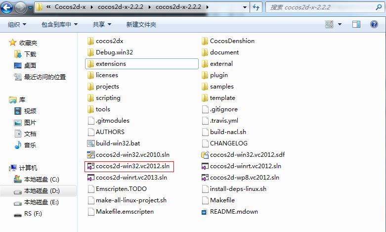
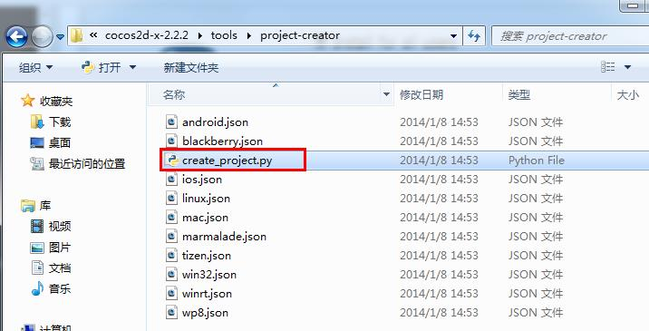

# 在Windows7上搭建Cocos2d-x win32开发环境
---

在windows7上搭建COCOS2D-X开发环境并不难， 但是由于框架更新过快，很多用户都有困难。我希望你们认为这个教程有用。

建议：为了避免安全相关的问题，请以管理员权限执行所有的操作，当运行命令的时候，也要确保之前是以管理员权限打开了命令行窗口.

## 工具准备

搭建开发环境需要安装工具包括

- Visual Studio    
- python  ———(本教程以python2.7.3版本为例），下载地址：[http://www.python.org/download/releases/2.7.2/](http://www.python.org/download/releases/2.7.3/)。     
- cocos2d-x ———(本教程以cocos2d-x-2.2.2版本为例），下载地址：[https://code.google.com/p/cocos2d-x/downloads/list](https://code.google.com/p/cocos2d-x/downloads/list)。
    
## 安装配置过程
Visual Studio 的安装过程略过，本教程主要讲解python2.7.3和cocos2d-x-2.2.2的安装配置过程。
### 安装配置python2.7.3
#### 1. 下载并安装python2.7.3。         

#### 2. 配置环境

右键单击“计算机”，选择“属性”----》“高级系统设置”，在“高级”选项卡下选择“环境变量”!      
       

在“系统变量”下选中“Path”，并点击下方的编辑按钮：    
      

在弹出的“编辑系统变量”对话框中编辑“变量值”，在“变量值”的后面添加Python的安装路径（D:\Program Files (x86)\Python27），用英文分号（;）将其与后面的其他内容隔开。    
   

同样地，在“PATHEXT“的变量值中添加 .PY;.PYM 。

#### 3. 检验安装是否成功
打开cmd控制台，输入 python，如果出现如下提示，则说明python安装成功。

### 安装创建cocos2d-x-2.2.2项目

- cocos2d-x-2.2.2项目无需安装，下载cocos2d-x-2.2.2文件并解压，直接双击运行相应的sln解决方案即可，如 cocos2d-win32.vc2012.sln       
     
   

- 将你要运行的项目设为启动项，点击运行。

- 如果一切正常，你将得到如下的界面。那么祝贺你！你已成功的在Windows 7平台中运行cocos2d-x引擎了。

#### 创建项目

- 打开..\cocos2d-x-2.2.2\tools\project-creator文件夹，找到create_project.py文件，如下所示。

- 复制create_project.py文件所在的路径，在cmd控制台中依次输入以下命令符：          
      
分别表示：切换到你存放cocos2d-x的盘，打开project-createor 文件夹。

- 输入下图方框内的命令python create_project.py (熟练使用时可跳过此步骤)，将会出现如下的提示信息。         
       
上图信息为你提供了创建项目的方法，画线部分中：       
   PROJECT_NAME 表示项目名称，可自定义。           
   PACKAGE_NAME  表示你的包名。           
   PROGRAMING_LANGUAGE  表示你所要创建项目的开发语言，可以是cpp,lua和javascript。           
　　
- 根据上图的提示创建项目。
输入命令： `Python create_project.py -project myTest -package com.myPackage -language cpp `，回车后出现下方信息表示创建成功           

- 查看目录你会发现在“Cocos2d-x-2.2.2”文件夹中生成了“projetcs”新文件，同时在“Cocos2d-x-2.2.2/projects”目录中会出现新建的“myTest”新项目。依次打开“ myTest/proj.win32 ”文件夹，“ myTest.sln ”解决方案，单击运行项目。出现下面的界面则项目创建成功        

 
