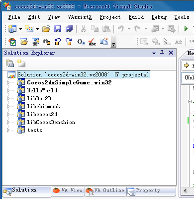
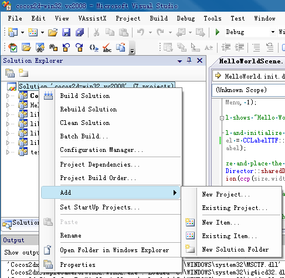
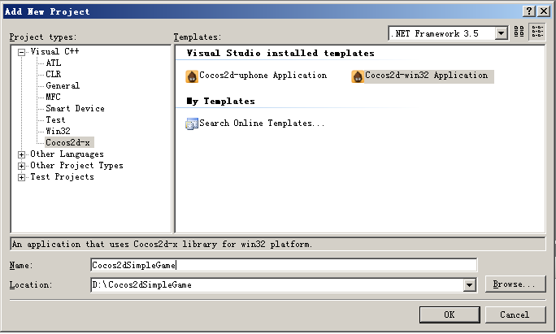
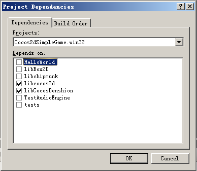
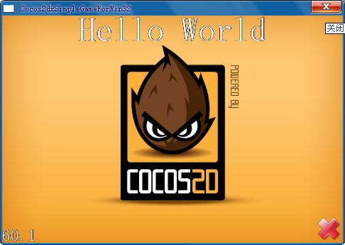
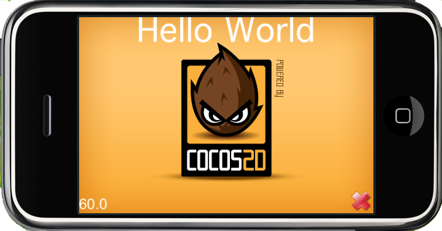

# 第一章——如何在多平台新建Cocos2d-x项目

**DEPRECATED! (see Updated process)弃用！（见更新过程）**

本文介绍如何使用Cocos2d-x引擎将众所周知的“Cocos2dSimpleGame”游戏从objc文件移植到c++中，然后再在WIN32/iPhone/Android/WoPhone多平台运行游戏。“Cocos2dSimpleGame”由Ray Wenderlich编写而成。几乎每个Cocos2d-iphone引擎初学者都看过他的操作指南。

首先，你需要从[http://download.cocos2d-x.org](http://download.cocos2d-x.org)下载最新稳定版引擎。编写本指南时引擎最新版本为Cocos2d-0.99.5-x-0.8.2，然后升级游戏资源至0.91版本。最新引擎名称中的“0.99.5”是指该c++端口是基于Cocos2d-iphone 0.99.5父引擎，而后缀“0.82”是我们Cocos2d-x端口的版本号。

“Cocos2dxSimpleGame”源码地址为 [http://www.cocos2d-x.org/attachments/535/Cocos2dxSimpleGame-0.9.1.rar](http://www.cocos2d-x.org/attachments/535/Cocos2dxSimpleGame-0.9.1.rar)。该源码已经经过“cocos2d-1.0.1-x-0.9.1”引擎测试。             
下面开始介绍如何创建项目。你可以直接跳到平台上开始操作。

## 1. 从WIN32平台开始

cocos2d-win32端口已经在WinXP+ VistualStudio2008/2010环境下经过测试。但在Vista或Win7系统，本人不敢保证能够顺畅运行。如果按照本指南操作在cocos2d-win端口上仍然无法成功运行，请参考错误解答。

### 1.2 在VisualStudio安装Wizard

下载解压文件包后，进入cocos2d-x文件夹，点击“build-win32.bat”文件编译整个项目，然后点击“install-templates-msvc.bat”安装Wizard工具。BAT脚本文件会自动适配VS2008或VS2010。若需了解更多信息，请参见以下文档VS版Cocos2d-x Application Wizard用户指南。

### 1.3 新建cocos2d-win32项目

用VS2008打开“cocos2d-x/cocos2d-win32.vc2008.sln”文件即会看到如下所示界面。



右键单击“Solution ‘cocos2d-win32.vc2008”选项然后选择“Add->New Project”。如图所示。



选择“Cocos2d-x -> cocos2d-win32 Application”在“Name”一栏中填上“Cocos2dxSimpleGame”，“Location”一栏选择默认设置。

注意：WIN32及WoPhone端口中，游戏存放路径（location）必须在cocos2d-x根目录下。



单击“OK -> Next”，不勾选“Box2D”因为“Cocos2dSimpleGame”不会用到物理系统。确保勾上“SimpleAudioEngine in CocosDenshion”选项，然后点击“Finished”。


### 1.4 编译和运行

现在即可看到已经新建“Cocos2dxSimpleGame.win32”项目！检查一下“Dependencies”（依赖）选项因为现在游戏需要依赖“libcocos2d”及“libCocosDenshion”。



确认之后编译运行。通常情况下成功时你会看到如下画面。



### 1.5 错误解答

可能有些人在WIN32平台上无法成功运行这个测试项目，因为“cocos2d-win32”端口基于“PC模拟器版本的PowerVR OpenGL ES 1.1 SDK”（Windows Vista/XP版本）。[http://www.imgtec.com/PowerVR/insider/sdkdownloads/index.asp#GLES1b](http://www.imgtec.com/PowerVR/insider/sdkdownloads/index.asp#GLES1b)

我们已经将“PowerVR”库放到“cocos2d-x-root/cocos2dx/platform/win32/third_party/libraries”路径下。    
因此:

- 对于WIN7用户：“PowerVR”还未发布Windows7版本端口。但还是可以试一下，许多行业里的WIN7用户成功运行过这个样例。
- 对于WINXP/Vista用户：如果“HelloWorld”是因为“glXXX”或“eglXXX”功能而崩溃，请更新视频显卡驱动，登陆“NVIDIA/ATI/INTEL”网址下载最新驱动。
- 对于其他不幸的用户：可以手动在XCode中创建Cocos2d-x项目。
## 2. 从WoPhone开始

如果你是WoPhone开发人员，以上WIN32平台的各步骤也适用。只有3个不同点：      
必须将“cocos2d-x-root”放置于“D:/Work7”目录中，WoPhone开发对应用路径有非常严格的要求。
请用VS2008打开“D:/Work7/cocos2d-x/cocos2d-wophone.sln”文件，请勿使用“cocos2d-win32”打开该文件。
在“Add New Project”对话框中选择“cocos2d-wophone application”，如下所示。


cocos2d-wophone引擎下运行HelloWorld界面如下。


## 3. 从iPhone开始

自从0.8.2版本以来我们就提供了XCode模板。你可以像创建“cocos2d-iphone projects”项目一样新建“Cocos2d-x”项目。
首先进入“cocos2d-x”文件夹根目录，然后在Mac Shell中运行“install-templates.sh”。     
``` 
./install-templates-xcode.sh -u -f
```
你也可以在该命令中选择XCode版本号如XCode3或XCode4。     
安装完成之后，便可启动XCode，然后单击“Create a new Xcode project”后会看到如下界面。          

          
选择“Cocos2d-x application”，然后点击“choose”，输入项目名称，之后XCode便会为你新建“Cocos2d-x”项目。
注意：iOS平台Cocos2d-x项目可以创建在任意路径。Xcode中的Wizard工具会复制所有cocos2dx及CocosDenshion等的库到项目文件夹中。这点与在VisualStudio环境WIN32及WoPhone平台的Wizard工具不同。
然后编译运行，你会看到如下HelloWorld运行界面。

   
## 4. 从Android开始

Android NDK项目包括两个部分，用于Java语言的部分和用于C++语言的部分。你可以运行“create-android-project.bat”（或者在Linux平台下运行“create-android-project.sh”）来新建Android NDK项目。
### 4.1 Windows平台操作说明
#### 4.1.1 创建项目
“create-android-project.bat”文件位于cocos2d-x根目录下。你应该根据自己的开发环境修改该文件。

为适配本机环境，本机“create-android-project.bat”文件的设置修改如下：

- set _CYGBIN=C:\cygwin\bin The path of cygwin bin Cygwin Bin路径
- set _ANDROIDTOOLS=D:\anroid\android-sdk-windows\tools The path of android sdk tools Android SDK工具路径
- set _NDKROOT=D:\anroid\android-ndk-r5bThe root of ndk NDK路径

现在即可运行“create-android-project.bat”创建Android项目。
进入cocos2d-x根目录，双击“create-android-project.bat”文件，输入项目名称（project name）及目标ID（target id）如下图所示。


**自从0.8.2版本之后，你可能会遇到要求输入资源包路径的请求**。该路径格式如下：

org.coco2dx.Cocos2dxSimpleGame.      

不同开发环境下的目标ID（target id）不同，你应确保输入有效的目标ID（target id）。目前Cocos2d-x支持Android 2.1-update1及Android 2.2，其他版本尚未测试。

#### 4.1.2 编译本地代码

在Cocos2d-x根目录下有一个“Cocos2dxSimpleGame”文件夹。运行cygwin然后进入“Cocos2dxSimpleGame/android”目录，然后运行“build_native.sh”文件。


#### 4.1.3 往Eclipse导入项目

运行Eclipse然后依次点击“File -> New -> Project -> Android Project”，导入项目如下图所示：


### 4.1.4 编译Java代码并运行

右键单击项目然后选择“Build Project”，然后右键单击项目选择“Run As”->“Android Application”，这时你会看到如下界面。


### 4.2 Linux平台操作说明

创建Android项目时运行“create-android-project.sh”文件，其他步骤与Windows平台操作说明一样。
在Linux环境下运行“create-android-project.sh”前请定义一些环境变量。

初始化一些环境变量。如下所示。

- `NDK_ROOT` NDK路径
- `ANDROID_SDK_ROOT ` Android NDK路径