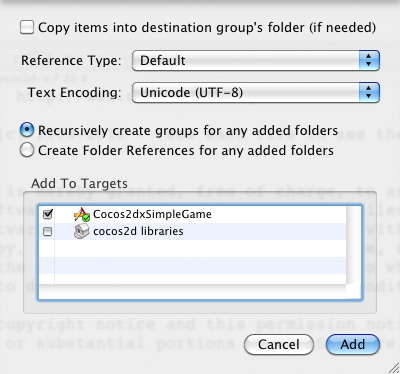
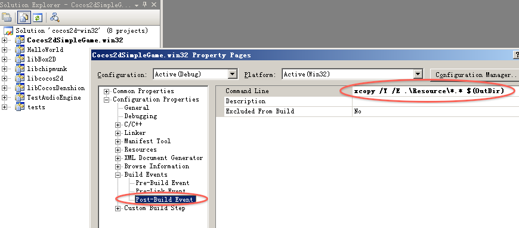
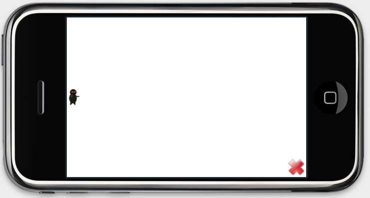

# 如何增加精灵（sprite）

## 1. 添加图片资源
以下三张图像由Ray Wenderlich妻子制作，在“Cocos2dSimpleGame”会用到这三张图像。

  


经过第一章——如何在多平台创建新的Cocos2d-x项目之后，你现在肯定有“cocos2d-x/Cocos2dSimpleGame”文件夹。请下载这些图像，然后复制到“cocos2d-x/Cocos2dSimpleGame/Resources”文件夹中。然后回到各平台的集成开发环境。

### 1.1 iPhone平台增加资源

很简单，打开Xcode依次点击“Add -> Existing Files from the context menu of Cocos2dSimpleGame/Resources group”，然后增加以上三张图像。
注意你应该在“Add to Targets”中选上“Cocos2dxSimpleGame”。


### 1.2 Android平台增加资源

如果你是运行“build_native.sh”进行编译，那你需要将这些图像复制到“Resources”（资源）文件夹，或者将这些图像复制到“assets”（资产）文件夹。
### 1.3 Win32平台增加资源

Win32平台的可执行文件会从相关路径中找到资源文件。所以只需将这些图像从“cocos2d-x/Cocos2dSimpleGame/Resources”文件夹手动复制到“cocos2d-x/Debug.win32”文件夹即可。



将以下命令写到“Post-Build Event -> Command Line”命令行中。如上图所示。

```
xcopy /Y /E .\Resources\*.* $(OutDir)
```

每次编译完成，VisualStudio都会复制资源到可执行路径。

## 2. 增加精灵

现在你会发现将cocos2d游戏从objc移植到c++是多么简单了。打开“HelloWorldScene.cpp”文件，将“init”方法换成以下代码。

	bool HelloWorld::init(){	 bool bRet = false;	do
		{
			//////////////////////////////////////////////////////////////////////////
			// super init first
			//////////////////////////////////////////////////////////////////////////		CC_BREAK_IF(! CCLayer::init());
			//////////////////////////////////////////////////////////////////////////
			// add your codes below...
			//////////////////////////////////////////////////////////////////////////
			// 1. Add a menu item with "X" image, which is clicked to quit the program.
			// Create a "close" menu item with close icon, it's an auto release object.
			CCMenuItemImage *pCloseItem = CCMenuItemImage::create(
			"CloseNormal.png",
			"CloseSelected.png",
			this,
			menu_selector(HelloWorld::menuCloseCallback));
			CC_BREAK_IF(! pCloseItem);
			// Place the menu item bottom-right conner.
			pCloseItem->setPosition(ccp(CCDirector::sharedDirector()->getWinSize().width - 20, 20));
			// Create a menu with the "close" menu item, it's an auto release object.
			CCMenu* pMenu = CCMenu::create(pCloseItem, NULL);
			pMenu->setPosition(CCPointZero);
			CC_BREAK_IF(! pMenu);	 
			// Add the menu to HelloWorld layer as a child layer.
			this->addChild(pMenu, 1);
			/////////////////////////////
			// 2. add your codes below...
			CCSize winSize = CCDirector::sharedDirector()->getWinSize();
			CCSprite *player = CCSprite::create("Player.png",
			CCRectMake(0, 0, 27, 40) );
			player->setPosition( ccp(player->getContentSize().width/2, winSize.height/2) );
			this->addChild(player);
			bRet = true;
		} while (0);
		return bRet;
	}

在关闭菜单之后，其实我们只增加了“2. Add your codes below”部分。从这里你可以看到将cocos2d-iphone代码一行一行地转换成Cocos2d-x multi-platform代码的过程。

	// cpp with Cocos2d-x
	bool HelloWorld::init()
	{
		if ( CCLayer::init() )
	   	{
	     	CCSize winSize = CCDirector::sharedDirector()->getWinSize();
	     	CCSprite *player = CCSprite::create("Player.png", 
	                                     CCRectMake(0, 0, 27, 40) );
	     	player->setPosition( ccp(player->getContentSize().width/2, 
	                              winSize.height/2) );
	   		this->addChild(player);
		}
		return true;
	}

### 提示1

1. 不要在C++中使用“_super”关键字，这与objc不同。只有VC++才能识别“_super”关键字，而GCC是无法编译该关键字的。所以最好调用父类名称“`CCLayer::init()`”。      
2. C++与objc不同的是，不像objc，C++没有“属性（property）”这个概念。所以在C++中请使用“get/set”方法。例如，如果你想要获取“`CCSprite`”的“`contentSize`”属性，必须调用“`sprite->getContentSize()`”方法。记得第一个字母大写，然后再加上“get”前缀。     
3. 请用“setter”来设置属性值。所以“`player.position = …`”转换成“`player->setPosition(…)`”。
4. 但是访问结构成员不用遵循这个规则。例如在“winSize”结构中是没有包装了“width”和“height”的“getter/setter”包装类的。     
5. 我们已经安装了一些频繁用到的CGGeometry功能，例如CGRectMake、CGPointMake、CGSizeMake、CGPointZero、CGSizeZero以及CGRectZero。你可以在“`cocos2dx/include/CCGeometry.h`”文件中看到这些功能，且功能与iOS平台一样。至于命名冲突，在Cocos2d-x中CG、NS及UI前缀的类名字已经改为CC前缀。     
6. Cocos2d-x中所有游戏元素如精灵、层、场景、标签及动作均位于堆内存（heap）。所以必须通过“->”来调用它们的方法。
7. 在Cpp文件中使用“this”关键字，而不是objc中使用的“self”。     
8. 现在“init”方法的返回类型是“bool”。在Cpp中没有“id”关键字，所以所有返回“id”的方法均会被转换为目标指针（object pointer）或者bool。    
9. 对于Android平台，标题栏会占据一些空间，所以需要将角色位置设置为“`ccp(player.contentSize.width/2 + 40, winSize.height/2)`”。   

现在可以开始编译并运行代码。现在忍者身穿黑色衣服，隐藏在黑色背景中，只有眼睛是红色。   
 
对于这个游戏，我们得将背景颜色改为白色。方法很简单，将HelloWorld文件从“`CCLayer`”继承改为从“`CCLayerColor`”继承。

首先修改HelloWoldScene.h文件中的声明（declaration）。

	// cpp with Cocos2d-x
	class HelloWorld : public cocos2d::CCLayerColor

将以下开头部分代码

	if ( !CCLayer::init() )
	{
	    return false;
	}

修改为

	if ( !CCLayerColor::initWithColor( ccc4(255,255,255,255) ) )
	{
	    return false;
	}

这里跟RayWenderlinch的代码有些不同，因为更习惯用防御式编程（defensive programming）。一般的代码是，如果“supoer init”成功，然后就会干什么声明。本人更愿意使用：如果“init”失败，先处理错误，然后再继续编写正确的代码流。圆规正传。我们再来比较一下objc到cpp的转换。

	// cpp with Cocos2d-x
	if ( CCLayerColor::initWithColor( ccc4(255,255,255,255) ) )

### 提示2

1. C++继承的默认权限是私人权限。所以需要在“CCLayerColor”前面加上“public”修饰语。
2. Cocos2d-iphone首席编写者RicardoQuesada建议：使用Cocos2d-x的命名空间。重要的是要检查你启动的Cocos2d-x类是否在“cocos2d”命名空间或“CocosDenshion”命名空间里。

编译并运行，这时你会看到我们的主角一个人站在白色的背景中。如下图所示：    
     
IPhone界面        



Android界面       


Win32 界面         


