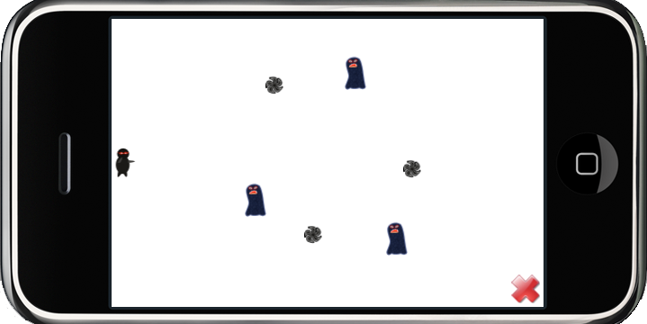

# 第四章——如何发射子弹

现在我们让英雄角色发射一些子弹消灭敌人，添加以下代码，使能层级的触摸功能，如下所示。

	// cpp with Cocos2d-x
	this->setTouchEnabled(true); or this->setIsTouchEnabled(true);

现在便可以接受到触摸事件了。

在“HelloWorldScene.h”文件中声明回调函数“void ccTouchesEnded(cocos2d::CCSet* touches, cocos2d::CCEvent* event);”，然后在“HelloWorldScene.cpp”文件中执行该函数。

	// cpp with Cocos2d-x
	void HelloWorld::ccTouchesEnded(CCSet* touches, CCEvent* event)
	{
	    // Choose one of the touches to work with
	    CCTouch* touch = (CCTouch*)( touches->anyObject() );
	    CCPoint location = touch->locationInView();
	    location = CCDirector::sharedDirector()->convertToGL(location);
	
	    // Set up initial location of projectile
	    CCSize winSize = CCDirector::sharedDirector()->getWinSize();
	    CCSprite *projectile = CCSprite::create("Projectile.png", 
	        CCRectMake(0, 0, 20, 20));
	    projectile->setPosition( ccp(20, winSize.height/2) );
	
	    // Determinie offset of location to projectile
	    int offX = location.x - projectile->getPosition().x;
	    int offY = location.y - projectile->getPosition().y;
	
	    // Bail out if we are shooting down or backwards
	    if (offX <= 0) return;
	
	    // Ok to add now - we've double checked position
	    this->addChild(projectile);
	
	    // Determine where we wish to shoot the projectile to
	    int realX = winSize.width
	                         + (projectile->getContentSize().width/2);
	    float ratio = (float)offY / (float)offX;
	    int realY = (realX * ratio) + projectile->getPosition().y;
	    CCPoint realDest = ccp(realX, realY);
	
	    // Determine the length of how far we're shooting
	    int offRealX = realX - projectile->getPosition().x;
	    int offRealY = realY - projectile->getPosition().y;
	    float length = sqrtf((offRealX * offRealX) 
	                                        + (offRealY*offRealY));
	    float velocity = 480/1; // 480pixels/1sec
	    float realMoveDuration = length/velocity;
	
	    // Move projectile to actual endpoint
	    projectile->runAction( CCSequence::create(
	        CCMoveTo::create(realMoveDuration, realDest),
	        CCCallFuncN::create(this, 
	
	        callfuncN_selector(HelloWorld::spriteMoveFinished)), 
	        NULL) );
	}

现在即可编译并运行，触摸显示屏（或者在模拟器上用鼠标点显示屏）便会出现子弹效果。
顺便说一句：为了保持代码与Object-C代码相同，从“float”到“int”之间会出现一些警告对话框，这个不用担心。

Win32平台界面

              
iPhone界面

           
Android界面

