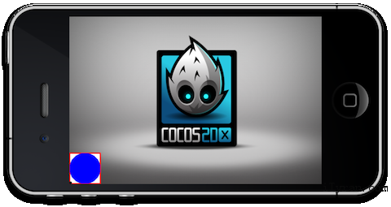
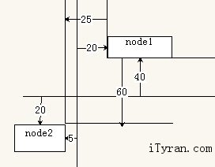
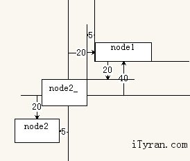

# Cocos2d坐标系 #

## 不同坐标系简介

### 笛卡尔坐标系

你可能上学的时候就已经知道“笛卡尔坐标系”了，它在几何课本里经常用到。如果你已经忘得差不多了，下面这些图片可以很快唤起你的记忆：


在移动游戏开发过程中，有三种类型的坐标系你可能遇到：

### UI坐标系

iOS/Android/Windows SDK中的通用UI坐标系：


- 起点坐标(x=0, y=0)位于左上角


- X轴从屏幕最左边开始，由左向右渐增


- Y轴坐标从屏幕最上方开始，由上向下渐增

详见下图


 

### Direct3D坐标系

DirectX 使用Left-handed Cartesian Coordinate


### OpenGL和Cocos2d坐标系

Cocos2d-x/-html5/-iphone使用的坐标系和OpenGL的坐标系一样，名为“Right-handed Cartesian Coordinate Syste”。


在2D世界中，我们仅会使用x轴和y轴。所以在你的cocos2d游戏中：
起点坐标(x=0, y=0)位于左下角，这意味着屏幕位于
X轴从屏幕最左边开始，由左向右渐增
Y轴坐标从屏幕最下方开始，由下向上渐增

下面这张图片有助于更好的阐述Cocos2d-x坐标：


一定要注意：通用UI坐标系和DirectX坐/attachments/1559/parent.jpeg)标系是不一样的。

### Parent and Childrens

由于每个类都继承自CCNode（Cocos2d-x的最顶层类），所以每个类都会默认有anchorPoint属性。 当我们在一个位置画一个的对象的时候，Cocos2d-x会合并属性位置和anchorPoint。当然，当旋转一个对象时，Cocos2d-x会围绕绕anchorPoint旋转的。

我们创建一个灰色父对象和一个蓝色子对象。设置父对象位置是ccp(100,100),子对象的anchor point位于圆心。

```
    CCSprite* parent = CCSprite::create("parent.png");
    parent->setAnchorPoint(ccp(0, 0));// Anchor Point
    parent->setPosition(ccp(100, 100));
    parent->setAnchorPoint(ccp(0, 0));
    addChild(parent);
 
    //create child
    CCSprite* child = CCSprite::create("child.png");
    child->setAnchorPoint(ccp(0.5, 0.5));
    child->setPosition(ccp(0, 0));
    parent->addChild(child);//add child sprite into parent sprite.
```

由于我们设置子对象的位置是ccp(0,0)，父对象位置是ccp(100,100)。所以，子对象位置是：


锚点

作为例子，下面这个精灵有的锚点位于 ccp(0,0)，位置位于ccp(0,0)。


这个矩形精灵将被放到它的父对象（layer）的左下角。

示例：

```
	// create sprite
	CCSprite* sprite = CCSprite::create("bottomleft.png");
	sprite->setAnchorPoint(ccp(0, 0));// Anchor Point
	sprite->setPosition(ccp(0,0));
	addChild(sprite);
```



在另一个例子中，我们会摆放一个坐标为ccp(0.5,0.5)的anchorPoint，以便您更好的理解锚点的相对值。


```
	// create sprite
	CCSprite* sprite = CCSprite::create("center.png");
	sprite->setAnchorPoint(ccp(0.5, 0.5));// Anchor Point
	sprite->setPosition(ccp(0,0));
	addChild(sprite);
```


正如你从图中看出的，锚点取的不是像素值，此值的X和Y是相对于此节点的大小的。

获取可视区域大小, 获取可视区域起点 vs 获取窗口大小

- getVisibleSize
- getVisibleOrigin
- getWinSize

VisibleSize（可视区域大小）会返回此点的OpenGL视图的可视区域大小。如果没有调用`CCEGLView::setDesignResolutionSize()`的话，此值等于getWinSize的大小。 getVisibleOrigin（获取可视区域起点）会返回此点的OpenGL视图的可视区域起点。请移步[Multi resolution support](http://shiren1118.github.io/blog/2013/03/03/coordinate-system/Multi%20resolution%20support)查看详情。

如何转换坐标

convertToNodeSpace：

举例，convertToNodeSpace用于tile-based的游戏，即有一个大地图。convertToNodeSpace会转换openGL触摸点转成.tmx 地图或者其他近似的坐标。

例子：

下面的图片会展现，node1的锚点(0,0)，node2的锚点是(1,1)。

我们会调用CCPoint point = node1->convertToNodeSpace(node2->getPosition()); 转换node2的屏幕坐标为node1的位置。结果是，node2的位置是(-25，-60).



convertToWorldSpace：

convertToWorldSpace(常量 CCPoint& nodePoint) 转换node坐标为SCREEN坐标。convertToWorldSpace会经常返回你的精灵的SCREEN位置，如果你想捕获精灵的taps而且需要移动/缩放layer的时候，这可能非常有帮助。

```
	CCPoint point = node1->convertToWorldSpace(node2->getPosition());
```
上面的代码会转换node2坐标为node2在屏幕上对应的坐标。



convertToWorldSpaceAR

convertToWorldSpaceAR返回相对锚点的位置：所以如果你的场景 – 根layer有一个锚点位于ccp(0.5f, 0.5f)。- 默认的，convertToNodeSpaceAR应返回相对于屏幕中心的位置。

convertToNodeSpaceAR – 和convertToWorldSpaceAR是一样的逻辑。

示例代码：

```
	CCSprite *sprite1 = CCSprite::create("CloseNormal.png");
	
	sprite1->setPosition(ccp(20,40));
	 
	sprite1->setAnchorPoint(ccp(0,0));
	 
	this->addChild(sprite1);
	
	CCSprite *sprite2 = CCSprite::cteate("CloseNormal.png");
	 
	sprite2->setPosition(ccp(-5,-20));
	
	sprite2->setAnchorPoint(ccp(1,1));
	
	this->addChild(sprite2);
	
	CCPoint point1 = sprite1->convertToNodeSpace(sprite2->getPosition());
	
	CCPoint point2 = sprite1->convertToWorldSpace(sprite2->getPosition());
	
	CCPoint point3 = sprite1->convertToNodeSpaceAR(sprite2->getPosition());
	
	CCPoint point4 = sprite1->convertToWorldSpaceAR(sprite2->getPosition());
	
	CCLog("position = (%f,%f)",point1.x,point1.y);
	
	CCLog("position = (%f,%f)",point2.x,point2.y);
	
	CCLog("position = (%f,%f)",point3.x,point3.y);
	
	CCLog("position = (%f,%f)",point4.x,point4.y);
```

结果：

```
	position = (-25.000000,-60.000000)
	
	position = (15.000000,20.000000)
	
	position = (-25.000000,-60.000000)
	
	position = (15.000000,20.000000)
```

参考

- Coordinate Systems (Direct3D 9) Windows from Microsoft MSDN
- How to make a simple iphone game with cocos2d tutorial written by Ray Wenderlich
- 如何使用cocos2d制作一个简单的iphone游戏
- Coordinate Systems of cocos2dx
- cocos2dx坐标系


标签：`Cocos2d-x坐标系详解` `Cocos2d-x官方文档 `
