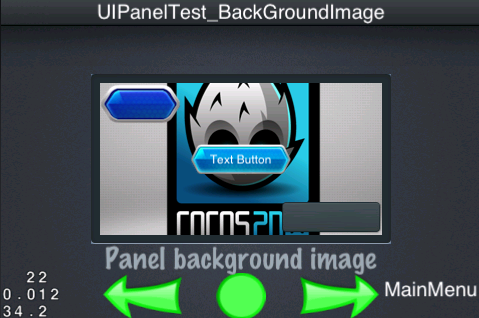
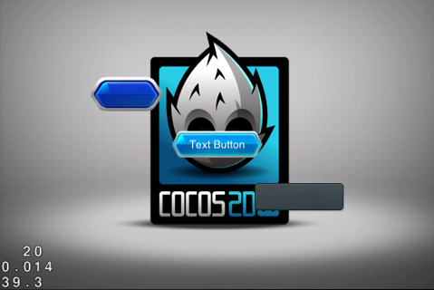

## 容器层的使用

GUI 控件我们大致可以分为两类，**普通控件** 和 **容器控件**，普通控件指的是一些常用的控件，如 UIButton，UILabel，UISlider 和 UITextField 等控件，而容器控件如 UILayout，UIScrollView，UIListView，UIPageView 等，这些容器控件都有一个特点，它可以作为容器，包含其它控件，虽然所有的控件都能够包含其它控件，但有些控件的职责非常单一，如按钮标签等，并不经常向其添加其它控件。以下详细介绍容器控件的使用方法。

### UILayout (Panel)

Panel 作为最主要的容器层，前面我们说过，由 CocoStudio UI 编辑器所创建的 UI 是基于 Panel 来布局的，要想熟练的使用 UI 控件，了解 Panel 以及其属性也是重中之重，既然是容器，容器里面总得有些内容了，Panel 对应得控件名称为 UILayout。

``` c++
	Size widgetSize = m_pWidget->getSize();
	
	UILayout *background = dynamic_cast<UILayout*>(m_pUiLayer->getWidgetByName("background_Panel"));
	
	// Create the layout
	UILayout* layout = UILayout::create();
	layout->setSize(Size(280, 150));
	Size backgroundSize = background->getSize();
	layout->setPosition(Point((widgetSize.width - backgroundSize.width) / 2 +
	                        (backgroundSize.width - layout->getSize().width) / 2,
	                        (widgetSize.height - backgroundSize.height) / 2 +
	                        (backgroundSize.height - layout->getSize().height) / 2));
	m_pUiLayer->addWidget(layout);
	
	UIButton* button = UIButton::create();
	button->setTouchEnabled(true);
	button->loadTextures("cocosgui/animationbuttonnormal.png", "cocosgui/animationbuttonpressed.png", "");
	button->setPosition(Point(button->getSize().width / 2, layout->getSize().height - button->getSize().height / 2));
	layout->addChild(button);
	
	UIButton* textButton = UIButton::create();
	textButton->setTouchEnabled(true);
	textButton->loadTextures("cocosgui/backtotopnormal.png", "cocosgui/backtotoppressed.png", "");
	textButton->setTitleText("Text Button");
	textButton->setPosition(Point(layout->getSize().width / 2, layout->getSize().height / 2));
	layout->addChild(textButton);
	
	UIButton* button_scale9 = UIButton::create();
	button_scale9->setTouchEnabled(true);
	button_scale9->loadTextures("cocosgui/button.png", "cocosgui/buttonHighlighted.png", "");
	button_scale9->setScale9Enabled(true);
	button_scale9->setSize(Size(100, button_scale9->getContentSize().height));
	button_scale9->setPosition(Point(layout->getSize().width - button_scale9->getSize().width / 2, button_scale9->getSize().height / 2));
	layout->addChild(button_scale9);

```

如上面代码所示，我们创建了一个 `layout` 控件，然后在其中添加了三个控件。`m_pUiLayer` 是当前场景的一个 UILayer ，前面我们介绍过，所有的 UI 控件，都是放在  UILayer 里面，UILayer 管理所有的控件，并添加到当前场景中去。显示效果如下：


我们设置了 layout 的 size 属性，也就是给它一个大小，但是并没有显示出来效果，默认是透明的，我们可以为这个层设置颜色：

``` c++
	layout->setBackGroundColorType(LAYOUT_COLOR_SOLID);
	layout->setBackGroundColor(Color3B(128, 128, 128));
	
```


除了设置纯色之外，还可以设计渐变颜色：

``` c++
	layout->setBackGroundColorType(LAYOUT_COLOR_GRADIENT);
	layout->setBackGroundColor(Color3B(64, 64, 64), Color3B(192, 192, 192));

```


当然，除了设置颜色之外，还可以设置我们想要的背景图片：

``` c++
	layout->setSize(Size(280, 150));
	
	layout->setClippingEnabled(true);
	layout->setBackGroundImage("cocosgui/Hello.png");

```



如上图显示，我们设置了 size 并且设置了 背景图片，但是不要忘了调用 `setClippingEnabled` 方法根据 size 进行裁剪，如果忘了调用，那么会向下面所显示的一样。



除了以上使用方式，还有其它玩法：

``` c++
	layout->setBackGroundImageScale9Enabled(true);
	layout->setBackGroundImage("cocosgui/green_edit.png");

```


使用九宫格图片做为背景，注意启用此功能。

UILayout 显示颜色的模式有三种

| LayoutBackGroundColorType	| 说明				|
|---------------------------|-------------------|
| LAYOUT_COLOR_NONE			| 透明，没有颜色显示	|
| LAYOUT_COLOR_SOLID		| 实体，可以设置颜色	|
| LAYOUT_COLOR_GRADIENT		| 渐变颜色			|

#### UIPanel 控件的布局方案

UILayout 是作为布局之用，以上都只是修改背景图片，下面除了手动摆放坐标位置的绝对定位，还提供了哪些布局方案呢。

| LayoutType				| 说明 				|
|---------------------------|-------------------|
| LAYOUT_ABSOLUTE			| 绝对布局			|
| LAYOUT_LINEAR_VERTICAL	| 垂直平铺			|
| LAYOUT_LINEAR_HORIZONTAL	| 横向平铺			|
| LAYOUT_RELATIVE			| 相对布局			|

``` c++
	layout->setLayoutType(LAYOUT_LINEAR_VERTICAL);

	// 或者
	layout->setLayoutType(LAYOUT_LINEAR_HORIZONTAL);

	// 或者
	layout->setLayoutType(LAYOUT_RELATIVE);
	
```

注意：除了绝对定位之外，如果设置了其它布局方案，那么 UIPanel 会忽略其内部控件本身设置的位置。而此时可以使用提供的 `UILayoutParameter` 来设置位置关系，根据布局方案提供了几种布局参数， `UILinearLayoutParameter` 和 `UIRelativeLayoutParameter`。下面介绍如何实用布局参数来配合布局设计界面显示效果。

``` c++
	layout->setLayoutType(LAYOUT_LINEAR_VERTICAL);

	// .... 省略控件创建代码，同前文控件一样

	UILinearLayoutParameter* lp1 = UILinearLayoutParameter::create();
	lp1->setGravity(LINEAR_GRAVITY_CENTER_HORIZONTAL);
	lp1->setMargin(UIMargin(0, 10, 0, 10));
	
	UILinearLayoutParameter* lp2 = UILinearLayoutParameter::create();
	lp2->setGravity(LINEAR_GRAVITY_CENTER_HORIZONTAL);
	lp2->setMargin(UIMargin(20, 20, 0, 5));
	
	UILinearLayoutParameter* lp3 = UILinearLayoutParameter::create();
	lp3->setGravity(LINEAR_GRAVITY_CENTER_HORIZONTAL);
	lp3->setMargin(UIMargin(0, 10, 0, 10));

	button->setLayoutParameter(lp1);
	textButton->setLayoutParameter(lp2);
	button_scale9->setLayoutParameter(lp3);

```

显示效果如下：


我们看到，分别创建了三个布局参数 `UILinearLayoutParameter`，设置了 `Gravity` 和 `Margin` 参数，然后给三个 UIPanel 的内部控件分别设置其布局参数值，已达到如上效果。

这里使用的方案是垂直平铺，而每个布局参数设置的 `Gravity` 值为  `LINEAR_GRAVITY_CENTER_HORIZONTAL`，也就是说水平剧中显示，而 Margin 则标示控件四周边缘的间距，注意以上的 `lp2` 的值为 `UIMargin(20, 20, 0, 5)`，其代表含义，距离左、上、右、下的间距。左值为 20，可以看见 `textButton` 相对中间位置向右便宜少数。这是垂直布局，而水平布局除了方向不一，基本使用方式同垂直布局同样。两者也都叫 **线性布局**，使用同样的线性布局参数。下面再看看相对布局：

``` c++
	layout->setLayoutType(LAYOUT_RELATIVE);

	// 此处省略控件的创建步骤 ...

	UIRelativeLayoutParameter* rp1 = UIRelativeLayoutParameter::create();
	rp1->setAlign(RELATIVE_ALIGN_PARENT_TOP_RIGHT);
	
	UIRelativeLayoutParameter* rp2 = UIRelativeLayoutParameter::create();
	rp2->setAlign(RELATIVE_ALIGN_PARENT_LEFT_CENTER_VERTICAL);
	
	UIRelativeLayoutParameter* rp3 = UIRelativeLayoutParameter::create();
	rp3->setAlign(RELATIVE_ALIGN_PARENT_RIGHT_BOTTOM);
	
	button->setLayoutParameter(rp1);
	textButton->setLayoutParameter(rp2);
	button_scale9->setLayoutParameter(rp3);

```


这里创建了三个布局属性，设置了不同的 "停靠" 参数 `Align` 。

### UIScrollView 滚动视图

除了布局容器，我们常用的还有滚动层容器，它可以扩大我们的显示控件，当内容元素很多时，尤为有用。可以设置为两个方向，横向或者是竖向。

``` c++
	UIScrollView* scrollView = UIScrollView::create();
	scrollView->setTouchEnabled(true);
	scrollView->setSize(Size(280, 150));        
	Size backgroundSize = background->getContentSize();
	scrollView->setPosition(Point((widgetSize.width - backgroundSize.width) / 2 +
	                       (backgroundSize.width - scrollView->getSize().width) / 2,
	                       (widgetSize.height - backgroundSize.height) / 2 +
	                       (backgroundSize.height - scrollView->getSize().height) / 2));


	m_pUiLayer->addWidget(scrollView);

	UIImageView* imageView = UIImageView::create();
	imageView->loadTexture("cocosgui/ccicon.png");
	
	float innerWidth = scrollView->getSize().width;
	float innerHeight = scrollView->getSize().height + imageView->getSize().height;
	
	scrollView->setInnerContainerSize(Size(innerWidth, innerHeight));    

	imageView->setPosition(Point(innerWidth / 2, imageView->getSize().height / 2));
    scrollView->addChild(imageView);

	// 为 scrollview 添加其它控件，省略
	
```


请看如图效果，这里创建了一个 ScrollView 控件，并且添加了一些内部元素，以完成布局，控件内容超出显示区域，我们可以通过上下拖动，来显示上下未未显示的不分。

**注意**： imageView 设置的位置在 scrollview 之外，可以通过 scrollview 的 setInnerContainerSize 方法设置包含内容的区域大小，在拖动的过程中，边界检查。

如果是设置横向的拖动效果，我们只需要设置 InnerContainerSize 的 宽度大于控件的大小，高度相同，就能实现横向的拖动效果。

### UIListView

ListView 继承自 ScrollView，所以 ScrollView 里面有的功能，特性，在 ListView 中也都能体现出来。那么 ListView 相比较 ScrollView 多了些什么呢？还是先从使用方法上开始：

``` c++
	UIListView* lv = UIListView::create();
	UIButton* model = UIButton::create();
	model->loadTextures("cocosgui/animationbuttonnormal.png", "cocosgui/animationbuttonpressed.png", "");
	lv->setItemModel(model);
	
	for (int i=0; i<20; i++)
	{
	    lv->pushBackDefaultItem();
	}
	lv->setItemsMargin(10);
	lv->setGravity(LISTVIEW_GRAVITY_CENTER_HORIZONTAL);
	lv->setSize(Size(100, 100));
	lv->setBackGroundColorType(LAYOUT_COLOR_SOLID);
	lv->setBackGroundColor(Color3B::GREEN);
	lv->setPosition(Point(100, 100));
	m_pUiLayer->addWidget(lv);

```


如图，但不能很好的看到效果，这里是类似 ScrollView 的实现，可以实现拖动，并且有二十个按钮在这其中。先说说普通的属性，通过 `ItemsMargin` 设置每个元素的间距， 通过 `Gravity`  设置布局方案，这里是横向剧中显示。

`lv->setItemModel(model)` 为 ListView 设置了默认的项 (Default Item)，然后通过一个 for 循环，添加了 20 次此默认的项，注意这 20 次并不是说， model 被添加了 20 次，二十在每次添加的时候都对 model 做了一个 克隆，它们拥有相同的属性，但却不是同一个对象。

除了使用 `pushBackDefaultItem()` 为 ListView 添加项之外，我们还可以通过以下方法添加：

|      方法      								|  说明   				|
|-----------------------------------------------|-----------------------|
| pushBackDefaultItem()							| 添加一个默认项			|
| insertDefaultItem(int index)					| 插入一个默认项，有序的	|
| pushBackCustomItem(UIWidget* item)			| 添加一个新项			|
| insertCustomItem(UIWidget* item, int index)	| 插入一个新项			|

以上是提供的一些添加项的方法，除了以上还有一些删除的方法，获取的方法，以便我们能够灵活的操作其中的每个元素：

|      方法						|  说明   					|
|-------------------------------|---------------------------|
| removeItem(int index) 		| 移除一个项					|
| removeLastItem()				| 移除最后一个项				|
| getItem(unsigned int index)	| 根据索引获取一个项			|
| getItems()					| 获取所有项，返回 Array 集合	|
| getIndex(UIWidget *item)		| 获取一个项的索引			|


### UIPageView

除了可以滚动显示的 ScrollView ， 根据项来显示列表的控件之外，还有可以根据 页 来显示 PageView。 PageVew 可以让我们整页整页的显示内容，并且可以做自动对齐，什么是自动对齐，就像你的书翻页，只翻了一半，它回自动帮你翻过去一样。

``` c++
	UIPageView* pageView = UIPageView::create();
	pageView->setTouchEnabled(true);
	pageView->setSize(Size(240, 130));
	Size backgroundSize = background->getContentSize();
	pageView->setPosition(Point((widgetSize.width - backgroundSize.width) / 2 +
	                          (backgroundSize.width - pageView->getSize().width) / 2,
	                          (widgetSize.height - backgroundSize.height) / 2 +
	                          (backgroundSize.height - pageView->getSize().height) / 2));
	
	for (int i = 0; i < 3; ++i)
	{
	    UILayout* layout = UILayout::create();
	    layout->setSize(Size(240, 130));
	    
	    UIImageView* imageView = UIImageView::create();
	    imageView->setTouchEnabled(true);
	    imageView->setScale9Enabled(true);
	    imageView->loadTexture("cocosgui/scrollviewbg.png");
	    imageView->setSize(Size(240, 130));
	    imageView->setPosition(Point(layout->getSize().width / 2, layout->getSize().height / 2));
	    layout->addChild(imageView);
	    
	    UILabel* label = UILabel::create();
	    label->setText(CCString::createWithFormat("page %d", (i + 1))->getCString());
	    label->setFontName(font_UIPageViewTest);
	    label->setFontSize(30);
	    label->setColor(Color3B(192, 192, 192));
	    label->setPosition(Point(layout->getSize().width / 2, layout->getSize().height / 2));
	    layout->addChild(label);
	    
	    pageView->addPage(layout);
	}
	pageView->addEventListenerPageView(this, pagevieweventselector(UIPageViewTest::pageViewEvent));
	
	m_pUiLayer->addWidget(pageView);

```


如图显示，创建了一个 PageView 对象 pageView，设置大小为 "Size(240, 130)"，这也就是它的显示区域大小了。我们使用一个 for 循环，添加了三个同样的元素 UILayout ，每个 UILayout 的大小也都是 `Size(240, 130)`，所以 PageView 一次正好能够显示一个项的内容，也就是 "页"。至于每个页的 UILayout 里面装着什么，那就是根据自己的需要而定了。然后使用 `pageView->addPage(layout)` 添加一个页，需要注意的是，这里所添加的必须是 `UILayout` 类型对象或者其派生类对象。

PageView 虽然实现了滑动，滚动的效果，但它并不是继承自 ScrollView 的，而是直接继承自 UILayout 的，那怎么实现滚动的呢，它集成并且实现了 `UIScrollInterface` 类型，这赋予了它可以滚动的属性。ScrollView 也是同样。

各个控件组成了丰富的 GUI 界面，而容器层则是其骨架，通过它的布局，来达到我们想要的效果。从 Panel 到 ScrollView ，Listview 和 PageView ，根据实际的需要灵活的组织可以让我们的界面显示的更为友好。
