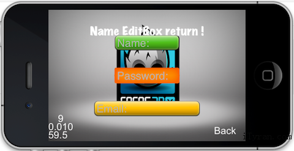

# EditBox #

## 介绍 ##

CCEditBox是供用户输入使用的。它是CCControlButton的子类。从iOS和Android平台上，你可以使用这个小工具收集小块的文字。

## 如何使用 ##

CCEditbox不支持换行符和wrapping换行，这意味着，CCEditbox只能用于单行文本，不支持多行或文本区域。

使用CCEditBox是很容易的，因为你只需要下面几行代码。

	m_pEditName = CCEditBox::create(editBoxSize, CCScale9Sprite::create("extensions/green_edit.png"));
	m_pEditName->setPosition(ccp(visibleOrigin.x+visibleSize.width/2, visibleOrigin.y+visibleSize.height*3/4));
	m_pEditName->setFontColor(ccRED);
	m_pEditName->setPlaceHolder("Name:");
	m_pEditName->setMaxLength(8);
	m_pEditName->setReturnType(kKeyboardReturnTypeDone); 
	m_pEditName->setDelegate(this);
	addChild(m_pEditName);

### EditBoxInputMode ###

EditBoxInputMode定义了以下用户被允许输入的文本类型：

	/**      * The user is allowed to enter any text, including line breaks.      */
	  kEditBoxInputModeAny = 0,
	/**       * The user is allowed to enter an e-mail address.
	    */
	  kEditBoxInputModeEmailAddr,
	/**     * The user is allowed to enter an integer value.
	     */
	  kEditBoxInputModeNumeric,
	/**     * The user is allowed to enter a phone number.     */
	   kEditBoxInputModePhoneNumber,
	/**   * The user is allowed to enter a URL.    */
	   kEditBoxInputModeUrl,
	/**  * The user is allowed to enter a real number value.
	 * This extends kEditBoxInputModeNumeric by allowing a decimal point.    */
	   kEditBoxInputModeDecimal,
	/**     * The user is allowed to enter any text, except for line breaks.    */
	   kEditBoxInputModeSingleLine

### KeyboardReturnType ###

	enum KeyboardReturnType {
	    kKeyboardReturnTypeDefault = 0,
	    kKeyboardReturnTypeDone,
	    kKeyboardReturnTypeSend,
	    kKeyboardReturnTypeSearch,
	    kKeyboardReturnTypeGo
	};

