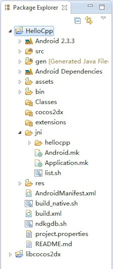

#Setup Android Development on Win7

Note: This tutorial is made for Cocos2d-x 2.x version. Since Cocos2d-x 3.x version doesn't need to install Cygwin for building Android samples any more.
You can refer to [this post](http://cocos2d-x.org/news/148) for more information.

In this tutorial, I will show you how to set up Cocos2d-x android development on windows 7. To follow this tutorial, you should have a PC with windows 7 and visual studio 2010 to be installed. It is better to have a fast and stable network connection, because there are many software packages
need to be downloaded during the configuration process.

##Download Cocos2d-x 2.2 

we can go to [ Cocos2d-x ](http://www.cocos2d-x.org) offical website to download the latest stable version of Cocos2d-x.


After your click the **Download** tab in the navigation bar, you will find a Cocos2d-x download section like this:


<!-- more -->

From the above picture, we can see that there are two versions available, one is called Cocos2d-x 2.2 and the other is called Cocos2d-x 3.0 pre-alpha0.

In this tutorial, I will take Cocos2d-x 2.2 as a example.

(Note: If you want to download any old version of Cocos2d-x, you can go to the link named "looking for an old versoin?". But I highly recommend you to try out the lastest version of Cocos2d-x, it has many new features and bug fixes.).

Ok, right click the download link and  choose "save link as..." to save the zip file to a proper location. In our case, the location is C:\cocos2d-x-2.2.0.

(Update: Don't put Cocos2d-x folder under c:\, since it will cause many privilege related problems. Try to put it in another disk, like D:\, E:\ etc.)

Now we can unzip the package and the unziped directory looks like this:


##Getting Started with Cocos2d-x

Do you see the red line in the above picture? Double click the file named cocos2d-win32.vs2010.sln, then it will launch your visual studio 2010.

Now you can make the HelloCpp project as the default startup project and press ctrl-F5 to run the sample. If you can build without any errors and run successfully.  You will get the following results:


Congratulations! You have successfully made Cocos2d-x running on your Win7. Now it's time to configure the android development environment.

##Configure android development environment

Since we are targeting Android development, so the first software package we need to install is definitely JDK. If you are running a 64 bit win7, you should download the responding [64 bit JDK for windows 64bit](http://www.oracle.com/technetwork/java/javase/downloads/jdk7-downloads-1880260.html), the current latest
version of JDK for window7 64bit is jdk-7u45-windows-x64.exe. 

Once your have finished the download, you can install the JDK. After installation, you'd better to setup a environment variable named JAVA_HOME, in our case it is: C:\Program Files\Java\jdk1.7.0_45

(Note: If you have any problems with environment variable setup, you can refer to [this post](https://kb.wisc.edu/cae/page.php?id=24500) for help.)

Now let's download  [ Android SDK ](http://developer.android.com/sdk/index.html#ExistingIDE). The Android SDK contains the following apps which are needed for developing your android apps.

- Eclipse + ADT plugin 
- Android SDK Tools
- Android Platform-tools
- The latest Android platform
- The latest Android system image for the emulator

It will take you several minutes to finish it, depending on your network bandwidth. After downoload, you can unzip it and put it on the followiwng director:C:\adt-bundle-windows-x86_64. In the folder, there is a eclipse.exe file under C:\adt-bundle-windows-x86_64\eclipse folder, I sent it to the desktop as a shortcut.

Now we can double click the shortcut on the desktop, then the eclipse will be launched along with a prompt dialog appeares. It asks us to set a default workspace. You can just choose OK to accept the deault settings. 

Before importing the sample Android project, we need to setup a new environment variable named ANDROID_SDK which value is C:\adt-bundle-windows-x86_64\sdk.

Next, we should install [cygwin](http://www.cygwin.com/install.html). My installation path is **C:\cygwin64\bin**  When you finish downloading, you should install the following software packages through cygwin:

``` cpp 
autoconf, automake, binutils, gcc-core, gcc-g++, gcc4-core, gcc4-g++, gdb, pcre, pcre-devel, gawk, make
```

Now we should add cygwin's bin folder at the end of the system's PATH.
I also added android platform tools at the end of the system's PATH. Here is my PATH environment variable.

``` cpp 
C:\cygwin64\bin;C:\adt-bundle-windows-x86_64\sdk\platform-tools;C:\adt-bundle-windows-x86_64\sdk\tools;
```


After you finish installing, you should install another software package named Android NDK. Here is the [download link](http://developer.android.com/tools/sdk/ndk/index.html). When you finish downloading, unzip it and put it at C:\android-ndk-r9 and setup another environment variable named NDK_ROOT
pointing at the url.

Finally, we can launch eclipse and import a sample android project within Cocos2d-x folder. Here is the instructions:

- Right click Package Explorer and choose "Import..."
- When a dialog will appear , you should choose "Exsiting Android project into workspace"


- Now you can choose import folder as C:\cocos2d-x-2.2.0\samples\Cpp\HelloCpp\proj.android. Now you will get the following result:


You may notice that there are some errors shown in the Package Explorer:


This is duing to the lack of Cocos2d-x android jni bridge library. We can fix the problem by importing another android project. The location of the project is at C:\cocos2d-x-2.2.0\cocos2dx\platform\android. After you have imported the project, the errors will disappear.




##Test Your Cocos2d-x Android NDK Environment

This time we will switch to use terminal, not windows' CMD tool. Open the directory c:\cygwin64, and double click the Cygwin.bat. Then a terminal will appear and you can use bash command to locate your Cocos2d-x android project.

Here is my instruction:

``` cpp 
cd /cygdrive/c/cocos2d-x-2.2.0/samples/Cpp/HelloCpp/proj.android/
```

Now you can run this command:

``` cpp 
./build_native.sh
``` 

If there are no errors. Congratulations, your Cocos2d-x android development environment on win7 is working.

(Note: you can also run your android applicaton through Eclipse. Right click the androd project and choose "Run as Android Application".)

##Install the apk on your android phone.

We can use the following command to install the HelloCpp.apk to our android phone.

``` cpp 
adb install  bin/HelloCpp.apk
```

(Note: you should do some configurations if the above instruction is failed. Here is the [solution](http://stackoverflow.com/questions/4756451/how-to-install-an-apk-file-on-an-android-phone))


##Troubleshootings

1. The Android AndroidManifest.xml is missing error.  [solution](http://stackoverflow.com/questions/12525969/androidmanifest-xml-is-missing)

2. Android requires compiler compliance level 5.0 or 6.0. Found '1.7' instead. [solution](http://stackoverflow.com/questions/7637144/android-requires-compiler-compliance-level-5-0-or-6-0-found-1-7-instead-plea)

3. Unable to add 'C:\cocos2d-x-2.2.0\samples\Cpp\HelloCpp\proj.android\assets\fonts\Marker Felt.ttf': Zip add failed. [solution](http://www.cocos2d-x.org/forums/6/topics/10142). Similar problems are  xxx.png files can't be added. The solution is to change the access control of the file by using chmod
command in cygwin environment.(Update: You can run your eclipse as Administrator, then the privilege problems will disappear.)

4. Sometimes the errors are really weird, I suggest you to disable "Build automatically" option, clean all projects and rebuild the workspace. Even sometimes you need to restart your eclipse and do the same process again and again. Android NDK development on windows platform is really shit!! 

5. If your eclipse is not working, you could try out using command line tools. Here I will show you one solution. At first, you should add 'ant' build command at the end of your PATH environment variable. The value is :C:\adt-bundle-windows-x86_64\eclipse\plugins\org.apache.ant_1.8.3.v201301120609\bin.  Then, you can refer to [this post](http://www.cocos2d-x.org/wiki/How_to_create_a_multi-platform_project_in_one_command_line) to build and install apk to your android phone.

6. Android dependency error:


The solution is opening your project's "Build path..." => "Configure build path", then select Library tab and remove the error library dependency.
