# Setup WP8 Development on Win8

##Overview

WP8 is the new phone operating system of Microsoft, since the same NT kernel with Win8 and the advantage differance with IOS and Android, it develops rapidly. It contains more than 170 thounsand apps, and the number is still increasing. More and more game developers are porting their game to wp8, to show their skills.
So using Cocos2d-x engine to develop game on wp8 is undoubtedly logical. Since this trend, I will show you the example. And hopes that, you can learn how to setup the develop environment of game on wp8 using Cocos2d-x, and I will show you some problems and the method to solve on the way of setup develop environment. Pick your windows phone up, we are starting.

## Enable to start develop on Windows phone

###  registe to be a windows phone developer

visit the MSDN's windows phone link of developer register
[http://msdn.microsoft.com/en-us/library/windowsphone/help/jj206719(v=vs.105)](http://msdn.microsoft.com/en-us/library/windowsphone/help/jj206719(v=vs.105))
[http://msdn.microsoft.com/zh-cn/library/windowsphone/help/jj206719(v=vs.105)](http://msdn.microsoft.com/zh-cn/library/windowsphone/help/jj206719(v=vs.105))

fill with your windows account and regist Windows phone developer account in steps

explanation of the Windows account：your account of Hotmail or SkyDrive or Xbox LIVE 

the fee of developer account: $19 per year, while students account is free but cannot release applications with fees.

### setup build environment
install visual studio 2003
install windows phone SDK 8.0
[http://dev.windowsphone.com/en-US/downloadsdk](http://dev.windowsphone.com/en-US/downloadsdk)
[http://dev.windowsphone.com/zh-cn/downloadsdk](http://dev.windowsphone.com/zh-cn/downloadsdk)

## create Cocos2d-x project

### get the latest Cocos2d-x codes（I will use the version of 2.2)

get the latest code from offical website：http://www.cocos2d-x.org/download

uncompress the zip pack file, and you will get the whole project of Cocos2d-x

the whole directory include as the following:

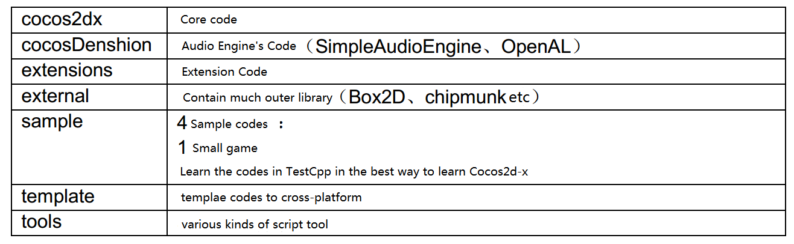

### create yourselve's Cocos2d-x porject of HelloWorld：

download and install Python, and note that donnot use the version above 3.0【Tip1】

[http://www.python.org/download/](http://www.python.org/download/)

setup the environment of your computer, add the install path of Python:

Conputer→right click->property->advanced->Environment Variables->system variable->path->add your python install path

start cmd, under any directory, enter oython, it's ok while not complain 'cmd not recognized internal external command'.

create HelloWorld Project:

into the directory of cocos2d-x-2.2.0\tools\project-creator，excute in the cmd：
       Python create_project.py project #PROJECT_NAME –package #PACKAGE_NAME 
    –language #PROGRAMING_LANGUAGE

Note：there is three variables you have to replace in your condition in the script above 

 	'#PROJECT_NAME' ： the name of the project

 	'#PACKAGE_NAME'： the name of the package（format：com.mycompany.mygame）

 	'#PROGRAMING_LANGUAGE'： the programming language（cpp, lua, javascript） 

Congratulation if you find the result as following, you create the project successfully!

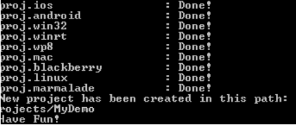

### seperate HelloWorld from Cocos2d-x project：
the code of HelloWorld is under the folder of cocos2d-x-2.2.0\projects\，you can create your folder in your condition, but cannot destroy the structure of the folder，copy the HelloWorld with some necessary file in Cocos2d-x，make a clean project， note that you cannot destroy the structure of the folder. The result of your creating as following：

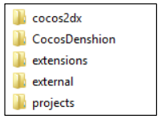

### simplify your steps to create project

I suggest you to write a bat file， do the work of creating project and make it independent. I provide you a sample as a reference:

    @echo off
    set /p directoryName=Please Input Directory Name:
    if "%directoryName%"=="" goto inputError
    set /p projectName=Please Input Project Name:
    if "%projectName%"=="" goto inputError
    set /p packageName=Please Input Package Name:
    if "%packageName%"=="" goto inputError
    create_project.py -project %projectName% -package %packageName% -language cpp
    xcopy ..\..\projects\%projectName% d:\%directoryName%\projects\%projectName% /s/e/i/y
    xcopy ..\..\cocos2dx d:\%directoryName%\cocos2dx /s/e/i/y
    xcopy ..\..\cocosDenshion d:\%directoryName%\cocosDenshion /s/e/i/y
    xcopy ..\..\extensions d:\%directoryName%\extensions /s/e/i/y
    xcopy ..\..\external d:\%directoryName%\external /s/e/i/y
    @echo Create Project OK!
    pause
    goto finish
    :inputError
    @echo Need Directory & Project & Package Name!
    pause
    :finish 

## HelloWorld project's analysis and expansion 

### like the method above, create project(MyDemo), have a view at the structure of the project directory

the structure of directory in the disk like the left image as following:

clike the .sln file under the folder in proj.wp8, open the project of WP8

the stucture of the directory like the right image as following:

### since observe,  we can conclude that:

There are codes, the project's file, the resources file like Splash releated with all the platform in the directory of the name with the head of Proj.. There are codes, the project's file and the resources file like AppDelegate, HelloWorldScene.cpp unreleated with all the platform in the Class directory. You should put your code under the folder. 
You can learn the engine the way to add AppDelegate to the WP project as following:

    IFrameworkView^ Direct3DApplicationSource::CreateView()
    {
    	return ref new MyDemo();
    }
    [Platform::MTAThread]
    int main(Platform::Array<Platform::String^>^)
    {
    	auto direct3DApplicationSource = ref new Direct3DApplicationSource();
    	CoreApplication::Run(direct3DApplicationSource);
    	return 0;
    }
    ref class MyDemo sealed : public Windows::ApplicationModel::Core::IFrameworkView
    {
    	public:
    	MyDemo();
    	….
    	private:
    	// The AppDelegate for the Cocos2D app
    	AppDelegate app;
    }; 

the feature of cross platform:

AppDelegate.cpp, HelloWorldScene.cpp and other codes are all the same in every project in every platform 

there are game resource files in the Resources directory, and just one directory in every platform.

### expanse the project HelloWorld

We can find that we just import base library like libcocos2d while check the stucture of the directory， not librarys like the audio lib CocosDenshion, the physics library Box2D. So we need to manually import thease librarys. I will show you the way to import thease librarys, using CocosDenshion. The steps as following:

add the library project into the solution: right click the solution, select "add" tab and click "Existing project...":

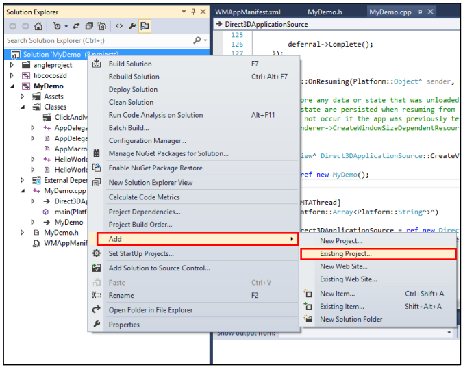

select the .vcxproj and add file under the folder of cocos2d-x-2.2\CocosDenshion\proj.wp8.

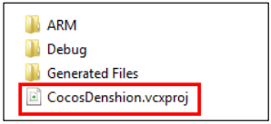

add project dependency: right click the solution, select "Project dependencies" tab.

check the item we added, and the esUtil_phone item

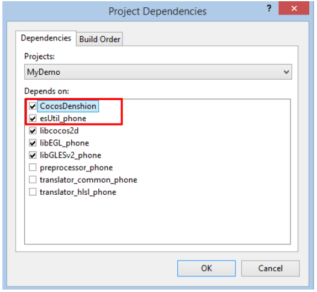

add new reference: right click the project like MyDemo, slect "Properties" tab, and click "Add new Reference..." in "Framework and References" under "Common Properties", check the new library item.

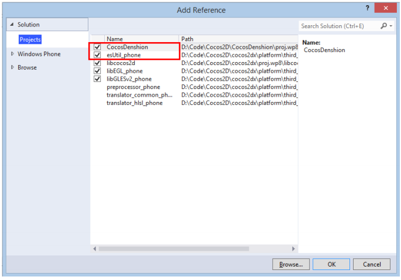

in order to add library much convenient, have better to add new library include path【Tip3】:

right click the project like MyDemo, select "Project dependencies" tab, select "General" tab under "C/C++" tab, add 
new path like '$(ProjectDir)..\..\..\CocosDenshion\include'

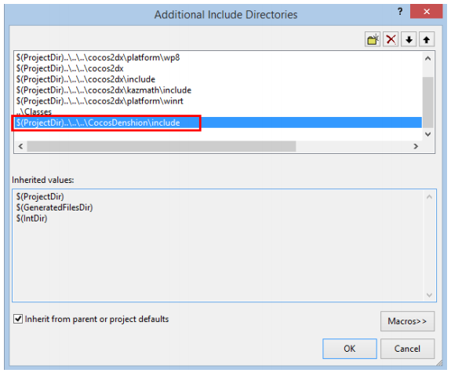

We create HelloWorld successfully now.

Setting the VS debug option as following, build and run.

Wow, appear hello world in the simulator, we make it, congratuations！

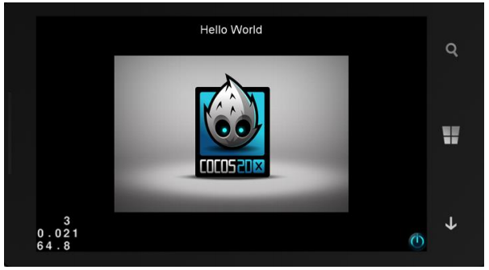

##ASSETS detail

### familiar with file of XAP and Assets

check the output of the porject build above, with some omission of mid output.

XAP file is the format of windows phone's package， like ths Android's APK or iOS's APP.
It's the standard zip format file, contain all the file the WP application that it needs, such as the assemblies, resource files. With the "output directory" option in the properties, we can find the xap file it generate.

We can try to rename the XAP file suffix as zip, then unzip, have a check the file contains in the package. 

The left image is the content in the XAP file, looks like the files in the Android, include application file like exe, some dll files and one Assets directory. The mid image is the Assets directory, the right one is the files in Assets/Resources folder, they are some game resource files. 

In a conclusion, WP's application we conclude all the resources file under the folder of Assets.

### much familiar with Assets folder（you can jump to next step）

With the feature of Cocos2d-x cross platform, we make a experiment:
build and run the MyDemo's proj.win32 project and proj.wp8 porject respectively, and meet with the result as following:

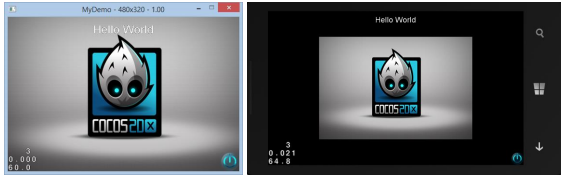

under the Resource folder of the project, we find a picture of HelloWorld.png, rename it as 
“Helloworld1.png”

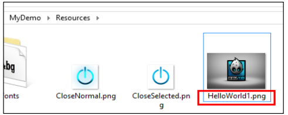

open HelloWorldScene.cpp，find bool HelloWorld::init() function and modify as following

(the file used in both of the two project, if you modify one, auto update in the other)

    // CCSprite* pSprite = CCSprite::create("HelloWorld.png");
    CCSprite* pSprite = CCSprite::create("HelloWorld1.png"); 

build and run respectively, and you will result with as following:

obviously, successed in Win32, and failed in WP8. You will find that the pointer is null while debug. Because we didn't get the picture that we just renamed as HelloWorld1.png at last moment. Why? We can open the XAP file and have a check. We find that there is the old picture named HelloWorld.png in the Assets/Resources folder in the XAP package. So we cannot replace resource file just as modify the code and the resource file under the Resources folder. The right method just see the third point.

（please reaserch yourself when you are not going woring in win32 project）

###learn how to add resource files into the Assets folder

we open the MyDemo of WP8， in VS Solution Explorer, we can find Assets folder as following， there are all resource files that put into the Assets folder of XAP package

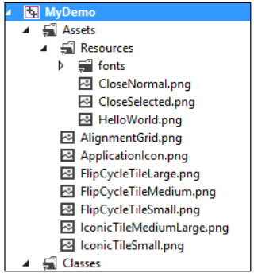

select one random png picture in the Assets folder, let's check it's position in the disk.

so, supprised, the resource isn't in the project's Resources folder we mentioned before. If you cannot see it clearly, see as following：

the project's Resources folder：(HelloWorld1.png is renamed after the 2 step's experiment)

the Assets/Resources folder in WP8：
(old HelloWorld.png and renamed HelloWorld1.png are exists)

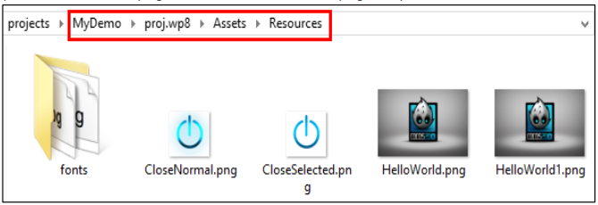

difine ”MyDemo/Resources” folder as A folder，

difine ”MyDemo/proj.wp8/Assets/Resources” folder as B folder

we can conclude that：

**the file that VS reference are all files in B's folder， that the files in the XAP folder is files in B folder；**
**it copy the A's files into B's file while VS compiling； just creating and covering, not removing；**

to confirm the procedure of copying, look at the detail output, and you will find the hint as following:

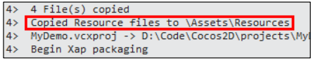

(you can add a file in A folder, compile, and check B folder)

### conclusion

According to the result above, we can deal with the resources in sequence as following【Tip4】:

clean B folder

Add, delete, modify resouces in A folder

Open and compile project, confirm that A's resources copy to B's, and modify

(what's difference as if we use resources in A folder as reference, you can try yourself)

recompile and generate XAP file

We use the method above, you can try yourself to add HelloWorld1.png, delete HelloWorld.png and add a text file 1.txt. The content in Assets and in XAP/Assets/Resources as following:

### Last step

We create a text file 1.txt again, renamed as 1.123, do as above and add it to Assets. Compile and check XAP file, check if 1.123 is in there or not.

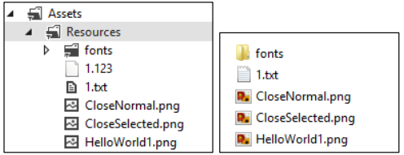

The result like as above, though we add 1.123, but not in XAP/Assets/Resources/.

Because VS just pack the resoucres into XAP that recognise in Assets folder, others not packing.
But we can change it by setting, just right click the file, and select "Properties":

set the "Content" as "Yes"

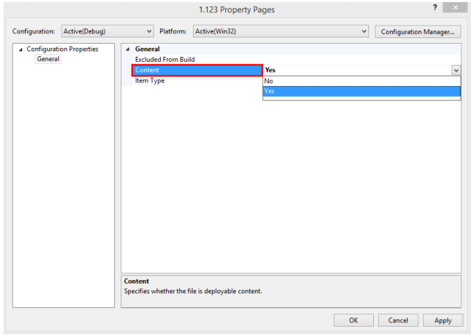

compile, and check XAP file, we find 1.123.

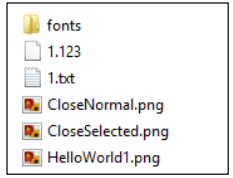

Congratulations, I believe you are familiar with Assets.

## Suggest you some common game transfer tools
### use TexturePacker to compose and arrange the pictures 【Tip5】

[http://www.codeandweb.com/texturepacker](http://www.codeandweb.com/texturepacker)

### use format-factory or other to transfer audio file

[http://www.pcfreetime.com/](http://www.pcfreetime.com/)

### use plistEditor or other in win8 to edit plist file

[http://www.icopybot.com/](http://www.icopybot.com/)

## import games
### with the konwledge above, developers can use Cocos2d-x to write your game code. About how to develop by Cocos2d-x，please look at the offical website， I don't make it detail here：

[http://www.cocos2d-x.org/](http://www.cocos2d-x.org/)

### as experiment, I refer the link as following with the right environment above, I take the code in Cocos2d-x into the MyDemo project, very convenient: 

[http://www.raywenderlich.com/33752/cocos2d-x-tutorial-for-ios-and-android-space-game](http://www.raywenderlich.com/33752/cocos2d-x-tutorial-for-ios-and-android-space-game)

That's the game interface that finish, so cool it is.

## run game in WindowsPhone

we run the game in the simulator right now, and how about in real device? very ease.

### use regist tool in Windows Phone SDK to regist

check the MSDN the detail steps:

[http://msdn.microsoft.com/library/windowsphone/develop/ff769508(v=vs.105).aspx](http://msdn.microsoft.com/library/windowsphone/develop/ff769508(v=vs.105).aspx)

### link your WP phone use USB wire to the computor， set the debug option in VS to debug in real device as following

### use deployment tools to deploy XAP to phone in Windows Phone SDK

check MSDN the detail steps:
[http://msdn.microsoft.com/zh-cn/library/windowsphone/develop/ff928362(v=vs.105).aspx](http://msdn.microsoft.com/zh-cn/library/windowsphone/develop/ff928362(v=vs.105).aspx)

