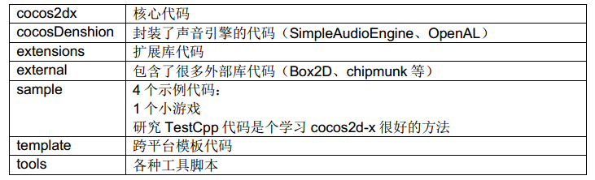

# 在WP8上搭建Cocos2d-x开发环境

##Overview

WP8 是微软公司最新一代的手机操作系统，由于采用和 Win8 相同的 NT 内核并拥有多项有
别于 iOS、Android 的优点，使得它发展迅速。目前已拥有超过 17 万个应用，并且数量还在
不断增加中。现在看来越来越多的开发者包括游戏开发者正向 WP8 平台迁移，想在这个平
台上一显身手。

所以采用 Cocos2d-x 引擎开发 WP8 手机游戏是一件顺理成章的事。鉴于这种趋势，笔者提
供这个示例。希望通过本示例，能让各位学习到如何在 WP8 平台上搭建 Cocos2d-x 的游戏
开发环境，并预先告知搭建平台可能会遇到的一些问题及其解决办法。握起你手中的
windows phone，我们开始吧！

##使自己能够开发 Windows phone

###  注册成为 windows phone 的开发者

访问以下 MSDN 的 windows phone 开发用户注册页
[http://msdn.microsoft.com/en-us/library/windowsphone/help/jj206719(v=vs.105)](http://msdn.microsoft.com/en-us/library/windowsphone/help/jj206719(v=vs.105))
[http://msdn.microsoft.com/zh-cn/library/windowsphone/help/jj206719(v=vs.105)](http://msdn.microsoft.com/zh-cn/library/windowsphone/help/jj206719(v=vs.105))

按步骤填写 windows 账号和注册 Windows phone 开发者账号
Windows 账号说明：就是 Hotmail、SkyDrive、Xbox LIVE 的用户
开发者账号的费用：$19 一年；学生账号免费但不能发布收费应用

### 安装编译环境
安装 visual studio 2013

安装 windows phone SDK 8.0

[http://dev.windowsphone.com/en-US/downloadsdk](http://dev.windowsphone.com/en-US/downloadsdk)
[http://dev.windowsphone.com/zh-cn/downloadsdk](http://dev.windowsphone.com/zh-cn/downloadsdk)

##Cocos2d-x 项目的创建

###获取最新的 Cocos2d-x 的代码（本文以 2.2 版本为例）

从官网下载最新代码：http://www.cocos2d-x.org/download

把下载的 zip 包解压后就是 Cocos2d-x 的整个工程:

整个工程的各个目录大致包含如下内容：

###创建自己的 Cocos2d-x 的 HelloWorld：

下载并安装 Python，注意不要安装 3.0 版本以上的【Tip1】

[http://www.python.org/download/](http://www.python.org/download/)

设置电脑的环境变量，加入 Python 的安装路径：

我的电脑→右键→属性→高级→环境变量→系统变量→path→加入你的 python 安装目录

进入 cmd，在任意目录下，输入 python，不会提示“不是外部或内部命令”就 OK。

创建 HelloWorld 工程：

进入 cocos2d-x-2.2.0\tools\project-creator 目录，在 cmd 下执行：
       Python create_project.py project #PROJECT_NAME –package #PACKAGE_NAME 
    –language #PROGRAMING_LANGUAGE
Note：上面的脚本中有三个变量需要根据自己的情况替换

 	'#PROJECT_NAME' ：工程的名称
 	'#PACKAGE_NAME'：包名称（格式：com.mycompany.mygame）
 	'#PROGRAMING_LANGUAGE'：编程语言（cpp, lua, javascript） 

如果看到如下界面，表示工程创建成功，恭喜！

###把 HelloWorld 从 Cocos2d-x 的大工程中独立出来：
刚才的 HelloWorld 在 cocos2d-x-2.2.0\projects\目录下，可以根据自己的情况新建一个目
录，把 HelloWorld 代码和 Cocos2d-x 必要的文件拷贝过去，做一个干净的工程，注意目
录结构不能破坏。做好的工程大致如下所示：

###进一步简化工程创建的步骤

笔者建议开发者可以自己写一个 bat 文件，把创建和工程独立合二为一，做到一步完
成。这里给出一个 bat 的例子供大家参考【TIP2】：

    @echo off
    set /p directoryName=Please Input Directory Name:
    if "%directoryName%"=="" goto inputError
    set /p projectName=Please Input Project Name:
    if "%projectName%"=="" goto inputError
    set /p packageName=Please Input Package Name:
    if "%packageName%"=="" goto inputError
    create_project.py -project %projectName% -package %packageName% -language cpp
    xcopy ..\..\projects\%projectName% d:\%directoryName%\projects\%projectName% /s/e/i/y
    xcopy ..\..\cocos2dx d:\%directoryName%\cocos2dx /s/e/i/y
    xcopy ..\..\cocosDenshion d:\%directoryName%\cocosDenshion /s/e/i/y
    xcopy ..\..\extensions d:\%directoryName%\extensions /s/e/i/y
    xcopy ..\..\external d:\%directoryName%\external /s/e/i/y
    @echo Create Project OK!
    pause
    goto finish
    :inputError
    @echo Need Directory & Project & Package Name!
    pause
    :finish 

##HelloWorld 工程的分析和扩充

###按上述方法，创建工程(MyDemo)，观察一下工程的目录结构

硬盘上的目录结构见下左图

点击 proj.wp8 目录下的.sln 文件，打开 WP8 的工程
目录结构见下右图

###通过观察，我们可以得出几点结论：

以 Proj.开头的目录存放的是和各个平台相关的代码和工程文件还有资源(比如 Splash)
Class 目录存放的是和平台无关的代码即用 Cocos2d-x 写的游戏代码部分(AppDelegate, 
HelloWorldScene.cpp)。大家开发游戏的时候也应该把代码放在此目录下。
通过如下代码可以了解引擎是如何把 AppDelegate 加到 WP 项目中去的

    IFrameworkView^ Direct3DApplicationSource::CreateView()
    {
    	return ref new MyDemo();
    }
    [Platform::MTAThread]
    int main(Platform::Array<Platform::String^>^)
    {
    	auto direct3DApplicationSource = ref new Direct3DApplicationSource();
    	CoreApplication::Run(direct3DApplicationSource);
    	return 0;
    }
    ref class MyDemo sealed : public Windows::ApplicationModel::Core::IFrameworkView
    {
    	public:
    	MyDemo();
    	….
    	private:
    	// The AppDelegate for the Cocos2D app
    	AppDelegate app;
    }; 

跨平台特性的体现：

AppDelegate.cpp, HelloWorldScene.cpp 等代码在任何平台的工程里都是一样的
Resources 目录存放的是游戏资源，各个平台都是统一的一份

###扩充 HelloWorld 工程
查看工程目录可以看到，引擎只给我们导入了基本的库(libcocos2d)，而比如声音库
CocosDenshion，物理库 Box2D 等并没有导入，所以我们需要手动将这些库导入。笔者
以导入 CocosDenshion 为例，介绍如何加入这些库。具体步骤如下：
添加库项目到工程里：选中解决方案 右键，选择 “现有项目”

选择 cocos2d-x-2.2\CocosDenshion\proj.wp8 目录下的 .vcxproj 文件，加入工程

增加项目依赖：选中解决方案右键，选择“项目依赖项” 

勾选我们刚才添加的库，记得 esUtil_phone 也勾选

添加引用：选中项目名(MyDemo)右键，选择“属性”，在“框架和引用”里面 点击 “添
加新引用”，勾选新添加的库

为了更方便使用添加的库，最好增加新库的包含路径【Tip3】：

选中项目名(MyDemo)右键，选择“属性”，在“C/C++通用”里面，选择“附加包含目
录”，增添新路径( $(ProjectDir)..\..\..\CocosDenshion\include )

至此 HelloWorld 工程正式建立起来了。

按下图所示设置 VS 的调试选项，编译并运行。

哇，出现了模拟器画面，恭喜啊，成功了！

##ASSETS 详解

###认识 XAP 文件和 Assets
看一下上述工程编译成功后的输出（中间省略了一些输出）

XAP 文件就是 windows phone 的包文件格式，相当于 Android 的 APK 和 iOS 的 APP。
它是一个标准的 zip 压缩文件，包括了 WP 应用程序所需的一切文件，如程序集、资源
文件等。通过项目的“输出路径”，我们可以找到生成的 XAP 的文件。

我们试着把 XAP 文件的后缀改为 zip，然后解压，看一下里面包含的内容：

左图是 XAP 文件包含的内容，看上去和 Android 有点类似，包括程序文件(exe)、应用配
置文件 WMAppManifest.xml（类似于安卓的 AndroidManifest.xml）、一些 dll 和一个
Assets 目录。中图是 Assets 目录、右图是 Assets/Resources 目录包含的内容，可以看
到主要是游戏资源。

由此可见，和 Android 一样，WP 的程序会把需要用到的资源放在 Assets 目录下。

###进一步认识 Assets 目录（本节内容可以跳过）
利用 Cocos2d-x 的跨平台特性，我们可以做一个实验

分别编译并运行 MyDemo 的 proj.win32 和 proj.wp8 工程，成功后分别出现如下画面

在整个工程的 Resource 目录下，找到 HelloWorld.png 图片，把这张图片的文件名改为
“Helloworld1.png”

打开 HelloWorldScene.cpp，找到 bool HelloWorld::init()函数做如下修改

（此文件在两个工程内都被调用，只要在任一个工程修改，另一个工程内会自动更新）

    // CCSprite* pSprite = CCSprite::create("HelloWorld.png");
    CCSprite* pSprite = CCSprite::create("HelloWorld1.png"); 

分别编译并运行，出现如下画面

很明显，Win32 成功了，WP8 失败了。Debug 一下就会知道 pSprite 的指针是空的。也
就是没有拿到刚才已经改名的 HelloWorld1.png 这张图。为什么会这样呢？我们打开新
生成的 XAP 文件看一下。结果发现 XAP 包里的 Assets/Resources 目录下还是原来那张
HelloWorld.png 的贴图，根本没有 HelloWorld1.png 的贴图。所以仅仅修改代码和工程
的 Resources 目录下的资源，是无法影响 XAP 包里的资源的，正确方法请看第 3 点。
（win32 工程不会错误的原因请读者自己研究）

###学习如何把资源加入到 Assets 目录中

我们打开 MyDemo 的 WP8 工程，在 VS 的 Solution Explorer 下可以发现有 Assets 目
录，见下图，这个目录下存放的就是打入 XAP 包里 Assets 目录下的所有资源

选择 Assets 下任意一张 png 图片，我们查看一下它所在的硬盘位置

怎么样，吃惊了吧。这个资源并不在我们之前一直提到的工程的 Resources 目录里。看
不清的读者，可以看下图。

工程的 Resources 目录：(HelloWorld1.png 是经过第 2 点实验后改过名的图片)

WP8 工程里的 Assets/Resources 目录：

(原来的 HelloWorld.png 和改过名的 HelloWorld1.png 都在)

把”MyDemo/Resources” 目录定义为 A 目录，

把”MyDemo/proj.wp8/Assets/Resources”目录定义为 B 目录。

我们得出如下结论：

**VS 里面引用的都是 B 目录下的资源，即真正打入到 XAP 包的是 B 目录下的资源；**

**VS 编译时会把 A 目录下的资源拷贝到 B 目录下；只会增加、覆盖，不会删除；**

为了证实有拷贝这个过程，再次仔细查看编译后的输出，发现有如下提示

（读者也可以在 A 目录下增加一个文件，然后编译工程，去查看 B 目录）

###阶段小结
根据以上结论，我们可以用如下顺序来处理资源【Tip4】：

 	清空 B 目录
 	在 A 目录下增加、删除、修改资源
 	打开并编译工程，确保 A 拷贝到 B
 	在打开工程的 Assets 下引用 B 目录的资源，并做修改
	（如果引用 A 目录下的资源情况会是怎样呢？读者可以自己去测试一下）
 	再次编译并生成 XAP
我们用上述方法，请读者试着增加 HelloWorld1.png、删除 HelloWorld.png，并创建加入
一个文本文件 1.txt。成功后 VS 工程的 Assets 内容和 XAP/Assets/Resources 内容应如
下所示：

###最后一步
我们再创建一个文本文件 1.txt，把它改名为 1.123，然后按照上面的步骤，最后引入到
Assets 下。编译后，查看一下 XAP 文件，看看 1.123 有没有。

结果如上所示，虽然我们放入了 1.123，但是却没有打入 XAP/Assets/Resources/。

这是因为引入到 Assets 目录下的资源，VS 只将认识的资源类型，默认打包进 XAP。如
果不是的话，则不会打进 XAP。这个可以设置，设置方法：对资源右击，选择属性

“内容”这个属性选择 ：是

编译后，查看一下 XAP 文件，1.123 果然有了。

恭喜，相信你已经完全了解 Assets 了！

##推荐一些常用的游戏资源转换工具
###利用 TexturePacker 软件来组合、整理图片【Tip5】
[http://www.codeandweb.com/texturepacker](http://www.codeandweb.com/texturepacker)
###利用格式工厂等软件转换声音文件
[http://www.pcfreetime.com/](http://www.pcfreetime.com/)
###利用 plistEditor 等软件在 win8 系统上编辑 plist 文件
[http://www.icopybot.com/](http://www.icopybot.com/)

##导入游戏
###有了以上知识的铺垫，读者应该可以真正用 Cocos2d-x 的语句来编写游戏代码了。关于如何用 Cocos2d-x 开发游戏，请参考官网介绍，此处笔者不做详细展开：
[http://www.cocos2d-x.org/](http://www.cocos2d-x.org/)

###作为试验，在上述已经搭好的环境下，笔者参考下面的网址，把里面的 Cocos2d-x 的代码直接拿到了 MyDemo 工程里，非常方便：
[http://www.raywenderlich.com/33752/cocos2d-x-tutorial-for-ios-and-android-space-game](http://www.raywenderlich.com/33752/cocos2d-x-tutorial-for-ios-and-android-space-game)

这是完成的游戏界面，很酷吧。

##在 WindowsPhone 手机上运行游戏
目前为止我们都是在模拟器上运行游戏，如何在真机上运行呢？很简单。

###使用 Windows Phone SDK 自带的注册工具，注册手机

详细步骤请参考 MSDN 上的介绍：
[http://msdn.microsoft.com/library/windowsphone/develop/ff769508(v=vs.105).aspx](http://msdn.microsoft.com/library/windowsphone/develop/ff769508(v=vs.105).aspx)

###把 WP 手机用 USB 线连接到电脑，按下图所示设置 VS 的调试选项进行真机调试

###使用 Windows Phone SDK 自带的部署工具，部署 XAP 到手机

详细步骤请参考 MSDN 上的介绍：
[http://msdn.microsoft.com/zh-cn/library/windowsphone/develop/ff928362(v=vs.105).aspx](http://msdn.microsoft.com/zh-cn/library/windowsphone/develop/ff928362(v=vs.105).aspx)

